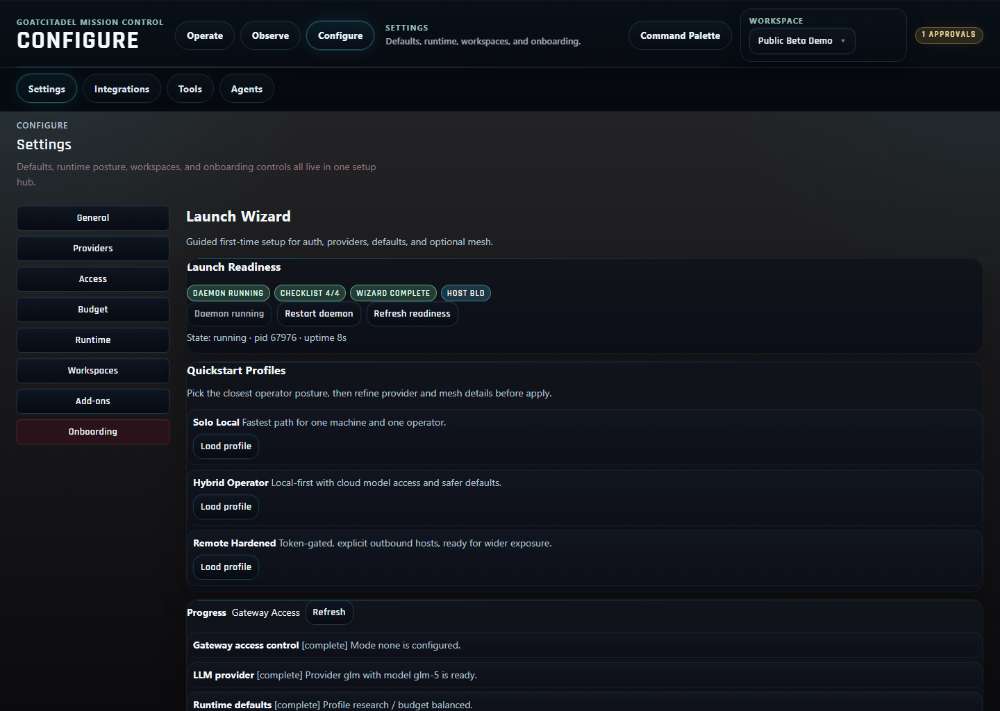

# GoatCitadel

> [!IMPORTANT]
> GoatCitadel is in public beta. The current repository ships a working Mission Control UI, gateway, installer path, screenshot pipeline, and verification commands, but the product is still evolving quickly.

Current release line: `0.6.0-beta.2`

GoatCitadel is a local-first AI command center for operating real assistant workflows instead of just chatting with a model. The current product combines a React/Vite browser UI, a Fastify gateway, shared orchestration/policy/memory packages, and optional local runtimes for voice and NPU-backed inference.


## What exists today

The current browser product is **Mission Control**. Its top-level shell is built around three spaces:

| Space | What is in it now |
| --- | --- |
| **Operate** | `Chat`, `Cowork`, `Code`, `Tasks`, `Approvals` |
| **Observe** | `Activity`, `Sessions`, `Artifacts`, `Costs`, `System`, `Quality` |
| **Configure** | `Settings`, `Integrations`, `Tools`, `Agents` |

Those spaces are not README fiction; they are the current routed structure in `apps/mission-control/src/content/page-registry.ts`.

### Current surfaces inside Mission Control

- **Operate / Chat, Cowork, Code**: one conversation shell with mode-specific posture for lightweight chat, explicit collaboration, or coding-oriented work.
- **Operate / Tasks**: task queue and deliverables view.
- **Operate / Approvals**: review queue for risky or gated actions.
- **Observe / Activity**: live feed, scheduler, and improvement tabs.
- **Observe / Sessions**: recent runs and outcomes.
- **Observe / Artifacts**: memory and file browsing in one place.
- **Observe / Costs**: runtime and provider spend visibility.
- **Observe / System**: machine and runtime health.
- **Observe / Quality**: Prompt Lab and evaluation workflows.
- **Configure / Settings**: general, providers, access, budget, runtime, workspaces, add-ons, onboarding.
- **Configure / Integrations**: connection overview plus MCP management.
- **Configure / Tools**: tool access and permissions.
- **Configure / Agents**: agent roster, Herd Live, Herd Lab, and Skills.

## Current feature set

- **Mode-aware chat surface** with `Chat`, `Cowork`, and `Code` behavior in one shell.
- **Task and approval workflows** instead of a chat-only interface.
- **Prompt evaluation** via the Quality space and Prompt Lab workflows.
- **Workspace memory and file browsing** in the Artifacts space.
- **Multi-provider configuration** through JSON config plus Mission Control settings.
- **Policy-aware tool execution** with tool profiles, write jails, network controls, and approval gating.
- **MCP and integrations support** through the Configure space and gateway routes.
- **Agent roster and live herd views** including Herd Live and Herd Lab.
- **Optional local voice runtime** managed around `whisper.cpp`.
- **Optional Python NPU sidecar** in `apps/npu-sidecar`.
- **Gateway API docs** at `/api/v1/docs`.

## Repository layout

This is a pnpm workspace monorepo.

### Apps

| Path | Purpose |
| --- | --- |
| [apps/gateway](apps/gateway) | Fastify gateway, API routes, auth, orchestration entrypoints, tooling, onboarding, admin, docs |
| [apps/mission-control](apps/mission-control) | React/Vite Mission Control UI |
| [apps/npu-sidecar](apps/npu-sidecar) | Optional Python sidecar for local NPU-backed inference |

### Shared packages

| Path | Purpose |
| --- | --- |
| [packages/contracts](packages/contracts) | Shared schemas and API contracts |
| [packages/gateway-core](packages/gateway-core) | Gateway support utilities |
| [packages/memory-core](packages/memory-core) | Memory and context primitives |
| [packages/mesh-core](packages/mesh-core) | Mesh coordination support |
| [packages/orchestration](packages/orchestration) | Agent/workflow orchestration logic |
| [packages/policy-engine](packages/policy-engine) | Tool policy, screenshot capture, and policy-related runtime logic |
| [packages/skills](packages/skills) | Skill metadata and loading support |
| [packages/storage](packages/storage) | SQLite-backed persistence and storage helpers |

## Install and run

The repository currently supports two real paths:

1. **Installer-first** for beta users.
2. **Manual clone / dev setup** for contributors.

### Prerequisites

- Git
- Node.js `22+`
- Corepack
- Optional: Python `3.10+` for `apps/npu-sidecar`

### Installer-first

Windows:

```powershell
iwr https://raw.githubusercontent.com/spurnout/GoatCitadel/main/install.ps1 -OutFile install.ps1
powershell -ExecutionPolicy Bypass -File .\install.ps1
```

macOS / Linux:

```bash
curl -fsSL https://raw.githubusercontent.com/spurnout/GoatCitadel/main/install.sh -o install.sh
bash install.sh
```

After install:

```bash
goatcitadel up
goatcitadel onboard
goatcitadel doctor --deep
```

Short alias:

```bash
goat up
goat onboard
goat doctor --deep
```

PowerShell note:

- use `goatcitadel` or `goat`
- do not use `gc` because PowerShell already reserves it for `Get-Content`

### Manual clone / contributor setup

```bash
git clone https://github.com/spurnout/GoatCitadel.git
cd GoatCitadel
corepack enable
corepack prepare pnpm@10.31.0 --activate
pnpm install --frozen-lockfile
pnpm config:sync
```

Create a local env file if you want cloud providers configured from the shell:

```bash
cp .env.example .env
```

Windows:

```powershell
Copy-Item .env.example .env -Force
```

At minimum, set whichever provider keys you actually plan to use:

```env
OPENAI_API_KEY=
GLM_API_KEY=
MOONSHOT_API_KEY=
```

Start the app:

```bash
pnpm dev
```

Split terminals if you want the gateway and UI separately:

```bash
pnpm dev:gateway
pnpm dev:ui
```

Default local endpoints:

- Mission Control: `http://localhost:5173`
- Gateway health: `http://127.0.0.1:8787/health`
- Gateway API docs: `http://127.0.0.1:8787/api/v1/docs`

## Runtime and configuration notes

- Shipped config lives under [config](config).
- `.env.example` currently includes gateway host/port, provider keys, auth overrides, mesh toggles, and advanced voice runtime overrides.
- The gateway enforces explicit auth posture for non-loopback exposure; the repo does not currently ship a Docker or Compose deployment path.
- The default config catalog includes remote providers plus local/compatible endpoints such as Ollama, LM Studio, LocalAI, and the optional NPU sidecar.

## Architecture overview

GoatCitadel currently resolves into these major layers:

| Layer | Where it lives | What it does |
| --- | --- | --- |
| UI | [apps/mission-control](apps/mission-control) | Mission Control shell, routing, pages, page tabs, visual operator workflows |
| Gateway | [apps/gateway](apps/gateway) | API routes, auth, sessions, approvals, tasks, memory, integrations, admin, docs |
| Contracts | [packages/contracts](packages/contracts) | Shared schemas, config validation, API payload contracts |
| Orchestration and policy | [packages/orchestration](packages/orchestration), [packages/policy-engine](packages/policy-engine) | Agent coordination, tool policy, runtime controls |
| Memory and storage | [packages/memory-core](packages/memory-core), [packages/storage](packages/storage) | Context composition, memory support, SQLite-backed persistence |
| Optional local runtimes | [apps/npu-sidecar](apps/npu-sidecar), gateway voice runtime commands | Local NPU and voice support |

### Gateway route coverage

The current gateway registers route groups for:

- auth
- chat
- tasks
- approvals
- sessions
- dashboard/system state
- memory/context
- files
- integrations
- MCP
- skills
- agents
- durable/daemon/admin utilities
- onboarding
- voice/media
- docs

That route breadth is why the product should be described as a control plane, not just a chat UI.

## Screenshots

The screenshots below were regenerated from the current app on **March 27, 2026** using the repo’s capture pipeline:

```bash
pnpm screenshots:capture
```

They come from a seeded, sanitized demo runtime and reflect the current `Operate / Observe / Configure` shell, not the older README-era naming.

Full gallery: [docs/screenshots/mission-control](docs/screenshots/mission-control)

### Operate

| Chat | Cowork |
| --- | --- |
|  |  |

| Tasks | Approvals |
| --- | --- |
|  |  |

### Observe

| Activity / Live feed | Quality / Prompt Lab |
| --- | --- |
|  |  |

| Sessions | Artifacts / Memory |
| --- | --- |
|  |  |

### Configure

| Settings / Onboarding | Integrations / MCP |
| --- | --- |
|  |  |

| Agents / Herd Live | Agents / Skills |
| --- | --- |
|  |  |

## Verification commands

Useful repo-level commands that exist today:

```bash
pnpm test
pnpm smoke
pnpm -r typecheck
pnpm -r build
pnpm doctor -- --deep
pnpm screenshots:capture
```

For coding workflow expectations, see [docs/GOATCITADEL_AGENTIC_CODING_WORKFLOW.md](docs/GOATCITADEL_AGENTIC_CODING_WORKFLOW.md).

For install/setup details beyond this summary, see [docs/INSTALL_SETUP_TESTING.md](docs/INSTALL_SETUP_TESTING.md).
