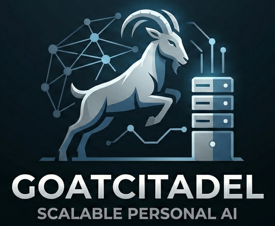
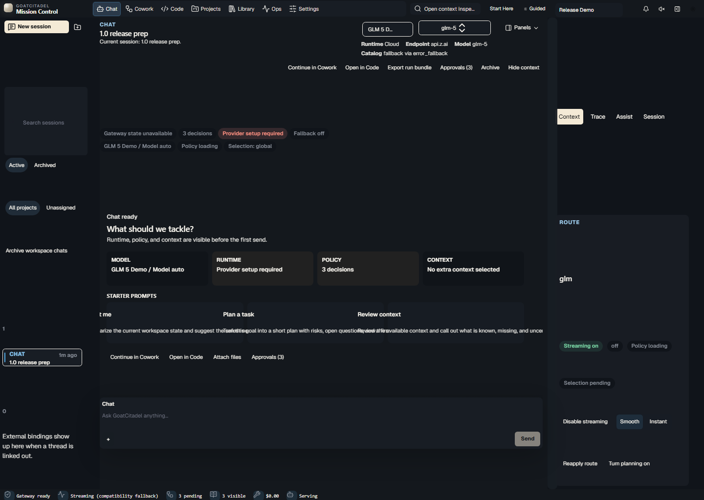
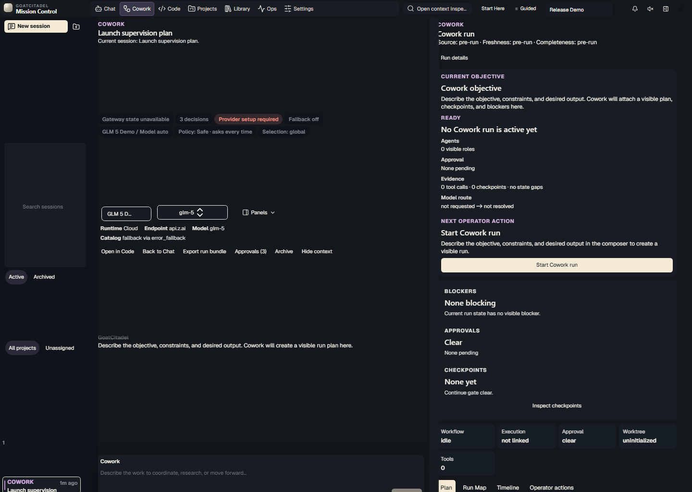
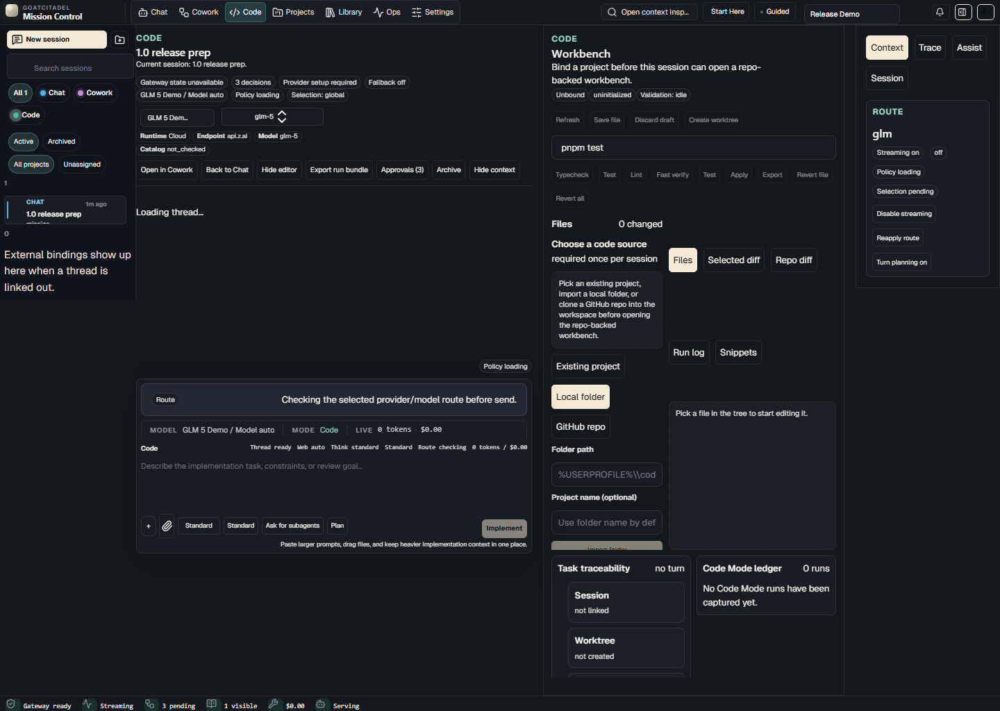
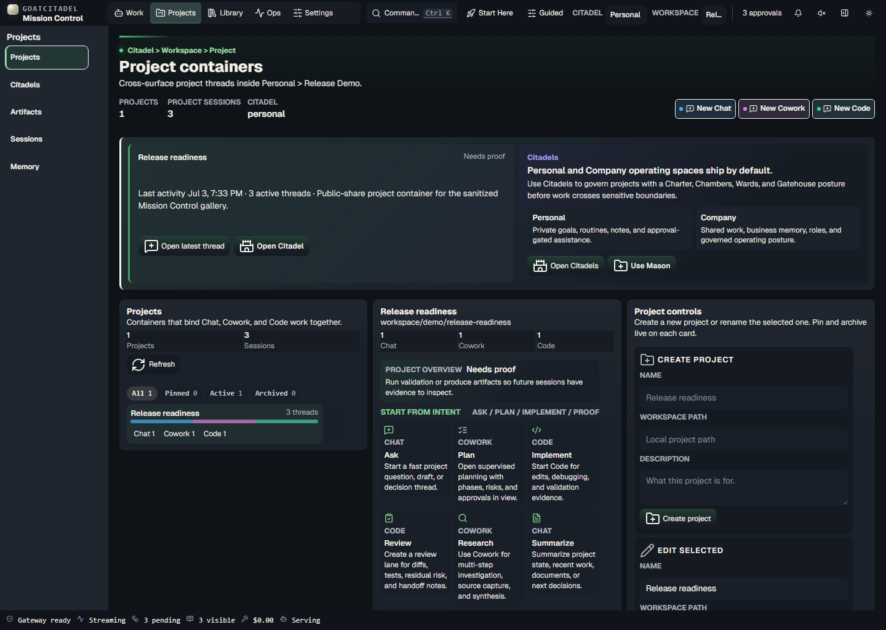
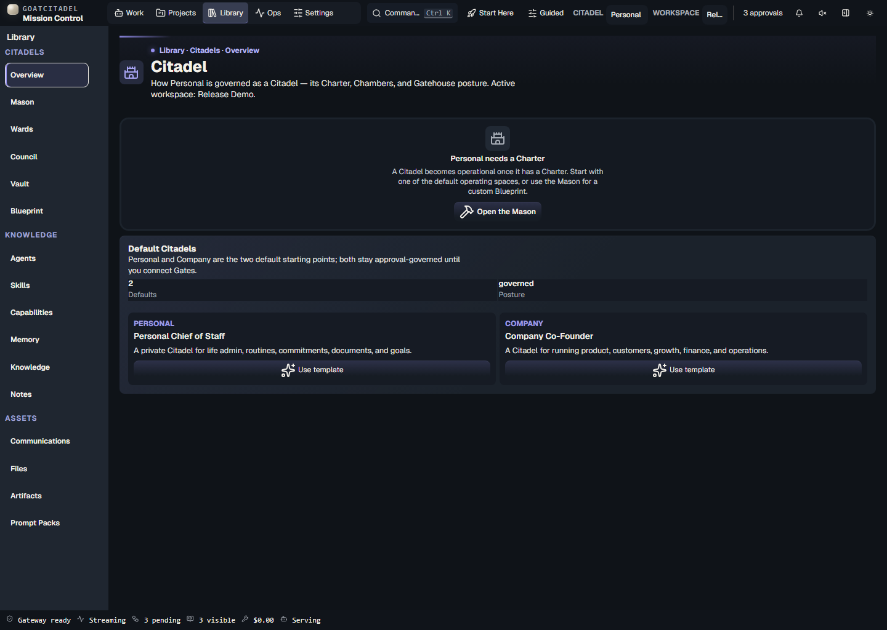
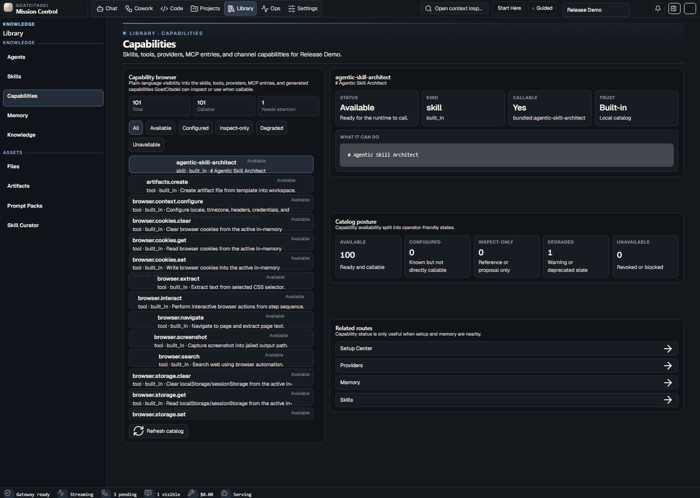
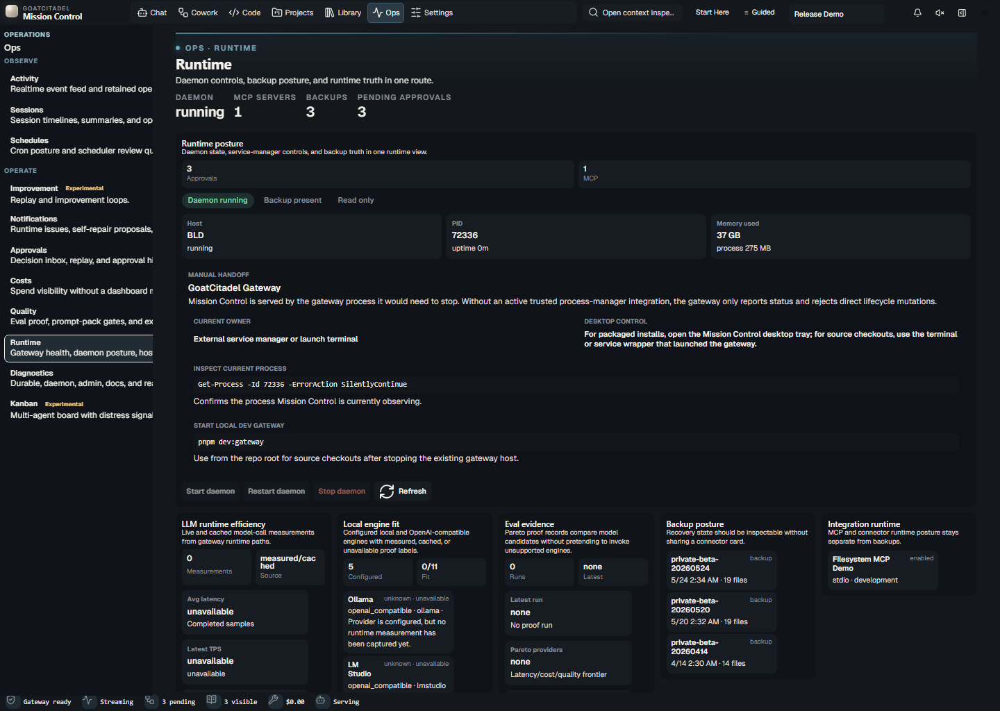
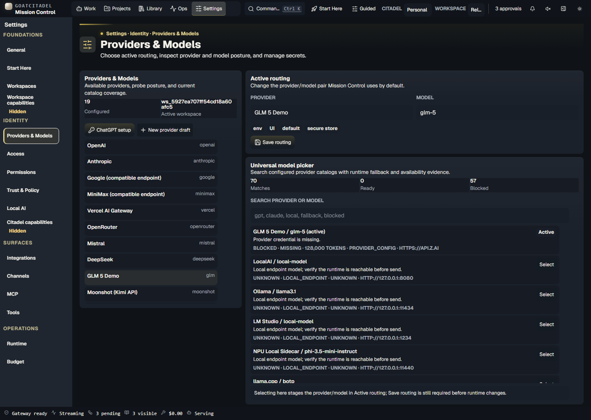
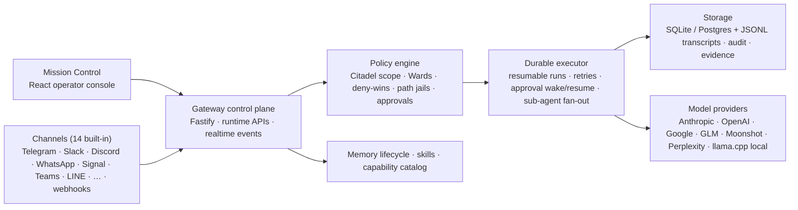

<p align="center">
  
</p>

<p align="center">
  <strong>Build a protected AI Citadel around anything you need help running.</strong>
</p>

<p align="center">
  <a href="https://goatcitadel.app"></a>
  <a href="./CHANGELOG.md"></a>
  <a href="./apps/mission-control-next"></a>
  <a href="./apps/gateway"></a>
  <a href="./package.json"></a>
  <a href="https://deepwiki.com/goatcitadel/GoatCitadel"></a>
</p>

<p align="center">
  <a href="#quickstart"><strong>Start</strong></a>
  ·
  <a href="#what-is-a-citadel"><strong>Citadels</strong></a>
  ·
  <a href="#product-tour"><strong>Tour</strong></a>
  ·
  <a href="#current-release-truth"><strong>Release truth</strong></a>
  ·
  <a href="#verification"><strong>Verify</strong></a>
  ·
  <a href="./docs/1_0_CONTRACT.md"><strong>1.0 contract</strong></a>
</p>

README last updated: 2026-07-03

**GoatCitadel** is a local-first AI command center for operators who want more leverage than a chat box and more control than a hidden-state agent platform. You work in one unified surface — conversation, supervised agentic runs, and governed code execution — inside **Citadels**: protected AI operating spaces with their own charter, memory boundary, agents, approval rules, sealed secrets, and durable evidence.

Everything runs on your machine. A Fastify gateway owns runtime truth (policy, approvals, orchestration, memory, audit, realtime events), Mission Control gives you an operator console over it, and every risky action is gated, logged, and replayable. [goatcitadel.app](https://goatcitadel.app) is the public product site; this repository remains the implementation source of truth for runtime behavior, release evidence, installation details, and supported technical claims.

## What Is A Citadel

A Citadel is not a chat folder, a project, or a dashboard. It is a protected AI operating space you build around a durable domain — your personal life, a company, a household, a client, a studio — with governance that the runtime actually enforces. Two Citadels are seeded out of the box: `personal` (a private operating world for single-operator use) and `company` (a ready parent for organization-level workspaces), and both stay approval-governed by default.

| Citadel part | What it owns | Where it lives |
| --- | --- | --- |
| **Charter & Chambers** | The Citadel's identity, purpose, and operating posture | Library → Citadels → Overview |
| **The Mason** | Guided setup: design, stage, and safely activate a Citadel | Library → Citadels → Mason |
| **Gatehouse Wards** | Access rules enforced at the policy gate on every tool invocation — `deny`, `require_approval`, and `redact` (tool-output secret scrub) ward effects are enforced and every matched ward is audited; `require_dry_run` enforcement is wired at the side-effect runner (integration/a2a caller wiring is a tracked follow-up); `route_local` is evaluated and audited but not yet enforced | Library → Citadels → Wards |
| **Council** | The agents seated in the Citadel, by reference | Library → Citadels → Council |
| **Vault** | Sealed per-Citadel secrets behind the OS keychain; fails closed when the keychain is unavailable | Library → Citadels → Vault |
| **Blueprint** | Portable `citadel.blueprint.yaml` export/import that never contains secrets, credentials, or live grants | Library → Citadels → Blueprint |

Scope is hierarchical and fail-closed: a **Citadel** owns the domain charter, global rules, memory boundary, and provider/tool defaults; **workspaces** are functional zones inside it (Engineering, Finance, Family Admin); **projects** are bounded work inside one workspace. Citadel rules cascade downward — workspace rules may specialize them but cannot weaken Citadel-level governance, safety, memory boundaries, approval requirements, path jails, deny rules, auth boundaries, or tool restrictions. The gateway resolves effective scope before policy, memory, approvals, tool grants, and durable execution decisions, so inheritance lives in the control plane, not in UI state.

Full model: [docs/CITADELS_OPERATING_MODEL.md](./docs/CITADELS_OPERATING_MODEL.md).

## At A Glance

| What GoatCitadel gives you | How it stays trustworthy |
| --- | --- |
| One Chat work surface for conversation, planning, agentic work, approvals, and governed code-capability context | Runtime decisions, tools, memory, approvals, and code execution evidence stay visible without switching panes |
| Citadels: protected operating spaces with charters, wards, councils, vaults, and blueprints | Always-on Ward deny/approval enforcement at the policy gate, fail-closed scope resolution, sealed secrets behind the OS keychain |
| Supervised agentic work with plans, checkpoints, retries, approval waits, and parallel sub-agent fan-out | Durable mission sessions, retained operator evidence, and orchestration decision traces in Run Detail |
| Governed trusted-code execution for implementation, review, and debugging | Explicit approval, artifact hashes, execution-time checks, path jails, policy gates, and adversarial sandbox canaries |
| Local-first memory, skills, tools, integrations, and multi-provider models (cloud or llama.cpp local) | Operator-visible lifecycle controls, provenance, and inspectable/callable catalog separation |
| Signed evidence receipts and offline-verifiable compliance export bundles | Digest, signature, and structure proof that verifies without trusting the runtime that produced it |
| Native Windows and Docker-backed local/shared-host operation | Runtime boundaries that do not replace auth, approvals, allowlists, or policy |

## Pick Your Path

| I want to... | Start here |
| --- | --- |
| Install the app on Windows | [Windows packaged installer](#windows-recommended-packaged-installer) |
| Run from source | [Source clone](#source-clone) |
| Run with Docker Compose | [Docker / Compose](#docker--compose) |
| Understand the Citadel model | [What is a Citadel](#what-is-a-citadel) |
| Understand what is actually shipped | [Current release truth](#current-release-truth) |
| Check supported claims and proof | [Claims boundaries](#claims-boundaries) and [Verification](#verification) |
| Contribute safely | [Development posture](#development-posture) and [CONTRIBUTING.md](./CONTRIBUTING.md) |

## Recent Highlights

The last release cycle concentrated on speed, parallelism, governance depth, and auditability:

- **One Chat surface.** Chat now carries conversation, planning, supervised agentic work, approvals, artifacts, and governed code-capability context inline. Legacy non-chat route and mode inputs normalize back to Chat or Ops Kanban.
- **Real parallel agentic execution.** Chat turns can spawn bounded sub-agents through the `agent.fanout` tool (policy-gated, audited, recursion blocked by construction), and the planner can declare independent worker steps that run concurrently. Read-only, low-risk tool batches pre-execute in parallel while per-tool policy and audit order is preserved.
- **It feels fast now.** Terminal synthesizer tokens stream live during agentic runs instead of buffering until the pipeline completes, trivial asks skip the planner entirely, planner drafts route to a speed-biased model, live-tail readers wake on append instead of polling, and a per-chunk idle watchdog turns hung provider streams into recoverable errors instead of infinite spinners.
- **Evidence you can hand to an auditor.** Runs produce signed, offline-verifiable evidence receipts (digest, signature, structure proof), and operators can export compliance bundles that verify without trusting the runtime that produced them. Orchestration decision traces (planner, policy gates, model selection) are visible in Run Detail.
- **Governance down to a single tool call.** Citadel Wards are enforced at the policy gate on every invocation, MCP tools and skills can be allowlisted per workspace/Citadel (enforced at MCP invocation), and skills carry declared governance metadata (approval, risk tier, trust scope) surfaced in the Trust UI.
- **Hardened Code Mode.** Docker sandbox images are digest-pinned fail-closed, the macOS Seatbelt read scope is narrowed to runtime essentials, synthetic-env guards block host env leakage, and a dedicated adversarial canary CI lane is a required gate — with the Windows AppContainer hostile-sandbox promotion slice green.
- **Models, cloud and local.** The model catalog spans Anthropic (including `claude-opus-4-8` and `fable-5`), OpenAI, Google, GLM, Moonshot, and Perplexity, with capability-selected per-step model routing inside orchestration. `llama.cpp` is a first-class local runtime option with guided setup and diagnostics ([docs/LLAMA_CPP_INTEGRATION_MEMO.md](./docs/LLAMA_CPP_INTEGRATION_MEMO.md)).
- **Reach it from where you work.** Guided Mission Control setup for 13 channels — Telegram, Slack, Discord, WhatsApp, Signal (bridge), iMessage (bridge), Microsoft Teams, Google Chat, LINE, Mattermost, Nextcloud Talk, Zalo OA, and Zalo Personal — plus ntfy push and generic webhook channels. Telegram, Slack, WhatsApp, LINE, and Nextcloud Talk accept governed inbound messages behind default-deny sender allowlists; Discord inbound is governed by guild/channel/role pairing rules instead. Signal is explicitly outbound-only because the current bridge receive operation lacks a durable acknowledgement/replay contract; the other remaining channels are also outbound delivery today ([docs/COMMUNICATION_CHANNEL_SETUP_GUIDE.md](./docs/COMMUNICATION_CHANNEL_SETUP_GUIDE.md)).
- **Governed scheduled automations.** A durable cron scheduler runs recurring agent turns under a restricted scheduled-turn permission profile, with a model-callable `schedule.manage` tool (per-creator caps, 15-minute minimum interval, scheduled-run recursion blocked), a human review queue for run warnings and watchdog findings, and delivery of run output to any configured channel.
- **Release proof tooling.** Tagged releases assemble signed installer checksums with cosign certificate sidecars, a CycloneDX SBOM, and a commit-bound `release-certificate.json` covering lane status, artifact digests, and scan results.

The complete change record is [CHANGELOG.md](./CHANGELOG.md).

## Product Tour

The images below are regenerated from a sanitized Mission Control Next demo runtime (captured 2026-07-03). They are for a quick product tour; release visual proof is owned by the checked-in visual regression baselines and `pnpm verify:visual:regression`.

<table>
  <tr>
    <td width="50%"></td>
    <td width="50%"></td>
  </tr>
  <tr>
    <td><strong>Chat</strong><br />Fast conversation with runtime context, citations, tool visibility, approvals, and artifacts close at hand.</td>
    <td><strong>Chat · Agentic work</strong><br />Supervised runs with visible objectives, plans, approvals, checkpoints, and delegation lineage.</td>
  </tr>
  <tr>
    <td width="50%"></td>
    <td width="50%"></td>
  </tr>
  <tr>
    <td><strong>Chat · Code capability</strong><br />Implementation, review, debugging, workbench state, and governed Code Mode runs launched from Chat.</td>
    <td><strong>Projects</strong><br />Project containers that group Chat threads, files, and evidence together.</td>
  </tr>
  <tr>
    <td width="50%"></td>
    <td width="50%"></td>
  </tr>
  <tr>
    <td><strong>Citadel · Overview</strong><br />Charter, chambers, and gatehouse posture for the active operating space, with the Mason for guided staging.</td>
    <td><strong>Library · Capabilities</strong><br />Inspectable capability, skill, tool, provider, MCP, and channel evidence.</td>
  </tr>
  <tr>
    <td width="50%"></td>
    <td width="50%"></td>
  </tr>
  <tr>
    <td><strong>Ops · Runtime</strong><br />Runtime health, backups, diagnostics, activity, costs, and proof posture.</td>
    <td><strong>Settings · Providers</strong><br />Providers, models, integrations, channels, MCP, tools, auth, and workspace controls.</td>
  </tr>
</table>

[Open the generated screenshot gallery.](./docs/screenshots/mission-control-next/index.html)

Regenerate the public gallery from a throwaway sanitized runtime:

```bash
pnpm screenshots:capture
```

## Product Surfaces

Mission Control navigation is `Work / Projects / Library / Ops / Settings`. Work is Chat: planning, research, supervised agentic execution, approvals, artifacts, and governed code-capability context appear inline instead of separate Cowork or Code panes. Code execution still requires operator confirmation before anything runs.

| Surface | Purpose | Primary feel |
| --- | --- | --- |
| Work / Chat | Conversation, questions, drafting, planning, research, approvals, durable multi-step execution, and code-capability context | Simple, direct, low-friction |
| Projects | Workspace and project organization | Structured, navigable |
| Library | Citadels, agents, skills, capabilities, memory, files, artifacts, prompt packs | Inspectable, provenance-aware |
| Ops | Approvals, activity, spend, runtime health, diagnostics, backups, release proof | Operational, high-signal |
| Settings | Providers, models, tools, integrations, channels, MCP, auth, workspace controls | Clear, progressive, safe |

## Current Release Truth

| Area | Current truth |
| --- | --- |
| Canonical shell | [apps/mission-control-next](./apps/mission-control-next) is the `1.0` Mission Control shell. |
| Retired shell | `apps/mission-control` source is archived from disk. Generated build/runtime residue may still exist locally, but it is not a shipped compatibility source. |
| Runtime owner | [apps/gateway](./apps/gateway) is the Fastify control plane for runtime APIs, orchestration, approvals, memory, integrations, audit, policy, realtime events, and persistence coordination. |
| Visible IA | Mission Control navigation is `Work / Projects / Library / Ops / Settings`; Work is the single Chat surface. Legacy `cowork` and `code` routes normalize to Chat or Ops Kanban. |
| Unified surface routing | The gateway normalizes conversation mode to Chat. Planning, research, approvals, and Code Mode context run as Chat capabilities rather than separate primary surfaces. |
| Route scope | The current visible route surface is 48 routes: 42 `ship`, 0 `needs_release_polish`, and 6 `experimental`. See [docs/1_0_RELEASE_SURFACE_SCOPE.md](./docs/1_0_RELEASE_SURFACE_SCOPE.md). |
| Citadels | Six Citadel Library routes ship (Overview, Mason, Wards, Council, Blueprint, Vault). Gatehouse Ward `deny`, `require_approval`, and `redact` effects are enforced at the policy gate on every tool invocation and every matched ward is audited; `require_dry_run` enforcement is wired at the side-effect runner (integration/a2a caller wiring is a tracked follow-up); `route_local` is evaluated and audited but not yet enforced. Vault secrets are sealed per Citadel behind the OS keychain and fail closed. |
| Capability scoping | MCP tools and skills can be allowlisted per workspace/Citadel; scope is enforced at MCP invocation. The dedicated capability-scoping Settings panels remain `hide` (not part of the certified release surface) while agent-side skill-discovery scoping and visual coverage land. |
| Durable execution | Durable runs own the shipped resumable mission-session Chat flow set. Chat turns may fan out to bounded, policy-gated sub-agents via `agent.fanout` and planner-declared parallel workers. |
| Evidence & compliance | Runs produce signed, offline-verifiable evidence receipts, compliance export bundles carry content plus signed receipt plus structure proof, and orchestration decision traces are visible in Run Detail. |
| Code Mode | Code Mode v1 is a governed trusted-code capability launched from Chat with explicit approval, recorded artifact hashes, execution-time hash checks, and separate `hostileSandboxClaim` metadata. The Windows AppContainer hostile-sandbox promotion slice now has green adversarial canary proof; the public cross-platform hostile-code claim remains not promoted until Linux, macOS, and Windows proof all pass. |
| Code backends | The trusted-code host runner is the default. Docker is selectable only when explicitly configured and its sandbox image is digest-pinned fail-closed. The Aider adapter is Docker-backed and audit-only; no patch replay, candidate promotion, or operator-workspace mutation is claimed. |
| Governed activation | Autonomous high-risk activation is opt-in through expiring operator grants scoped by workspace, surface, risk tier, capability/tool patterns, budget/count, grantor, reason, expiry, and revocation. Activations still pass deny-wins policy, path jails, auth, provenance, and health checks before durable evidence is recorded. |
| Memory | `MemoryLifecycleService` owns operator-facing memory lifecycle behavior, explicit recall, trace-derived memory proposals, feedback, dedupe, scope, and write policy. Memory composition is Citadel/workspace scope-aware. |
| Models | The shipped model catalog spans Anthropic (including `claude-opus-4-8` and `fable-5`), OpenAI, Google, GLM, Moonshot, and Perplexity, with capability-selected per-step model routing inside orchestration and `llama.cpp` as a first-class guided local runtime option. |
| Mesh | `packages/mesh-core` readiness is evidence-gated by `verify:mesh:readiness`, covering join-token, mTLS/tailnet posture, leases, owner failover, replication offsets, Settings visibility, and Gateway diagnostics. |
| MCP | Local `stdio` servers and the built-in Approval Inbox path are the visible runtime-invokable MCP surface; generic remote HTTP/SSE transports are gated behind an explicit experimental flag. Governed remote records support no-auth, token-env, and OAuth2 with OS secret-store token refs, refresh near expiry, `Authorization: Bearer ...` injection, and redacted audit/errors; missing tokens surface as `needs_auth`, expired tokens surface as `expired` and remain blocked until reconnect/refresh. Durable runs are exposed as MCP Tasks (list/get/cancel), and MCP elicitations route into the Approval Inbox. |
| Release line | The published release line is the `0.1.0-rc.1` release candidate, shipped as the GitHub prerelease `GoatCitadel 0.1.0 RC`. The earlier `v1.0.0` tag remains in git history, and installer/DMG/tarball artifact names plus embedded release manifests carry the RC version. |
| Desktop/installers | Windows x64 and arm64 installer paths are part of the product shape. macOS arm64 has an experimental ad-hoc-signed DMG lane for friend smoke only; macOS/Linux release artifacts are development-only until their workflow matrices produce signed proof. Public-trust signed EXE/DMG distribution requires exact-SHA proof plus release evidence; unsigned or ad-hoc convenience installers must be labeled as such. |
| Docker | Docker is a supported local/shared-host runtime boundary. It does not replace auth, approvals, path jails, allowlists, or policy. |

The authoritative claim set is [docs/1_0_CONTRACT.md](./docs/1_0_CONTRACT.md), [docs/1_0_RELEASE_EVIDENCE.md](./docs/1_0_RELEASE_EVIDENCE.md), and [docs/CANONICAL_RUNTIME_STATE_MODEL.md](./docs/CANONICAL_RUNTIME_STATE_MODEL.md).

## Quickstart

### Windows (recommended): packaged installer

For most Windows users, install from the packaged `.exe` release assets
(`GoatCitadel-Setup-windows-x64.exe` / `GoatCitadel-Setup-windows-arm64.exe`); see
[docs/INSTALL_SETUP_TESTING.md](./docs/INSTALL_SETUP_TESTING.md). Until public Authenticode
signing is configured, those `.exe`s ship as clearly-labeled **unsigned convenience
installers**. Verify the published SHA-256 from the release proof bundle before running.

### Windows source bootstrap (advanced)

> **Security note:** the one-liner below pipes a remote script straight into PowerShell with
> no signature or checksum verification, and clones the repo from `main` unpinned. Prefer the
> packaged installer above, or use the download-and-inspect flow so you can review the script
> and pin a release tag before executing it.

Power-user one-liner:

```powershell
iwr -useb https://raw.githubusercontent.com/goatcitadel/GoatCitadel/main/install.ps1 | iex
```

Safer download-and-run flow:

```powershell
iwr https://raw.githubusercontent.com/goatcitadel/GoatCitadel/main/install.ps1 -OutFile install.ps1
powershell -ExecutionPolicy Bypass -File .\install.ps1
```

The source bootstrap clones or updates the repo and adds the `goatcitadel` and `goat` launchers. It does not create packaged Windows desktop shortcuts. Packaged Windows installer assets install the native WinUI 3 / Windows App SDK Mission Control desktop host.

Full setup, update, uninstall, and troubleshooting guidance lives in [docs/INSTALL_SETUP_TESTING.md](./docs/INSTALL_SETUP_TESTING.md).

### macOS Apple Silicon installer smoke (experimental)

The first macOS installer lane is for Apple Silicon friend smoke only. It builds an
ad-hoc-signed, non-notarized DMG and should not be treated as a supported public
release asset yet.

Build it on an Apple Silicon Mac:

```bash
pnpm package:bundle --target macos-arm64 --skip-desktop
pnpm package:macos --target macos-arm64
```

Expected artifact (the filename carries the current workspace version):

```text
artifacts/installers/macos/GoatCitadel-<version>-macos-arm64.dmg
```

The DMG embeds the immutable GoatCitadel runtime inside the Tauri app at
`Contents/Resources/goatcitadel`. Mutable runtime state, including `runtime-root`,
logs, pid files, config, data, and artifacts, lives under
`~/Library/Application Support/GoatCitadel`. Because the app is ad-hoc signed and
not notarized, Gatekeeper warning/override behavior is expected during this
stage. Public macOS support still requires real Mac smoke evidence plus the
release workflow, signing, notarization, and installer proof gates.

### Source Clone

Use this path for development, contribution, and raw GitHub validation.

```bash
git clone https://github.com/goatcitadel/GoatCitadel.git
cd GoatCitadel
corepack enable
corepack prepare pnpm@10.31.0 --activate
pnpm install --frozen-lockfile
pnpm config:sync
pnpm dev
```

`pnpm dev` starts the gateway plus `@goatcitadel/mission-control-next`.

Default source endpoints:

- Mission Control: `http://localhost:5173`
- Gateway health: `http://127.0.0.1:8787/health`

### Docker / Compose

Use Docker when you want a stronger local or shared-host runtime boundary than a raw host install.

```powershell
pnpm secrets:docker | Tee-Object -FilePath .env
docker compose up --build
```

Or, from a packaged/source launcher:

```powershell
goatcitadel secrets generate --docker-env | Tee-Object -FilePath .env
docker compose up --build
```

Default container endpoints:

- Mission Control: `http://localhost:4173`
- Gateway health: `http://127.0.0.1:8787/health`

Before exposing GoatCitadel beyond your own machine, set long generated values for:

- `GOATCITADEL_AUTH_TOKEN`
- `GOATCITADEL_POSTGRES_PASSWORD`
- `GOATCITADEL_ALLOWED_ORIGINS`

The compose file binds published ports to `127.0.0.1` by default. Set `GOATCITADEL_DOCKER_BIND_IP` only when you intentionally want another host or interface to reach the stack.

## Platform Support

| OS | Arch | Package | Status |
| --- | --- | --- | --- |
| Windows | x64 | `GoatCitadel-Setup-windows-x64.exe` | Supported |
| Windows | arm64 | `GoatCitadel-Setup-windows-arm64.exe` | Supported |
| macOS | arm64 | `GoatCitadel-<version>-macos-arm64.dmg` | Experimental friend-smoke only |
| macOS | x64 | source/dev install | Development-only |
| Linux | x64 | source/dev install or Docker | Development-only |
| Linux | arm64 | n/a | Not shipped |

See [docs/supported-platforms.md](./docs/supported-platforms.md) for runtime expectations and installer notes.

## Configuration Basics

Tracked config ships as templates:

- tracked: `config/*.example.json`
- local runtime copies: `config/*.json`

Fresh installs and raw clones materialize local runtime config through `goatcitadel install`, `goatcitadel update`, or `pnpm config:sync`.

Create a local env file for repo-based development or provider setup:

```bash
cp .env.example .env
```

Windows:

```powershell
Copy-Item .env.example .env -Force
```

Set at least one model provider key if you plan to use cloud models:

```env
OPENAI_API_KEY=your_key_here
ANTHROPIC_API_KEY=your_key_here
CLAUDE_CODE_OAUTH_TOKEN=your_token_here
GOOGLE_API_KEY=your_key_here
GLM_API_KEY=your_key_here
MOONSHOT_API_KEY=your_key_here
PERPLEXITY_API_KEY=your_key_here
```

`CLAUDE_CODE_OAUTH_TOKEN` is the long-lived Claude subscription token from `claude setup-token`; unlike `ANTHROPIC_API_KEY`, it is sent as Bearer OAuth. Provider secrets prefer OS secure-store persistence and may fall back to local env/config storage when secure-store persistence is unavailable or disabled.

Prefer local inference? `llama.cpp` is a guided first-class local runtime option — see [docs/LLAMA_CPP_INTEGRATION_MEMO.md](./docs/LLAMA_CPP_INTEGRATION_MEMO.md).

## Useful Commands

Everyday local commands:

```bash
pnpm dev
pnpm verify:install
pnpm doctor:deep
pnpm typecheck
pnpm test
pnpm build
pnpm docs:check
```

Installed launcher basics:

```bash
goatcitadel help
goatcitadel status --json
goatcitadel launch --no-open --json --wait
goatcitadel up
goatcitadel stop --json
```

PowerShell note: prefer `goatcitadel` or `goat`. GoatCitadel does not install `gc` because PowerShell already uses it as the built-in alias for `Get-Content`.

## Architecture At A Glance



- Gateway runtime is the operational source of truth for runtime APIs, orchestration, approvals, policy, integrations, audit, realtime events, and persistence coordination.
- Mission Control is an API client for the Work surface, Projects, Library, Ops, and Settings. It should not bypass gateway-owned runtime state.
- Effective Citadel/workspace scope is resolved in the control plane before policy, memory, approvals, tool grants, and durable execution decisions.
- Durable execution owns resumable mission-session work, approval wait/resume, recovery, retries, cancellation truth, and dead-letter handling.
- Capability and skills catalogs split inspectable review state from callable runtime state. Inactive candidates and proposals are never callable.
- Memory lifecycle is explicit, scoped, and operator-visible. Trace-derived memory remains proposal-first.
- Deny-wins policy, Citadel Wards, approval gates, path jails, allowlists, auth boundaries, and tool grants remain authoritative.
- Canonical state belongs in repositories and durable logs. Retained realtime events are operator signals, not the complete historical record.

## What Ships In This Repo

Apps:

- [apps/mission-control-next](./apps/mission-control-next): canonical React/Vite Mission Control shell used by `pnpm dev`
- [apps/mission-control-windows](./apps/mission-control-windows): canonical Windows desktop host using C#/.NET, WinUI 3, Windows App SDK, and WebView2
- [apps/mission-control-desktop](./apps/mission-control-desktop): Tauri rollback host for Windows during migration and experimental macOS packaging work
- [apps/gateway](./apps/gateway): Fastify control plane and runtime APIs
- NPU sidecar support was retired from the `1.0` source and installer path; local model work should use llama.cpp, Ollama, LM Studio, LocalAI, or external providers until real NPU hardware proof justifies a new implementation.

Shared packages:

- [packages/contracts](./packages/contracts): shared contracts and schemas
- [packages/gateway-core](./packages/gateway-core): shared gateway runtime primitives
- [packages/storage](./packages/storage): SQLite/Postgres repositories and persistence helpers
- [packages/policy-engine](./packages/policy-engine): tool policy, Citadel Wards, wrappers, and runtime guardrails
- [packages/orchestration](./packages/orchestration): agent and workflow primitives
- [packages/memory-core](./packages/memory-core): context and memory composition utilities
- [packages/mesh-core](./packages/mesh-core): multi-node mesh runtime primitives (join tokens, mTLS/tailnet posture, leases, owner failover, replication)
- [packages/skills](./packages/skills): skill loading and activation support
- [packages/extensions-sdk](./packages/extensions-sdk): author SDK for add-ons and integration plugins
- [packages/threaded-surface-core](./packages/threaded-surface-core): shared threaded-surface runtime components for the Work modes
- [packages/mission-control-shared](./packages/mission-control-shared): shared Mission Control API clients, hooks, and UI primitives

## Verification

Use the smallest lane that proves your change. The full lane set:

| Theme | Lanes |
| --- | --- |
| Everyday | `verify:fast` · `verify:install` · `verify:review` · `verify:all` · `verify:soak` |
| Live end-to-end product proof | `verify:runtime:truth` · `verify:durable:recovery` · `verify:operator:proof` · `verify:surface:regression` · `verify:visual:regression` · `verify:backup:roundtrip` · `verify:desktop` |
| Agentic runtime & orchestration | `verify:agentic:contracts` · `verify:agentic:governance` · `verify:agentic:harnesses` · `verify:agentic:proof` · `verify:agentic:parity` · `verify:orchestration:perf` · `verify:harness:availability` · `verify:self-improvement:trust` |
| Code Mode & sandbox | `verify:code-mode:sandbox` · `verify:code-mode:hostile-sandbox` · `verify:code:workbench-loop` |
| Contracts & compatibility | `verify:api:compat` · `verify:auth:matrix` · `verify:ui:parity` · `verify:catalog:parity` · `verify:memory:truth` · `verify:realtime:truth` · `verify:mesh:readiness` · `verify:mcp:conformance` · `verify:a2a:full` · `verify:channels:runtime` · `verify:storage:migration-parity` |
| Security & supply chain | `security:trivy` · `verify:supply-chain` · `verify:security:evals` · `verify:artifacts:redaction` · `verify:repo:hygiene` |
| Ecosystem & packaging | `verify:extensions:package` · `verify:extensions:package:from-build` · `verify:plugins:marketplace` · `verify:skills:catalog` · `verify:workflows` · `verify:design:quality` · `verify:deep:core` · `verify:deep:ecosystem` |
| Architecture guard | `verify:architecture:metrics` |

Proof-type shorthand:

- Live end-to-end proof: `verify:runtime:truth`, `verify:durable:recovery`, `verify:operator:proof`, `verify:surface:regression`, `verify:visual:regression`, `verify:backup:roundtrip`, and `verify:desktop`.
- Targeted contract/behavior proof: `verify:auth:matrix`, `verify:code-mode:sandbox`, `verify:code-mode:hostile-sandbox`, `verify:mesh:readiness`, `verify:agentic:governance`, `verify:agentic:proof`, `verify:memory:truth`, `verify:realtime:truth`, and `verify:api:compat`. `verify:code-mode:hostile-sandbox` is a promotion gate for native hostile-sandbox claim metadata and adversarial canary coverage; it runs current-platform native canaries when the adapter is available. On Windows, the lane proves AppContainer outside-root read/write denial, network denial, env-secret absence, symlink/path traversal denial, process/job limits, artifact hash integrity, and fail-closed required mode, but it does not allow a public cross-platform hostile-code claim until every Linux, macOS, and Windows proof is green. `verify:agentic:proof` is targeted contract/behavior proof for retained agentic evidence, orchestration lineage anchors, and governance/harness proof families; it is not live end-to-end product proof.
- REST/SSE compatibility proof: `verify:api:compat` snapshots REST route/status compatibility and realtime event envelopes. It is not a full response-schema diff.
- Backup proof: `verify:backup:roundtrip` now restores and verifies the full minimum operator backup set.
- Parity sample: `verify:catalog:parity` now executes the runtime-backed operator action classes declared in its parity scenario; it is a parity sample, not proof every future visible catalog entry has a live action.
- Architecture debt guard: `verify:architecture:metrics` fails on coupling regressions and reports large-service debt. It is not proof broad `GatewayService` decomposition is complete.
- Architecture baseline provenance: update the accepted snapshot only with `pnpm architecture:baseline:update`. The generator refuses dirty measured Gateway or collector source and binds the regenerated metrics to the clean `HEAD` revision; do not hand-edit the metric values or source-revision fields.

For UI changes, include browser or visual proof when practical. `verify:visual:regression` compares checked-in shell and route baselines for the current Mission Control Next surface. Intentional visual baseline updates go through:

```bash
pnpm verify:visual:rebaseline
pnpm verify:visual:regression
```

## Claims Boundaries

Safe public claims today:

- The GoatCitadel `1.0` product contract is defined by [docs/1_0_CONTRACT.md](./docs/1_0_CONTRACT.md) and backed by [docs/1_0_RELEASE_EVIDENCE.md](./docs/1_0_RELEASE_EVIDENCE.md); the published release line delivering that contract is the `0.1.0-rc.1` release candidate.
- Chat is the single governed Work surface, backed by shared runtime foundations for conversation, planning, agentic execution, approvals, artifacts, and Code Mode context.
- Citadels are the operator-facing governance model: Citadel → workspace → project scope resolution is fail-closed, Gatehouse Ward `deny` and `require_approval` effects are enforced at the policy gate on every tool invocation, Vault secrets are sealed per Citadel behind the OS keychain, and Blueprints export/import without secrets.
- Durable execution owns the shipped mission-session resumable flow set, including bounded policy-gated sub-agent fan-out via `agent.fanout` and planner-declared parallel workers.
- Runs produce signed, offline-verifiable evidence receipts, and compliance export bundles verify offline via digest, signature, and structure proof.
- The capability system governs tools, runtime skills, generated candidates, proposals, and Code Mode runs, and MCP/skill capability scoping is enforced per workspace/Citadel at MCP invocation.
- Code Mode v1 is trusted-code, approval-gated execution with recorded artifact hashes and execution-time hash checks.
- Windows-native AppContainer hostile-sandbox proof is green as a current-platform promotion slice under `verify:code-mode:hostile-sandbox`; public cross-platform hostile-code sandboxing remains unclaimed.
- High-risk autonomous activation is governed by expiring operator grants, deny-wins policy, path jails, auth, provenance, health checks, durable audit/evidence, and an emergency revoke path.
- Runtime-invokable MCP is local `stdio` plus the built-in Approval Inbox path; when the explicit experimental remote-transport flag is enabled, remote HTTP/SSE invocation is Gateway-mediated for supported no-auth, token-env, and OAuth2 records, including OAuth token refs in the OS secret store, refresh near expiry, bearer injection, readiness blockers, and redacted audit/errors.
- `packages/mesh-core` has a named readiness lane, `verify:mesh:readiness`, for release evidence over join tokens, mTLS/tailnet posture, leases, owner failover, replication offsets, Settings, and Gateway diagnostics.
- Visible `beta` integrations in Mission Control now expose real operator actions backed by runtime handlers instead of diagnostics-only shells.
- Backup create/list/verify are shipped, and backup verify reports both archive integrity and `contractVerified` minimum-set truth.
- `verify:backup:roundtrip` now restores and verifies the full minimum operator backup set: SQLite state, transcripts, audit logs, and every runtime `config/*.json` file.
- Filesystem-backed restore is offline-only for `1.0`; the live admin restore route returns `offline_restore_required` instead of mutating an active runtime.
- `@goatcitadel/extensions-sdk` is the author boundary for add-ons and integration plugins.
- Docker adds a useful runtime boundary when paired with auth and policy configuration.
- Multi-user RBAC is not shipped for `1.0`; gateway auth is deployment-level while permission profiles, tool grants, route access classes, Local Operator Override, and deny-wins policy govern actions inside the authenticated runtime.

Do not claim without fresh proof:

- cross-platform or general hostile-code sandboxing for Code Mode beyond the named Windows-native proof slice
- ungoverned autonomous high-risk tool activation
- full Citadel Ward effect enforcement across every effect: `deny`/`require_approval`/`redact` are enforced and all matched wards are audited, but `require_dry_run` is not yet wired to the integration/a2a side-effect callers, and `route_local` is evaluated and audited without an execution-routing path to enforce it
- the workspace/Citadel capability-scoping Settings panels as certified release surface, or agent-side skill-discovery scoping as complete
- multi-user Citadel sharing or cross-operator Citadel membership
- NPU sidecar maturity or local-inference completeness as a `1.0` signal; that path is retired from the shipped 1.0 source and installer.
- `packages/mesh-core` readiness without a green `verify:mesh:readiness` evidence lane
- compatibility shell parity as canonical product readiness
- generic remote MCP transports as a shipped default surface; they are gated behind an explicit experimental flag
- remote MCP invocation that bypasses Gateway policy, approvals, network allowlists, audit, or supported auth
- OAuth-backed remote MCP invocation without OAuth metadata, OS secret-store token refs, ready auth state, and redacted refresh/runtime evidence
- generated screenshot, release proof, installer signing, or backup restore guarantee that was not actually produced

## Public Docs

- [goatcitadel.app](https://goatcitadel.app)
- [CHANGELOG.md](./CHANGELOG.md)
- [CONTRIBUTING.md](./CONTRIBUTING.md)
- [SECURITY.md](./SECURITY.md)
- [docs/1_0_CONTRACT.md](./docs/1_0_CONTRACT.md)
- [docs/1_0_RELEASE_EVIDENCE.md](./docs/1_0_RELEASE_EVIDENCE.md)
- [docs/1_0_RELEASE_SURFACE_SCOPE.md](./docs/1_0_RELEASE_SURFACE_SCOPE.md)
- [docs/CANONICAL_RUNTIME_STATE_MODEL.md](./docs/CANONICAL_RUNTIME_STATE_MODEL.md)
- [docs/CITADELS_OPERATING_MODEL.md](./docs/CITADELS_OPERATING_MODEL.md)
- [docs/CAPABILITY_SYSTEM_V1.md](./docs/CAPABILITY_SYSTEM_V1.md)
- [docs/COMMUNICATION_CHANNEL_SETUP_GUIDE.md](./docs/COMMUNICATION_CHANNEL_SETUP_GUIDE.md)
- [docs/LLAMA_CPP_INTEGRATION_MEMO.md](./docs/LLAMA_CPP_INTEGRATION_MEMO.md)
- [docs/INSTALL_SETUP_TESTING.md](./docs/INSTALL_SETUP_TESTING.md)
- [docs/ENGINEERING_HANDBOOK.md](./docs/ENGINEERING_HANDBOOK.md)
- [docs/PLUGIN_SDK_CONTRACT.md](./docs/PLUGIN_SDK_CONTRACT.md)
- [docs/security/findings-triage.md](./docs/security/findings-triage.md)

## Repo Layout

```text
apps/                                      product runtimes and UI
packages/                                  shared libraries and runtime modules
scripts/                                   repo automation and verification
templates/                                 add-on, integration, companion, and verification templates
config/*.example.json                      public config templates
docs/brand/                                optimized public brand assets used by this README
scripts/verification/baselines/visual/     checked-in Mission Control visual baselines
docs/screenshots/mission-control-next/     sanitized public screenshot gallery
artifacts/verification/                    local verification output, regenerated by proof lanes
```

## Development Posture

When changing this repo:

- inspect the current runtime owner before editing
- prefer implementation truth over stale plans or review notes
- keep diffs surgical and avoid unrelated formatting churn
- preserve public truth across docs, UI copy, release notes, and implementation
- do not mutate user data, secrets, generated evidence, or runtime state casually
- validate proportionally to risk and report what remains uncertain

Before acting on a GitHub Security finding, read [docs/security/findings-triage.md](./docs/security/findings-triage.md).

## License And Credits

See [ASSET_LICENSES.md](./ASSET_LICENSES.md) and [CREDITS.md](./CREDITS.md).
