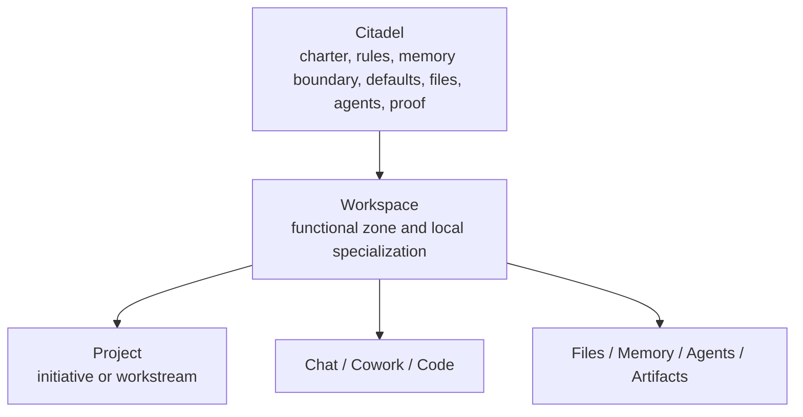

# Citadels Operating Model

GoatCitadel treats a Citadel as the top-level operating world for a person,
company, family, studio, client, or other durable domain. A workspace is a
functional zone inside that world, and a project is a concrete initiative inside
one workspace.

This document captures the staged product and runtime model introduced for the
Citadel parent scope. It is intentionally conservative: the gateway remains the
runtime source of truth, Mission Control remains an API client, and legacy
workspace-as-Citadel callers stay compatible while the product migrates.

## Target Shape

- Citadel owns the domain charter, global rules, memory boundary, provider/tool
  defaults, default agents, shared files, and durable proof.
- Workspace owns functional specialization inside the Citadel, such as
  Engineering, Marketing, Finance, Family Admin, or Client Delivery.
- Project owns bounded work inside one workspace.
- Chat, Cowork, Code, files, memory, agents, artifacts, and runtime decisions
  receive an effective scope that includes both `citadelId` and `workspaceId`.

Default Citadels are seeded as:

- `personal`, the default operating world for local single-operator use.
- `company`, a ready parent for organization and department-level workspaces.

## Inheritance

Citadel rules cascade downward. Workspace rules may specialize them, but cannot
weaken Citadel-level governance, safety, memory boundaries, approval
requirements, path jails, deny rules, auth boundaries, or tool restrictions.

The gateway resolves effective runtime scope before policy, memory, approvals,
tool grants, and durable execution decisions. That keeps inheritance in the
control plane rather than in Mission Control UI state.

## Runtime Scope

The effective runtime scope is resolved from explicit input, session metadata,
project ownership, workspace ownership, and finally the default Citadel.

Resolution order:

1. explicit `citadelId` or `workspaceId`
2. chat/cowork/code session metadata
3. project workspace ownership
4. default workspace and default Citadel

Mismatch rules are fail-closed:

- a workspace cannot be used under a different explicit Citadel
- a project cannot be used under a different workspace
- missing Citadel information falls back to `personal` only for compatibility

## Storage Model

The storage layer has first-class Citadel records and Citadel-linked
workspaces:

- `citadel_records.citadel_id`
- `workspaces.citadel_id`
- `runtime_decision_traces.scope.citadelId`

SQLite and Postgres migrations seed `personal` and `company`, then backfill
legacy Charter/Citadel data so existing workspace-based Citadel IDs continue to
resolve during the transition.

## Compatibility

Existing Library Citadel routes historically used `workspaceId` as the Citadel
identifier. The transition preserves that path as a fallback while Mission
Control now passes the active parent Citadel explicitly.

Gateway APIs continue to accept workspace-scoped requests. New Citadel-aware
clients should pass both `citadelId` and `workspaceId` when the distinction is
known.

## Migration Risks

- Naming collision: old "Citadel" Library pages can imply the Citadel is a
  workspace feature. UI copy should consistently describe Citadel as the parent
  operating world and workspace as the functional zone.
- Scope drift: Mission Control must not infer or persist canonical relationships
  outside gateway APIs.
- Policy weakening: workspace-specific rules must not override Citadel deny,
  approval, privacy, memory, path jail, or tool restrictions.
- Memory leakage: unscoped memory compose calls must remain compatible but
  Citadel/workspace-aware surfaces should pass explicit scope.
- Legacy data: older Charter records may have workspace-shaped IDs. Migrations
  keep them resolvable and relink matching workspaces.
- Test brittleness: page-level tests may omit Citadel props. Route components
  provide compatibility defaults while shell-owned paths pass the real Citadel.

## Staged Plan

1. Add contracts, storage columns, seeds, repositories, and effective scope
   helpers.
2. Thread `citadelId` through gateway runtime scope, policy access, memory
   compose, workspace APIs, and runtime decision traces.
3. Add Mission Control Citadel context selection and make workspace loading and
   creation Citadel-aware.
4. Move individual files, agents, artifacts, and project flows to explicit
   Citadel-aware APIs as their owners are touched.
5. Tighten governance inheritance once all major callers provide effective scope,
   then remove compatibility fallbacks in a dedicated migration.

