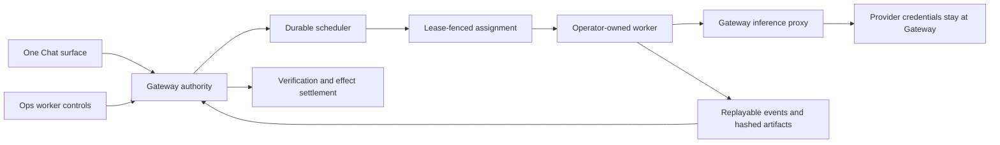

# OpenClaw and Hermes Parity Program

Last updated: 2026-07-20

> **Program freeze (2026-07-20):** Scope is frozen at the 2026-07-15 upstream pins recorded below. Upstream delta refreshes are suspended until the remaining rows complete; no re-pinning, no new rows. Execution of the frozen register continues in the operator's Claude session while the originating codex session is unavailable. The pre-freeze dirty tree (register/packet updates, verification lanes, and visual baselines dated 2026-07-15) is committed as the freeze checkpoint.

This is the active execution register for bringing GoatCitadel to broad, Goat-native capability parity with the pinned OpenClaw and Hermes Agent baselines. It supersedes report-only backlog interpretation; the historical OpenClaw epic ledger remains in place for its existing contract tests.

## Goal

Bring GoatCitadel to broad, Goat-native capability parity with the pinned July 2026 OpenClaw and Hermes Agent baselines, including operator-owned remote workers, while preserving one Chat surface, deny-wins governance, approvals, path jails, provenance, and operator-visible runtime truth.

Parity in this program means the useful capability exists behind GoatCitadel's own runtime and trust boundaries and has exact acceptance evidence. It does not mean matching upstream names, channel count, provider count, UI layout, or multi-tenant cloud scope.

## Evidence Baseline

| Source | Pin | Notes |
|---|---|---|
| GoatCitadel | `ef079d74ae649dd2f7a817fd3b57fc7674d7fe30` | `main`, `origin/main`, and remote `main` matched when this program started. |
| GoatCitadel first integration checkpoint | `5793220b1f38714f0206839d83c6c53720c2d7e8` | Local branch `codex/openclaw-hermes-parity-20260714`; a fresh detached worktree at the exact SHA passed Gateway typecheck and 90 focused tests with a clean status. The commit is not pushed, and later dirty-tree work is outside this checkpoint. |
| GoatCitadel HX-501 checkpoint | `aa68ba9d9b13671c5e6587b9bead37568d034a31` | Local parity branch; commits the production-dark remote-worker admission contracts/storage foundation and committed source migration heads SQLite `170` / PostgreSQL `112`. The commit is not pushed. |
| GoatCitadel current parity checkpoint | `24c04fa5677fc0eb737c756bed690622e4a98d7c` | Local parity branch; includes governed search, external-source recovery, admitted-node authority and deterministic activation approvals, requester-scoped MCP hardening, remote-worker admission/assignment/transport foundations, production-dark native-listener startup composition, the first canonical HX-507 registry reads, the model-aware HX-403 provider-reasoning correction at `56e644e2a`, and the HX-411 cross-dialect session-control authority through committed SQLite `172` / PostgreSQL `114`. The commit is not pushed; active 173/115 and 174/116 HX-411 work is intentionally uncommitted. |
| OpenClaw report baseline | `f8aa995856ecec703e7391e0f3818a16ac844847` | Pinned by the 2026-07-11 report. |
| OpenClaw program snapshot | `e330e4a17d3c9705ff79da123efe259acd9bd0f3` | Observed 2026-07-13 PT; 592 commits ahead of the prior program snapshot and 1,694 commits ahead of the report baseline. Stable `v2026.7.1` had replaced the prior beta as the latest release. |
| OpenClaw live delta refresh | `c3f08eba177d5b3b1dc0dc3d7c3856ae959ce09e` | Observed 2026-07-14 PT; 286 commits after the program snapshot. Selective review resolved all 49 cited commits and added one new row, `HX-415`. |
| OpenClaw closing refresh | `ed496733075ebad627de0404713cbdf131e14a2c` | Observed 2026-07-14 PT; 347 commits after the live-delta pin. The reviewed changes strengthen existing rows; latest stable release remained `v2026.7.1`. |
| OpenClaw post-closing refresh | `bb3fae834810cf466be70668b1bce2bd16e31227` | Observed 2026-07-14 PT; 110 commits after the closing pin. The reviewed changes strengthen existing rows; latest stable release remained `v2026.7.1`. |
| OpenClaw 2026-07-15 refresh | `ff4d854167ce06350ec5f477e28b3e55b4089b15` | Observed 2026-07-15 PT; 109 ancestor-verified commits after the post-closing pin. The reviewed changes strengthen existing rows; stable remains `v2026.7.1`, while `v2026.7.2-beta.1` is prerelease evidence only. |
| Hermes report baseline | `5ecc07986f46463ca3096679b03a46402eb19cee` | Pinned by the 2026-07-11 report. |
| Hermes program snapshot | `b663d50a6a0101d5214112b24ffe20924af32beb` | Observed 2026-07-13 PT; 119 commits ahead of the prior program snapshot and 225 commits ahead of the report baseline; latest release remained `v2026.7.7.2`. |
| Hermes live delta refresh | `444b5e96fa2829c29cfd7ecdc84d89f83a1441da` | Observed 2026-07-14 PT; 52 commits after the program snapshot. The reviewed deltas extend existing rows; no additional standalone row was justified. |
| Hermes closing refresh | `9baa7d4673ce89f09378daa3660530f8bf142708` | Observed 2026-07-14 PT; 91 commits after the live-delta pin. The reviewed changes strengthen existing rows; latest stable release remained `v2026.7.7.2`. |
| Hermes post-closing refresh | `569b912d7d0931c7256e9f5fb326609e9deda377` | Observed 2026-07-14 PT; 18 commits after the closing pin. The reviewed changes strengthen existing rows; latest stable release remained `v2026.7.7.2`. |
| Hermes 2026-07-15 refresh | `58033baba282ef133b219731eb9d0dd01f0558fe` | Observed 2026-07-15 PT; 87 ancestor-verified commits after the post-closing pin. The reviewed changes strengthen existing rows; latest stable release remains `v2026.7.7.2`. |

Primary review inputs:

- `reports/external-repo-reviews/2026-07-04-weekly-hermes-openclaw-parity.md`
- `reports/external-repo-reviews/2026-07-07-hermes-openclaw-parity.md`
- `reports/external-repo-reviews/2026-07-11-weekly-hermes-openclaw-parity.md`
- [OpenClaw snapshot delta](https://github.com/openclaw/openclaw/compare/f8aa995856ecec703e7391e0f3818a16ac844847...2ecd485cd5f41f8884117eac91e9c57fbe7c4c98)
- [Hermes snapshot delta](https://github.com/NousResearch/hermes-agent/compare/5ecc07986f46463ca3096679b03a46402eb19cee...e589b739ca70eba00aa90fd3d0228bada00dbf8f)
- [OpenClaw final refresh](https://github.com/openclaw/openclaw/compare/2ecd485cd5f41f8884117eac91e9c57fbe7c4c98...e330e4a17d3c9705ff79da123efe259acd9bd0f3)
- [Hermes final refresh](https://github.com/NousResearch/hermes-agent/compare/e589b739ca70eba00aa90fd3d0228bada00dbf8f...b663d50a6a0101d5214112b24ffe20924af32beb)
- [OpenClaw 2026-07-14 live delta](https://github.com/openclaw/openclaw/compare/e330e4a17d3c9705ff79da123efe259acd9bd0f3...c3f08eba177d5b3b1dc0dc3d7c3856ae959ce09e)
- [Hermes 2026-07-14 live delta](https://github.com/NousResearch/hermes-agent/compare/b663d50a6a0101d5214112b24ffe20924af32beb...444b5e96fa2829c29cfd7ecdc84d89f83a1441da)
- [OpenClaw 2026-07-14 closing delta](https://github.com/openclaw/openclaw/compare/c3f08eba177d5b3b1dc0dc3d7c3856ae959ce09e...ed496733075ebad627de0404713cbdf131e14a2c)
- [Hermes 2026-07-14 closing delta](https://github.com/NousResearch/hermes-agent/compare/444b5e96fa2829c29cfd7ecdc84d89f83a1441da...9baa7d4673ce89f09378daa3660530f8bf142708)
- [OpenClaw 2026-07-14 post-closing delta](https://github.com/openclaw/openclaw/compare/ed496733075ebad627de0404713cbdf131e14a2c...bb3fae834810cf466be70668b1bce2bd16e31227)
- [Hermes 2026-07-14 post-closing delta](https://github.com/NousResearch/hermes-agent/compare/9baa7d4673ce89f09378daa3660530f8bf142708...569b912d7d0931c7256e9f5fb326609e9deda377)
- `docs/review/UPSTREAM_DELTA_REFRESH_2026-07-14.md`
- [OpenClaw 2026-07-15 delta](https://github.com/openclaw/openclaw/compare/bb3fae834810cf466be70668b1bce2bd16e31227...ff4d854167ce06350ec5f477e28b3e55b4089b15)
- [Hermes 2026-07-15 delta](https://github.com/NousResearch/hermes-agent/compare/569b912d7d0931c7256e9f5fb326609e9deda377...58033baba282ef133b219731eb9d0dd01f0558fe)
- `docs/review/UPSTREAM_DELTA_REFRESH_2026-07-15.md`

The final OpenClaw pin refresh added four parity-relevant deltas after the first program draft: ambiguous cron direct-delivery retries (`ac31549853`), interrupted-turn context preservation (`432da8b3cb`), anchored history reopening around search hits (`143fed81c1`), and staged invalid-versus-signed SMS webhook quotas (`ef9383d88a`). They map to `HX-204`, `HX-208`, `HX-310`, and `HX-108` respectively.

The 2026-07-13 closing refresh added further parity-relevant behavior. OpenClaw added governed Codex/Claude memory migration (`4319ddbe8c`), resumable session-history skill-workshop scans (`cf8b57e7d0`), self-learning conflict recovery (`2198591d0f`), route-provenance preservation (`d6d09293c2`), worker bundle/vendor integrity (`553c245961`), dispatch-owned live-event acceptance and acknowledgement diagnostics (`fc3ba072f3`, `f264f4517a`), and fleet log/restore hardening (`53d7192c73`). Hermes added strict bounded/cycle-safe session imports (`b51d365ef0`, `ac705b52c9`), Windows/Git-Bash-safe snapshot paths (`f2fcf89c1f`), API/cron drain reservations (`021ee34546`, `104ffeae23`, `ffc10cc659`, `915f1bf1bc`), a persistent ineffective-compaction breaker (`af7dceaf77`), request-aware output-cap recovery (`62ea800586`, `57f1814832`), model-catalog-scoped provider request bodies (`8a5f8379ed`), and empty credential-pool rejection (`5d524d0427`). These deltas strengthen `HX-401`, `HX-404` through `HX-407`, `HX-412`, and `HX-501` through `HX-505`; the context-pressure work is tracked explicitly in new row `HX-414`.

The 2026-07-14 live delta refresh found one genuinely new requirement: requester-scoped MCP connection resolution, tracked as `HX-415`. The remaining verified deltas strengthen existing owners: post-commit canonical board refresh (`HX-410`), external-source liveness and control-generation revoke (`HX-407`/`HX-411`), typed remote-node capability and resource truth (`HX-408`, `HX-501`-`HX-507`), structured/multimodal council projection (`HX-403`), normalized skill/core-command collision proof (`HX-401`/`HX-413`), and bounded liveness, persistence, restart, cron, and worker-exit regression matrices. The authoritative committed ledger has `165/107` for `HX-413`, `166/108` for `HX-407`, `167/109` for `HX-410`, `168/110` plus `169/111` for `HX-408`, `170/112` for HX-501 admission, `171/113` for the paired HX-502/HX-504 assignment/event/settlement foundation, and `172/114` for the HX-411 cross-dialect control-generation/auth-coupling foundation. No later pair is allocated by this register entry.

The final closing refresh added no standalone row. OpenClaw's strongest new signals extend `HX-501`-`HX-507` cloud-worker admission, recovery, target handoff, teardown, route pinning, stream bounds, and error sanitation; `HX-306`/`HX-503` provider-body deadlines; `HX-302`/`HX-414` byte-aware compaction; `HX-108`/`HX-406`/`HX-505` transport, path, and resource bounds; and `HX-413` untrusted-plugin rejection. Hermes extends `HX-306`/`HX-308`/`HX-503` with fail-closed cheap-model fallback and zero-chunk/provider-stream truth; `HX-305`/`HX-415` with MCP parameter schemas, null-argument rejection, and resource materialization; `HX-505` with bounded foreground terminal capture; and `HX-207`/`HX-411` with exact-session fail-closed restored delegation completion. After `70bb46fac` committed 172/114, a fresh head/reservation scan assigned SQLite 173 / PostgreSQL 115 exclusively to the next HX-411 lifecycle and durable mutation-admission tranche under `docs/review/HX_411_NEXT_TRANCHE_PACKET_2026-07-14.md`.

The post-closing refresh also adds no standalone row. OpenClaw's new plugin-byte, active-turn queue/steer, session-handoff,
approval-rescue, attachment, device-pair, memory-preparation, and tool-schema changes map to existing `HX-413`, `HX-411`,
`HX-305`, and `HX-415` owners or are already covered by stricter GoatCitadel behavior. Hermes' council reasoning change exposed
one bounded `HX-403` correction: only canonical C3 synthesis inherits the acting profile's normalized reasoning effort; C1
advisors remain without an inherited global-high override. Dynamic MCP/tool semantic-schema normalization remains a targeted
`HX-305`/`HX-415` audit, not a permissive repair or new row. Grok/xAI-specific Hermes work is excluded and must not add an
Elon Musk, X, xAI, or Grok provider/integration surface.

The 2026-07-15 refresh adds no standalone row. OpenClaw's operator-run/reclaim cloud-worker sessions, immutable workspace
manifests and journals, crash reconciliation, bounded heartbeat queues, durable plugin/image staging, model-scoped usage
limits, and timestamped cost corrections strengthen `HX-501`-`HX-507`, `HX-411`, `HX-401`/`HX-413`, `HX-306`, and
`HX-414`. Hermes' requester-authenticated HTTP MCP, exact catalog version pins, multiplexed inbound profile routing,
dead-session cache eviction, finite provider wall time, incomplete/refusal truth, multimodal compaction markers, passive
SQLite checkpoints, and all-or-nothing Model Council configuration strengthen `HX-415`, `HX-305`/`HX-306`, `HX-411`,
`HX-302`/`HX-414`, `HX-104`/`HX-105`/`HX-107`, and `HX-403`. The exact acceptance additions and exclusions are frozen in
`docs/review/UPSTREAM_DELTA_REFRESH_2026-07-15.md`; migration ownership and the current HX-411 execution order are unchanged.

## Non-Negotiable Product Boundaries

- Chat remains the only primary conversation surface. Agentic planning, delegation, approvals, code capability, model comparison, and background work must stay available from Chat rather than reintroducing primary Cowork or Code panes.
- The Gateway remains the control plane. Mission Control, mobile clients, workers, plugins, MCP servers, and external harnesses are clients of Gateway-owned auth, policy, approval, audit, and persistence.
- Deny-wins policy, path jails, network allowlists, approval gates, provenance, and inspectable-versus-callable separation remain authoritative.
- Learned, generated, imported, or remotely published skills remain non-callable until their exact bytes, provenance, health, policy posture, and activation approval are recorded.
- Code Mode remains governed trusted-code execution. This program does not claim hostile-code sandboxing.
- Remote workers are operator-owned extensions of one GoatCitadel installation. This program does not create a general multi-tenant worker cloud.
- Smart approval suggestions may be advisory. They cannot replace explicit human approval or weaken deny-wins policy.
- Do not add xAI, Grok, X, or Cursor-specific provider surfaces as parity work.

## Goal and Subagent Execution Model

`/root` is the Goatherder and owns scope, dependency order, conflict avoidance, integration, and the final completion audit.

Each implementation tranche uses the minimum useful role set:

1. **Architect/Researcher** pins upstream evidence, locates GoatCitadel owners, and updates this register without changing runtime code.
2. **Coder** implements one bounded, independently testable owner slice. Concurrent Coders must have disjoint file ownership or isolated `codex/` worktrees.
3. **QA** independently reviews the resulting diff, adds or requests missing adversarial proof, and reruns the named lane. The author of a slice does not provide its only completion verdict.

At most three subagents run alongside the Goatherder. A row moves to `complete` only after the acceptance evidence is current at the integrated HEAD. The active goal remains open until every required row is `complete` or explicitly retained as `regression_only` with fresh proof.

Status values:

- `complete`: implementation and acceptance proof are current.
- `regression_only`: GoatCitadel is already at or ahead of the target; keep the proof green.
- `in_progress`: an active implementation tranche owns the row.
- `partial`: a real owner exists, but the exact behavior or proof is incomplete.
- `missing`: no conforming implementation was found.
- `external_proof`: the contract/API exists here, but completion evidence must come from another owned repo or runtime.

## Closed Baseline: Preserve, Do Not Rebuild

| ID | Capability | Status | Current evidence |
|---|---|---|---|
| `HX-B01` | Durable runs, approval wait/resume, first-winner decision truth, and restart recovery | `regression_only` | Durable-run, approval lifecycle, effect lease, and recovery suites; `0bda04e48`. |
| `HX-B02` | External side-effect no-replay, `unknown_after_send`, and manual reconciliation | `regression_only` | External side-effect runner/repo matrix and production Activepieces replay; `c15fda436`. |
| `HX-B03` | Bounded external HTTP/body reads | `regression_only` | `check:bounded-response-reads` and policy-engine coverage; `488ac9078`. |
| `HX-B04` | MCP child crash, stream bounds, cancellation, HTTP deadline, and quarantine proof | `regression_only` | MCP regression pack; `a0916c958`. |
| `HX-B05` | Atomic memory batch mutation plus operator UI failure truth | `regression_only` | Real transactional-storage proof and batch UI; `6ad30d211`. |
| `HX-B06` | Transcript full-text search and cursor/offset paging | `regression_only` | Transcript repositories, search routes, and paging clients. |
| `HX-B07` | Provider credential isolation and route-level usage/cost ledger foundations | `regression_only` | Secret store, provider projections, usage and cost repositories. |
| `HX-B08` | Exact-SHA release certificate and Ops release evidence | `regression_only` | `docs/1_0_RELEASE_EVIDENCE.md` and release-certificate scripts. Shell-wide identity remains `HX-303`. |
| `HX-B09` | GPT-5.6 and Codex OAuth catalog alignment | `regression_only` | `35f686ffd`, `ef079d74a`, provider template and route tests. |
| `HX-B10` | Governed candidate-only skill creation | `regression_only` | Skill mutation/candidate lifecycle and capability activation gates. The remaining `/learn` gap is operator flow in `HX-401`. |
| `HX-B11` | Local bridge at-most-once delivery and atomic forget/workspace isolation | `regression_only` | `58cb05963`, `e4663809b`, and `3bbbc0721`. |
| `HX-B12` | Durable Chat continues after a passive SSE disconnect | `regression_only` | Chat turn entry detaches durable work from passive transport loss; only explicit operator stop cancels it. General observer/producer lifetime remains `HX-206`. |
| `HX-B13` | Recursive unsafe configuration-key filtering | `regression_only` | Config sanitization rejects inherited and dangerous keys; keep prototype, own-key, and path traversal coverage green across mutation routes. |

## Phase 0 - Program Truth

| ID | Requirement | Owner | Status | Acceptance evidence |
|---|---|---|---|---|
| `HX-001` | Keep one authoritative register with observed-at pins, owners, status, acceptance gates, and do-not-copy boundaries. | Docs / Goatherder | `complete` | This document passes `pnpm docs:check`; historical parity ledgers link here without breaking their alignment tests. |
| `HX-002` | Re-audit current GoatCitadel owners before each phase and close stale report gaps rather than reimplementing them. | Architect / QA | `complete` | The Phase 0 handoff records inspected GoatCitadel HEAD `ef079d74a`, observed upstream pins, owner files, and reconciled status rows; repeat the audit before each later phase. |

## Phase 1 - Recovery, Integrity, and Trust

| ID | Requirement | Upstream driver | GoatCitadel owner | Status | Acceptance evidence |
|---|---|---|---|---|---|
| `HX-101` | Verify SQLite backup payloads semantically with `integrity_check` and `foreign_key_check` before restore mutation; retain Postgres dump behavior. | OpenClaw verified SQLite snapshots | Gateway backup verification and retention services | `complete` | Checksum-valid corruption, FK violations, Windows-equivalent path aliases, and Postgres copy misuse fail before mutation; repeated verification is non-mutating and restore consumes its verified stage; 29 focused tests and `pnpm verify:backup:roundtrip` passed with artifact `2026-07-13T05-22-32-002Z-backup-roundtrip-806e46b2`. |
| `HX-102` | Bind skill validation, copy, provenance, activation, and callable projection to one deterministic exact-byte tree manifest. | Hermes exact-file bundle provenance; OpenClaw immutable skill refs | Skill import, lifecycle, capability catalog | `complete` | Mutation-during-import and post-install drift fail closed; legacy missing provenance is inspectable-only; activation rechecks the installed tree. The shared 96-file / 384-entry / 4 MiB envelope, bounded `source.json`, zip-expansion proof, and same-size drift proof passed 79 independent focused tests; the legal-maximum uncached callable recheck measured about 33 ms warm on the implementation host. |
| `HX-103` | Persist owner, expiry, and monotonic generation leases for orchestration worktrees; fence stale release/reap attempts. | OpenClaw session worktree leases | Orchestration worktree service and storage | `complete` | Newer generations atomically own path/status/base-ref/token fields; heartbeat loss fences the run and linked durable worker; restart blocks on a live prior lease and CAS-adopts a higher generation after expiry before phase dispatch. Independent proof passed 72 Gateway tests, 11 focused storage tests, and `verify:durable:recovery` with artifact `2026-07-13T05-45-29-660Z-durable-recovery-eee27117`. Live Postgres execution remains environment-blocked; static migration and shared SQL parity passed. |
| `HX-104` | Add revision/CAS semantics to mutable operator resources that can lose concurrent writes: settings, workspaces, cron, skills, sessions, boards, and config-backed resources. | OpenClaw lost-update fixes and file hash-CAS | Gateway mutation routes and owning repositories | `complete` | Settings mutations and workspace/project storage, routes, shared clients, and UI now use positive revisions with structured stale-write conflicts. Workspace/project conflict proof passed 34 Gateway, 12 shared-client, and 53 Mission Control tests, including refetch-with-draft-preservation and retry against revisions `11 -> 12` and `7 -> 8`. All six remaining Settings panels now refetch on real 409s, preserve only the relevant editable draft, and retry with refreshed revisions across 100 focused Mission Control tests. A single session-aggregate revision now fences metadata, base preferences, autonomy preferences, project assignment, delete, proactive policy, and goals; its public routes, shared client, and one-Chat controls keep refreshed server state canonical while preserving rejected drafts separately for explicit retry. Independent integrated proof passed 70 Gateway, 19 shared, 68 threaded-controller, and 14 drawer tests. Cron specs and every public update/start/pause/delete path now use positive revisions, semantic no-ops, structured conflicts, and separate non-bumping runtime telemetry across SQLite v147 and Postgres v89; independent proof passed 54 Gateway, 9 shared-client, and four real-SQLite/migration tests. Task-board storage, routes, shared clients, Kanban, and one-Chat controls now carry positive revisions through every public writer, atomic bulk operation, artifact verification, and conflict retry. Independent QA passed 162 focused tests plus six package typechecks and confirmed lock-before-write, post-commit events, and no automatic conflict replay. Skill creation, update, state, policy, candidate promotion, rollback, and revoke now share aggregate CAS; first-revision creation is atomic with its domain mutation, duplicate creators fail closed, file/Code Mode conflicts refetch canonical state without automatic replay, and exact-byte reuse verifies hashes before indexing. Integrated `verify:skill-learning` passed all 7 configured scenarios in artifact `2026-07-14T06-39-00-920Z-skill-learning-64013a72`; live two-client PostgreSQL remains conditionally skipped because no test URL is configured. Future mutable operator resources, including trusted boards in `HX-410`, must inherit the same CAS contract. |
| `HX-105` | Make runtime/config hot reload transactional: parse and validate a complete candidate, atomically swap only on success, retain the last good generation on failure. | OpenClaw transactional hot reload | Config sync, Gateway runtime settings, provider/tool/channel registries | `complete` | Settings, autonomy, database cutover, provider-secret, and cron configuration now commit through one generation owner per resource, record the durable decision before owner effects, retain recovery markers through exact compensation or forward reconciliation, and fence reads/mutations while recovery is active. Provider-secret receipts are secret-free, restore the exact keychain/env/inline owner, and verify both process and durable `.env` state. Cron generations rebuild specification-only projections under one revision lock while runtime telemetry remains non-bumping. Startup reconciles committed generations before clearing markers; production split-file persisters and adopt bridges have no callers. Independent integrated proof passed 133 Gateway tests with one conditional skip, the cron owner/integration matrix passed 142 tests, Gateway typecheck passed, and static ownership scans found no production persistence or adoption bypass. |
| `HX-106` | Expose sanitized authenticated readiness grounded in live owner state. | Hermes authenticated runtime readiness | Health/readiness routes, doctor, Ops | `complete` | Public `/health` exposes only service/status/readiness; operator-authenticated `/api/v1/ops/readiness` distinguishes database and config-generation configured/degraded/ready state without raw issues or payloads. SQLite readiness opens the configured database read-only, runs `SELECT 1`, reports migration version and latency, closes in `finally`, and fails closed with generic errors; config readiness exposes only revision/generation, transaction, mirror-repair, and sanitized recovery state. Independent proof passed the focused readiness suites, Gateway typecheck, and `verify:auth:matrix` with artifact `2026-07-13T06-12-01-957Z-auth-matrix-9558ce3d`. |
| `HX-107` | Add online/concurrent SQLite snapshot consistency proof in addition to offline manifest/hash verification. | OpenClaw verified and concurrent snapshot repository | Backup creation, storage coordination, release proof | `complete` | Storage-owned Node 24 `node:sqlite.backup` creates a self-contained staged database without checkpointing or copying the live DB/WAL/SHM. Concurrent commits yield a coherent pre/post snapshot that opens read-only, passes integrity/FK checks, restores successfully, and leaves live DB/WAL bytes unchanged; cleanup, path-jail, and legacy-client cases passed independent proof plus `verify:backup:roundtrip` artifact `2026-07-13T06-11-01-385Z-backup-roundtrip-0cf31775`. Live Postgres dump execution was not rerun; its existing path was unchanged. |
| `HX-108` | Preserve current SSRF, ingress, plugin metadata, approval, and MCP policy boundaries against the live upstream regression set. | OpenClaw July security fixes | Policy engine, browser/network guard, plugins, MCP, auth | `complete` | Independent focused proof covered staged signed-webhook quotas, context-wide HTTP/WebSocket guards, proxy-side DNS pinning, explicit-loopback grants, WebRTC non-proxied-UDP denial, bounded plugin descriptor reads, MCP/approval policy, Origin ordering, and negative config scanning. The 137-test policy/browser, 61-test webhook, 26-test Gateway/auth, 188-test MCP/approval, and 9-test extension matrices passed with live Chromium probes, six-scenario MCP conformance, auth artifact `2026-07-13T06-47-51-895Z-auth-matrix-d9de3c37`, security artifact `2026-07-13T06-49-33-312Z-security-evals-25eb0745`, and clean integrated runtime-truth artifact `2026-07-13T08-23-06-286Z-runtime-truth-72bf50b0`. |

The integrated Phase 1 gate passed storage migration parity, runtime truth artifact `2026-07-13T08-23-06-286Z-runtime-truth-72bf50b0`, and backup-roundtrip artifact `2026-07-13T08-24-45-019Z-backup-roundtrip-65effb15`. The roundtrip proof now recursively mutates and compares config-generation receipts as part of the recoverable configuration set.

## Phase 2 - Durable Liveness and Settlement

| ID | Requirement | Upstream driver | GoatCitadel owner | Status | Acceptance evidence |
|---|---|---|---|---|---|
| `HX-201` | Emit tool-activity heartbeats that keep an active tool from being mistaken for a dead provider stream and surface the distinction to operators. | OpenClaw tool heartbeat | Tool invocation, chat turn runner, stream watchdog, Chat timeline | `complete` | Actual `tool_start` and retained monotonic `tool_activity` chunks identify the tool run, tool name, start time, activity time, elapsed time, and sequence while leaving transcript reducers unchanged. Stale pre-existing runs cannot manufacture liveness, true provider idle still aborts, and success/error/cancel stop the heartbeat. The iterator wrapper attaches one settlement pair per pending step, cleans every timer/listener/waiter, and never strands cancellation on an abort-ignorant tool. Independent QA passed 84 Gateway, 10 shared-client, 45 threaded-surface, and 33 runner/watchdog tests plus all four package typechecks; manual probes closed `return()` in 0 ms, abort-ignorant cancellation in 15 ms, and preserved canonical cancellation for a signal-aware tool. |
| `HX-202` | Share local LLM/embedding processes through ref-counted service leases with readiness, idle shutdown, crash recovery, and diagnostics. | OpenClaw local provider leases | llama.cpp runtime, embeddings, Ops runtime | `complete` | Chat, model discovery, policy embeddings, memory context, and verification seeds acquire strict configured-origin leases; concurrent waiters share startup while abort, release, idle-stop, config transitions, close, crash recovery, and restart exhaustion are generation-fenced. Owned Windows/POSIX process trees are retained through leader exit and terminated with bounded escalation; external services are never killed. Persisted evidence is fingerprinted, ordered, bounded, secret-free, and projected in Settings/Ops. Independent QA passed the 66-test lifecycle matrix, 320/320 repeated lease stress cases, Gateway typecheck, a 133-test consumer matrix, 72 focused embedding/memory tests, and 77 operator-surface tests. Runtime truth artifact `2026-07-13T10-14-17-246Z-runtime-truth-3cc6f77d` and surface-regression artifact `2026-07-13T10-14-45-624Z-surface-regression-2cba06b4` passed. POSIX escalation is deterministic hook proof; a live detached multi-process POSIX tree remains release-environment validation rather than a parity blocker. |
| `HX-203` | Acknowledge supported inbound channel/voice events only after durable acceptance and use persistent claim/commit dedupe. | OpenClaw durable webhook acceptance and claimable dedupe | Webhook routes, channel dispatch, voice ingest, storage | `complete` | Generic signed webhooks, LINE/WhatsApp batches, Telegram normal/voice/command/callback paths, and Discord normal/slash-command paths commit secret-free durable admission before acknowledgement, use exact-generation claims and deterministic turn identities, and recover across the command side-effect boundary without duplicate execution. Voice and bot-loop decisions are restart-safe. Independent QA passed 173 Gateway and 11 storage durability tests plus typechecks. Signal remains truthfully outbound-only because the current bridge has no acknowledgement/replay contract: stale inbound flags fail closed, no production `/v1/receive` path remains, and the final channel-runtime artifact `2026-07-13T13-12-11-495Z-agentic-channels-runtime-34c95123` passed. |
| `HX-204` | Treat scheduled `agent_turn` enqueue as admitted, not successful; settle each cron run from its child durable terminal state with generation fencing, and never auto-retry an ambiguous direct delivery. | OpenClaw cron settlement recovery and ambiguous-delivery fix | Cron automation, durable events, external-effect ledger, cron storage | `complete` | Scheduled occurrences and admission keys are stable, enqueue returns admitted/pending rather than success, and canonical cron-run state distinguishes admission, execution, waiting, post-commit delivery, and terminal settlement. Startup/maintenance reconciliation is generation-fenced; stale children cannot settle newer runs; terminalization verifies and clears the exact owner atomically; unknown-after-send stays in manual reconciliation with the active lease retained. Focused proof passed 72 Gateway and 7 storage tests plus contracts/storage/Gateway typechecks. |
| `HX-205` | Persist Code Mode verification state separately from execution completion and from artifact presence. | Hermes completion/verification contracts | Code Mode contracts, run repo, execution service, Chat workbench | `complete` | Execution, trusted artifact-integrity hashes, and semantic verification are separate durable truths. Successful execution begins `completed_unverified`; only a server-owned named proof bound to exact run/artifact/worktree hashes can reach `verified`; failures and later drift become `verification_failed` or `stale`. The append-only SQLite/Postgres evidence ledger is bounded and immutable, legacy/missing evidence fails closed, scoped APIs accept no raw command, and Chat labels each claim separately without a sandbox claim. Independent QA passed 135 focused API/storage/client/UI tests and five package typechecks; follow-up hardening rejects junction/symlink artifact escapes and suppresses repository-controlled Git diff/fsmonitor helpers under a bounded sanitized probe, with 9/9 adversarial verifier tests and Gateway typecheck green. |
| `HX-206` | Separate SSE/stream transport lifetime from durable run control so disconnect is not cancellation and reconnect is replay-safe. | Hermes SSE lifetime fix; OpenClaw replay-safe streaming | Realtime leases, retained events, chat streaming | `regression_only` | Live re-audit found durable Chat already ignores passive SSE abort while explicit operator cancel remains authoritative; retained chunks/events use monotonic sequence and event IDs, reconnect resumes by watermark, client processing dedupes, and general realtime attaches before bounded replay with gap detection and persistent observer leases. Fresh focused proof passed 46 Gateway, 37 threaded-surface, and 3 real-storage lease tests. |
| `HX-207` | Add detachable child-run watchers with durable watermarks and parent state-change notices. | OpenClaw child watchers/watermarks | Delegation, durable events, Chat background-task rail | `complete` | Watchers persist monotonic child-event watermarks, emit deterministic parent notices exactly once, detach/reattach with bounded catch-up, reject cycles, and are created by real Chat delegation/orchestration dispatch without waking approval-waiting parents. Independent hardening bounded IDs, metadata, payload depth/items/bytes, and secret-bearing keys before persistence; oversized payloads retain only hash/size/reason evidence. A durable round-robin cursor prevents an idle first page from starving later watchers. Focused proof passed 104 tests across storage, Gateway wiring/routes, and the shared client; contracts, storage, and shared-client typechecks passed. Live PostgreSQL row-lock execution remains environment-blocked, while Postgres 94 schema/lock parity is covered statically. |
| `HX-208` | Make replay-safe Code/session recovery explicit after interruption or Gateway restart, including interrupted-turn context, final-source delivery, and terminal outcome preservation. | OpenClaw Code recovery, interrupted-turn context, and final-source fixes | Durable recovery, Code Mode, transcript outbox | `complete` | Generation-fenced execution phases distinguish safe pre-dispatch replay from post-boundary manual reconciliation; restart preserves completed transcript prefixes, exact final-source delivery, terminal receipts, artifact hashes, and bounded/redacted interruption evidence without duplicate mutation or false completion. Independent QA fixed the stale approval-effect retry gap and manual-reconciliation receipt flattening, then passed 203 Gateway, 22 storage/schema, and 30 Mission Control tests plus four typechecks. `pnpm verify:durable:recovery` passed 3/3 with artifact `2026-07-13T15-21-26-557Z-durable-recovery-1a58d39f`. Live PostgreSQL execution remains environment-blocked; static SQLite/Postgres parity passed. |

The integrated Phase 2 gate passed durable recovery artifact `2026-07-13T15-21-26-557Z-durable-recovery-1a58d39f`, agentic channel runtime artifact `2026-07-13T15-14-12-719Z-agentic-channels-runtime-02314e12`, runtime-truth artifact `2026-07-13T15-39-01-621Z-runtime-truth-08e1a416`, the 203-test focused Code Mode/restart recovery matrix, and `pnpm docs:check`. No scenario was skipped, degraded, or not configured in the named lanes. Live PostgreSQL execution remains an explicit environment gap rather than inferred proof.

## Phase 3 - Immutable Evidence and Operator Truth

| ID | Requirement | Upstream driver | GoatCitadel owner | Status | Acceptance evidence |
|---|---|---|---|---|---|
| `HX-301` | Persist an immutable resolved capability profile for every governed turn, not only Code Mode. | OpenClaw scoped capability profiles | Capability system, chat/durable metadata, run detail | `complete` | Every governed turn now atomically binds a secret-free immutable profile and persisted catalog to the exact route, provider/model/options, actor/scope, governance posture, permissions, tool schemas, and trusted-skill bytes/provenance used for execution. Admission fails closed for collisions, corruption, incomplete stores, inactive or drifted skills, broader live capabilities, and weaker current policy; durable replay/backfill preserves content, selection, and profile binding. Independent QA passed 236 Gateway, 8 storage, and 13 threaded-surface tests, seven affected package typechecks, `pnpm docs:check`, and runtime truth with zero findings in artifact `2026-07-13T16-06-37-898Z-runtime-truth-2d002cbd`. |
| `HX-302` | Prevent compaction thrash using actual provider/token usage and persisted boundary state. | Hermes real-usage anti-thrash | Chat compaction, usage capture, session state | `complete` | Compaction now summarizes only complete eight-turn windows, preserves the six most recent turns plus rich/partial content verbatim, and binds persisted hysteresis to the exact effective provider, model, and capability dimension. The initial threshold and later 2,200/1,600/600 trigger-rearm-growth cycle use the first provider request's reported input usage when available and a deterministic estimate only when it is absent; newer failed, fallback, or mismatched evidence prevents stale older usage from being reused. Restart, forks, equal-turn writers, corruption, deletion, bounded 512-turn boundaries, and per-session retention are fail-closed. Independent QA found and fixed four defects, then passed 33 compaction/usage tests, 21 exact-history/profile tests, 6 storage concurrency/retention/migration tests, 22 targeted Code Mode recovery tests, four package typechecks, and scoped diff checks. Live PostgreSQL execution remains environment-blocked; SQLite migration 155 and PostgreSQL migration 97 have static parity coverage. |
| `HX-303` | Show build/source/release/proof identity in the shell at all times, with detailed evidence in Ops. | OpenClaw build identity chip | Mission Control shell, runtime API, release certificate | `complete` | Gateway-owned dev/source/packaged identity binds exact SHA, version, integrity, release status, and fixed-root evidence; malformed, missing, stale, contradictory, swapped, truncated, or cached-incomplete proof fails closed. Release assembly snapshots and re-verifies exact certificate/evidence bytes and stages a hash-matched sidecar; standalone installers remain explicitly unverified without it. The pinned shell chip and detailed Ops view distinguish source and release truth without raw JSON. Independent QA passed 23 Gateway, 58 Mission Control, and 33 release/packaging tests plus four typechecks and docs/diff checks. Surface regression passed 68/68, including a 390x844 pinned-identity screenshot, with artifact `2026-07-13T15-36-45-403Z-surface-regression-f8de105b`; runtime truth passed with artifact `2026-07-13T15-39-01-621Z-runtime-truth-08e1a416`. Live signed GitHub, Authenticode, and full Inno install/uninstall proof remain release-environment validation. |
| `HX-304` | Provide a durable background-task rail in Chat with live tool state, detach/reattach, cancellation, blockers, and synthesis lineage. | Hermes fan-out UX; OpenClaw background rail | Delegation, tasks, durable events, Chat | `complete` | The one-Chat rail now projects Gateway-owned canonical child-run state, retained watcher/tool/approval signals, explicit blockers/unknowns, detach/reattach/cancel controls, and generation-bound parent synthesis lineage. Exact stored output bytes remain hash-addressed while public previews and cancellation reasons are bounded/redacted; missing, cross-scope, malformed, duplicate, out-of-order, or capped evidence fails closed. Watcher controls use a persisted monotonic revision with SQLite 156/PostgreSQL 98 parity and SQL-level CAS, including same-millisecond ABA, two-connection one-winner, converged, stale, and child-cancel coupling proof. Independent QA passed 17 storage, 21 Gateway, 5 shared-client, and 6 Mission Control tests plus five package typechecks and scoped diff checks. Integrated runtime truth passed 1/1 in artifact `2026-07-13T17-02-40-084Z-runtime-truth-f5b3bdbe`; surface regression passed 68/68 in artifact `2026-07-13T17-03-21-145Z-surface-regression-2d209d53`. Live PostgreSQL execution remains environment-blocked; static schema parity passed. |
| `HX-305` | Distinguish `unknown`, `none`, and concrete tool effects in planning, policy, and evidence. | Hermes tool-effect truth fix | Tool contracts, policy, decision traces | `complete` | Planning freezes the server-authored `none`/`unknown` potential, a secret-safe exact binding over all four tool hook triggers, and the active built-in/plugin runtime-owner generation into the immutable profile; add/change/remove/handler-swap drift blocks before delivery or execution. Chat tool runs persist recovery disposition plus outcome/evidence with SQLite 157/PostgreSQL 99 parity. Separate durable auxiliary-hook and main-executor fences preserve approval after a hook without treating a late post-executor approval as replayable; opaque legacy hosts, browser/MCP fallbacks, approval-resume settlement, interruption, and post-dispatch output rejection stay coherent `unknown`/`uncertain`. Ambiguous calls are never automatically replayed and expose inspect-before-retry guidance in ordinary Chat decision traces, the one-Chat tool card/trace, and trusted Ops Run Detail. Only exact typed out-of-band correlation to a completed canonical owner can establish a concrete receipt; result payload IDs are never evidence, trusted UI withholds raw receipt IDs without a dedicated server-verified projection, and Expert raw JSON is labeled diagnostic/non-canonical. Internal metadata is stripped at the shared complete/stream provider chokepoint. Independent QA passed the 334-test focused matrix plus the 111-test browser-fallback regression, six affected package typechecks, docs and diff checks. Integrated runtime truth passed with zero findings in artifact `2026-07-13T19-09-42-427Z-runtime-truth-17c4eed3`. Live PostgreSQL execution and the full repository-wide suite were not run; SQLite behavior and static cross-dialect migration parity passed. |
| `HX-306` | Attribute usage and cost to the effective provider/model/route across mid-session switches, fallbacks, councils, workers, and utility calls. | Hermes per-route usage | LLM usage/cost, routing, Ops | `complete` | A canonical per-network-attempt ledger now attributes completion, streaming, direct Chat/image, orchestration, worker, Assembly, utility, embedding, and fallback calls to the effective provider/model/route with immutable lineage and dispatch fencing. Authoritative accounting failures never trigger redispatch; legacy partial usage records explicit known-field masks; canonical-first exact-window aggregation excludes compatibility duplicates and includes sessionless calls; Ops totals are derived from canonical segments. Independent QA cleared the frozen 85-file scope: 424 tests across 25 files, seven package typechecks, and scoped diff checks. The named reconciliation lanes passed 9/9 with artifacts `2026-07-13T22-30-29-975Z-usage-reconciliation-44ae740e` and `2026-07-13T22-30-44-442Z-usage-reconciliation-00ca51a4`; settlement proof passed 225 Gateway cases. SQLite 158/Postgres 100 static parity passed. Live Postgres lock/CAS execution remains environment-blocked because `GOATCITADEL_TEST_POSTGRES_URL` is unset. |
| `HX-307` | Resolve routed context references under the effective workspace/profile budget and preserve their provenance. | Hermes routed context references | Context composition, memory lifecycle, attachments | `complete` | Chat admits at most 16 unique Gateway-owned attachment or workspace-memory refs, attests exact UTF-8 bytes, and resolves them once in request order under the final frozen profile/model budget. SQLite 159/Postgres 101 persist an immutable insert-only snapshot atomically with profile, catalog, durable run, and a narrow four-hash trace binding; restart verifies and reuses frozen bytes without live re-resolution, while retry/edit creates a new snapshot. Scoped inspection is content-free and every direct provider seam carries only snapshot/intent/resolution hashes into `HX-306`. Routed v1 fails global memory closed, requires `subagentPolicy=off`, and bypasses model orchestration/fan-out before their provider calls. Independent QA passed 143 adversarial tests and issued SHIP. `verify:routed-context:snapshots` passed 7/7 configured scenarios with 341 focused tests and artifact `2026-07-14T00-24-45-282Z-routed-context-snapshots-4e733668`; five-package typechecks, 46 focused capability-profile/storage tests, docs checks, runtime truth `2026-07-14T00-25-59-463Z-runtime-truth-873a486f`, usage reconciliation `2026-07-14T00-26-36-824Z-usage-reconciliation-41884872`, and surface regression `2026-07-14T00-08-29-207Z-surface-regression-8affb4aa` passed. Live PostgreSQL remained skipped because `GOATCITADEL_TEST_POSTGRES_URL` is unset; static parity passed. |
| `HX-308` | Add a selection-aware preflight in Chat for model, trusted skills/tools, memory scope, and approval posture. | Hermes profile/model UX; OpenClaw scoped session controls | Threaded surface, capability routing, turn snapshot | `complete` | Chat now exposes a scoped preflight/inspection flow for governed model, trusted skill/tool, memory, permission, and approval selection without adding another primary surface. The final persisted profile is resolved from the same exact compacted history used by execution, route/fallback selection is frozen, and dimension or lifecycle drift is rejected. Independent QA passed 13 threaded inspection/preflight tests, 4 Mission Control panel tests, the 236-test Gateway matrix, affected typechecks, docs checks, and runtime-truth artifact `2026-07-13T16-06-37-898Z-runtime-truth-2d002cbd`. |
| `HX-309` | Make canonical versus inferred state explicit in trusted Ops views for runs, approvals, workers, backups, and reconciliation. | OpenClaw operator surfaces | Mission Control Ops, runtime APIs | `complete` | Ops now consumes an authenticated, strict-workspace Gateway authority projection that labels canonical records, retained signals, derived projections, and external unknowns across runs, approval/effect settlement, durable/local/mesh workers, backup staging, release proof, config reconciliation, and manual-reconciliation ledgers. Owner over-return, exact-cap windows, count/list races, malformed or duplicate identities, foreign approval effects, unscoped runs, deleted linkage, backup path swaps, and incomplete mesh/effect scans cannot produce green or default-workspace truth. Mission Control renders one responsive semantic-card view with typed links, basis/caveats, and no raw JSON or duplicate mount. Independent proof passed 53 Gateway authority/route/backup, 14 approval-effect storage, 7 shared API/hook, 29 Mission Control, and 14 facade tests; affected typechecks, docs, and diff checks passed. Runtime truth passed 1/1 in artifact `2026-07-13T17-02-40-084Z-runtime-truth-f5b3bdbe`; surface regression passed 68/68, including Ops Runtime and Diagnostics, in artifact `2026-07-13T17-03-21-145Z-surface-regression-2d209d53`. |
| `HX-310` | Reopen transcript history around a search result using a stable message/sequence anchor. | OpenClaw anchored session-history search | Transcript repositories, history routes, Chat search UI | `complete` | Exact workspace/session/message/sequence hits reopen a bounded, redacted minimal history window with high-water continuation, stale/deleted/mismatch truth, no-store responses, and one-Chat return-to-latest controls. Historical mode blocks every mutating callback while retaining only explicit stop/cancel safety actions. Impossible minimum identities fail closed before an oversized item response, and shared clients clamp to the same 1,024-1,048,576 byte envelope. Independent QA passed 219 focused Gateway, shared-client, threaded-controller, Mission Control, storage, and policy tests, seven affected package typechecks, and scoped diff checks. Live PostgreSQL and browser interaction were not rerun for this correction slice. |

## Phase 4 - Broad Feature Parity

| ID | Requirement | Upstream driver | GoatCitadel owner | Status | Acceptance evidence |
|---|---|---|---|---|---|
| `HX-401` | Add explicit and history-assisted "learn into candidate skill" actions in Chat/Library using the existing non-callable candidate lifecycle. | Hermes `/learn`; OpenClaw history workshop | Skill mutation, candidate lifecycle, Chat and Library | `complete` | Explicit output and bounded/resumable history scans are inspectable-only and carry exact-byte source, explicit correction provenance, stable fingerprints, source-session high-water marks, and review outcomes. Automatic recurrence requires three distinct sessions and passes poisoning, conflict, foreign-scope, and config-CAS guards; repeated evidence in one session cannot strengthen trust. Candidate creation and its first revision are one transaction, conflicts refetch canonical state without replay, and no action directly promotes a candidate into callable skill or durable memory. Evaluation, approval, and activation remain separate required steps. Independent review covered the Gateway, shared client, Chat, TUI, Library, Code Mode lineage, and six affected package typechecks. Integrated `verify:skill-learning` passed all 7 configured scenarios with 0 failures in artifact `2026-07-14T06-39-00-920Z-skill-learning-64013a72`; its live PostgreSQL scenario was the sole conditional skip because `GOATCITADEL_TEST_POSTGRES_URL` is unset. The refreshed regression gate reserves one NFKC/case/separator-normalized identity for every core Chat command and alias: reserved or ambiguous skill aliases remain inspectable with collision evidence but non-callable, while exact full IDs may remain callable only when uniquely bound to trusted active bytes. |
| `HX-402` | Add a Journey timeline over memory, skill proposals, imports, activation, edits, forgets, corrections, and provenance. | Hermes `/journey` | Memory lifecycle, skills, Library | `partial` | A safe experimental slice exposes an immutable, workspace-scoped, filterable Library projection with opaque high-water cursors, stable fingerprints, distinct-session recurrence, poisoning/conflict guards, strict operator-only no-store APIs, and no mutation or promotion controls. Focused proof passed 14 Gateway and 4 Mission Control cases plus shared-client coverage, three package typechecks, and scoped diff checks. The canonical release-surface manifest, public route counts, docs truth, and visible experimental badge include `/library/journey`; all 8 route-specific light/dark desktop/laptop/mobile visual comparisons passed in artifact `2026-07-14T06-57-50-002Z-visual-regression-8c95f004`. The `HX-401` skill-learning transaction now emits explicit `sourceRequired: true` and `approvalRequired: false` for correction evidence, inactive candidate creation, and review-only proposal creation; all 39 focused replay/poisoning/CAS cases and Gateway typecheck passed, so clean records project as evidence-only without gaining callability or memory authority. Standard and expiry-driven approval resolution emits content-free `approval_lifecycle` records in the same transaction as the canonical resolved event and effect enqueue; it preserves exact bounded linkage, refuses to invent missing workspace scope, and rolls resolution back if Journey persistence fails. Its focused proof passes 59 cases plus Gateway typecheck. The canonical effect repository now couples every completed/skipped/failed transition to `approval_effect_lifecycle` in one nested-safe database transaction; insert failure rolls state back, and payload/result/error/target-ID content is excluded. Focused proof passes 16 storage cases, the approval lifecycle/effect regression passes 130 Gateway cases, and both package typechecks pass. `HX-413` lifecycle settlements also emit exact approval/source-bound Journey records. The approval-bound memory-mutation producer snapshots approved input once, revalidates exact canonical approval/linkage/actor/expiry state under lock, emits deterministic correction-provenance and stable-fingerprint Journey evidence in the same transaction, rolls back atomically on projection failure, and never promotes skills or memory; its focused 43-case proof, Gateway typecheck, ownership check, formatting, and diff checks pass. A fresh read-only producer audit found that this memory slice is still production-dark: live patch/forget/batch routes do not create or recover a `memory.lifecycle` approval effect. Structured/session memory, legacy executable import, direct skill/capability transitions, improvement pause/rollback, and HX-407 config/scan/attachment/knowledge producers remain real release gates. `docs/review/HX_402_REMAINING_PRODUCER_AUDIT_2026-07-14.md` freezes their P0-P5 order, disjoint allowlists, immutable source/approval/Journey invariants, and the rule that the next migration is allocated only after HX-411 commits 173/115 and a fresh scan runs. |
| `HX-403` | Integrate an opt-in advisory model council into Chat using existing comparison/assembly foundations. | Hermes MoA | Model comparison, assembly, Chat | `complete` | Opt-in councils freeze a governed participant/route snapshot, fail closed on participant or route drift, keep advisory participants read-only, recover durable Assembly stages idempotently, and publish exactly one canonical synthesized Chat answer while retaining dissent/minority evidence. Independent QA passed 51 Gateway Assembly/LLM cases, 98 threaded queue/orchestration cases, 35 Composer cases, 4 storage/parity cases, five affected package typechecks, and all 6 named model-council scenarios in artifact `2026-07-14T02-47-15-486Z-model-council-bbff719f`. Every participant, synthesis, failure, and retry reconciles distinct effective provider/model/route/cost attempts through `HX-306`. The refreshed regression gate adds a deterministic bounded advisory projection for mixed text/typed attachment references: raw binary/base64 and provider-private fields are excluded, image-only turns get an explicit placeholder, ordering and canonical history hashes remain unchanged, tools remain unavailable, and malformed/oversized structured parts fail closed. Commit `56e644e2a` closes the post-closing reasoning gap: only canonical C3 inherits the frozen acting profile, provider API style is now part of the immutable route binding, OpenAI sampling incompatibilities fail before dispatch, and Anthropic manual/adaptive/always-on modes preserve model-valid effort plus a visible-answer reserve that generic output-cap recovery cannot erase. Incomplete legacy reasoning runs without the new route binding fail before lease or provider dispatch with explicit retry-new-turn guidance; completed legacy evidence remains readable. Independent correction QA passed 164 focused cases, exact 12-file lint/format/diff checks, and contracts typecheck; the only full Gateway type errors were four concurrent HX-411 owner files. Live PostgreSQL was not configured; SQLite 160/PostgreSQL 102 parity passed statically. |
| `HX-404` | Add provider breadth where it serves the operator: Vertex AI service-account/ADC and Fireworks through existing abstractions. | Hermes Vertex and Fireworks | Provider templates, secret refs, LLM service | `complete` | Vertex service-account, ADC-file, and metadata postures plus Fireworks now stay behind Gateway-owned auth, bounded transport, exact credential/config fingerprints, expiring live-readiness truth, strict model metadata, secret-free failures, and empty-pool rejection. Independent QA passed 56 focused cases and all 5 provider-lane scenarios in artifact `2026-07-14T02-02-58-472Z-providers-vertex-fireworks-f1f188e9` (15 contract, 77 Gateway, 16 surface tests and four-package typecheck). Real GCP OAuth/metadata and Fireworks account calls remain release-environment proof gaps; controlled transport, usage, and cost simulations passed. |
| `HX-405` | Support explicit advanced reasoning effort levels without inventing support for models that do not expose them. | Hermes `max`/`ultra`; OpenClaw route provenance | LLM contracts, provider adapters, model picker | `complete` | Capability metadata gates valid levels; requested and dispatched settings are frozen in the immutable queued-turn envelope and reused across preflight, send, retry, edit, hydration, and recovery. Unsupported routes fail closed, fallback downgrades remain visible with exact provider-route provenance, and private reasoning fields are stripped from complete and streaming responses. Independent QA passed the 51-case Gateway reasoning/Assembly matrix, 98 threaded queue/orchestration cases, 35 Composer cases, affected typechecks, the 6-scenario model-council lane, and the prior reasoning-profile artifact `2026-07-14T02-03-18-419Z-reasoning-profiles-bb77cb53`. No live provider-account calls were run. |
| `HX-406` | Bridge Windows, Git Bash/MSYS, and WSL workspace identities and execution paths safely. | Hermes WSL and Windows path fixes | Path normalization, workspaces, execution backends | `complete` | Server-owned workspace/project roots, write-jail intersections, validated source flavor/distro configuration, canonical session/project binding, stable Git identity, and immutable snapshot fingerprints now govern native Windows, forward-slash, MSYS/Git Bash, and WSL execution paths. Device, drive-relative, ADS, control-character, traversal, symlink, UNC, foreign-root, unavailable-converter, owner/generation drift, missing cancellation, and missing or changed policy/pre-execute fingerprints fail closed before any builtin, generic plugin, or approved replay handler executes. Independent review confirmed all three comparator call sites explicitly require fingerprints; the focused coordinator lane passed 46/46 and `verify:workspace:path-bridge` passed 148 total cases plus policy/Gateway typechecks and SQLite 162/PostgreSQL 104 parity in artifact `2026-07-14T09-19-06-738Z-workspace-path-bridge-75e8c4b9`. |
| `HX-407` | Catalog and attach external Codex/Claude sessions and memory sources as governed, paged external sources. | OpenClaw external sessions/memory import; Hermes session import | Session catalog, external harness, memory lifecycle, Chat sidebar | `complete` | The paired SQLite 166/PostgreSQL 108 foundation now owns nine additive, content-free tables for workspace-scoped source configuration, immutable scans/catalogs, exact dry-run plans, retry-safe intents/items/settlements, read-only Chat attachments, and approved knowledge links. Stable cursors bind sealed manifests and normalized filters; the 16-root cap preserves exact replay and same-ID conflict behavior while still rejecting a new seventeenth root. Knowledge links accept only a canonical workspace/import/item/artifact/approval-bound internal snapshot document, never an unrelated document ID or public ingest shortcut. Independent QA passed 5 contract and 21 storage/integrity cases plus both package typechecks; the full storage suite passed 1,064 tests with 28 conditional skips and zero failures. The bounded foreign-source reader, fixed adapter port, and managed normalized-artifact CAS now fail closed on cancellation, replacement, reparse points, identity drift, digest drift, and permission-hardening failure. Windows uses an exact owner-only DACL plus native reparse inspection; POSIX uses `O_NOFOLLOW` descriptor hardening and exact modes. Independent G1 QA passed 48 focused tests, Gateway typecheck, exact formatting, live Windows one-ACE ACL/injection-marker proof, real junction rejection, and a live OneDrive non-symlink reparse proof. Four fixed adapters now validate and normalize current frozen Codex rollout, Codex memory Markdown, Claude session, and Claude memory Markdown formats without projecting tool bodies, generated/meta-user records, hidden world-state content, or unsupported variants. Filename/payload/session identity, catalog evidence, lineage caps/cycles, active/archive alias semantics, same-ID byte conflicts, and periodic cancellation fail closed; independent QA passed 21 focused cases, Gateway typecheck, formatting, fixture provenance scans, and current producer checks. The fixed-registry scanner now rebinds the exact live source before sealing, enforces one 60-second deadline even when dependencies ignore cancellation, reads only recognized items with deterministic four-read concurrency, snapshots/revalidates bytes and evidence, folds identical active/archive aliases, preserves same-ID byte conflicts, and publishes through one exact-return-validated repository seal. Independent scanner QA passed 22 scanner and 21 adapter/registry cases plus Gateway typecheck, formatting, diff, and content-leak sentinels. Each newly drifted producer version still requires an accepted synthetic compatibility fixture before activation. Live PostgreSQL and live POSIX execution remain environment gaps. Production lifecycle composition, recovered knowledge effect, Journey producers, routes, read-only Chat attachment, Library UI, browser proof, and `verify:external-sources` remain release gates under `docs/review/HX_407_EXTERNAL_SOURCE_PACKET_2026-07-13.md`. The production-dark configuration and sealed-scan tranche now accepts only the fixed producer registry, permits the exact loopback actor class, and rebinds the current configuration in the same database transaction before final seal; late drift becomes a content-free `source_revision_conflict`, and malformed producer registries fail closed. Independent proof passed 141 focused contract/storage/Gateway/PostgreSQL-migration cases plus all three package typechecks. Commit `e4235af87` adds production-dark exact-plan staging, governed import/apply recovery, operator route handlers, and content-free Journey projection. The four closure tranches ship the remaining gates at the 2026-07-22 integration head: commits `be8eaa081`..`0a8f2a776` add the C1 attachment core (strict attach/list/detach/knowledge-request contracts, the `external_attachment` routed-context kind, same-transaction content-free Journey evidence, byte-exact whole-or-omit HX-307 freezing); commits `00506feb7` and `14a51c09c` add the C2 governed recovered-knowledge effect (deterministic payload-hash approval identity, single-transaction re-hash/policy/revalidation/materialization, replay-idempotent and racing-safe with zero partial state); commits `d17ee0b7d`..`f8ef51525` add the C3 typed Library and Chat controls (identifier-only client, queue-frozen per-turn selection, success-only selection clear, fail-closed until incarnation); commits `56bd780a7`..`f75a97393` compose C4 into production (Chat attachment routes matching the typed client, the approved-snapshot resolution effect, proof-gate removal, and the named `verify:external-sources` lane with a hermetic live-PostgreSQL replay/concurrency proof); commits `8789daecc`..`caf3518a9` activate the UI from the list-carried session incarnation, admit the frozen `external_attachment` kind through the chat send path, and execute the complete Library-to-Chat selection/send/approval-recovery browser flow across light/dark desktop and mobile (4/4 combos, 48 steps). `pnpm verify:external-sources` passes with every row-completion matrix row executed, including the lane-provisioned hermetic live-PostgreSQL proof; each tranche passed an independent security-focused review with zero Critical or Important findings. |
| `HX-408` | Allow admitted remote nodes/workers to publish dynamic tools, MCP servers, and skills through governed catalogs. | OpenClaw node-hosted capabilities | Mesh, MCP, capability system | `partial` | Live mesh nodes currently retain only an arbitrary descriptive string list; it is not a versioned publication or callable catalog. `docs/review/HX_408_MESH_CAPABILITY_PUBLICATION_PACKET_2026-07-14.md` freezes admitted publisher generations, immutable canonical manifests, three review-only entry kinds, exact permission/effect posture, real-approval activation, inspectable/callable separation, disconnect/lease/generation revocation, no direct skill activation or MCP bypass, and generation-fenced invocation/settlement under HX-305/HX-306 truth. The SQLite 168/PostgreSQL 110 publication foundation persists immutable canonical manifests, exact descriptor/permission/effect bytes, activation revisions, publisher generations, leases, health, approvals, revocation, and invocation fences. SQLite 169/PostgreSQL 111 now commit the durable workspace-scoped admitted-node authority. Independent QA fixed forged review diffs, stale activation revival, cap replacement, admission-generation regression, same-generation reconnect, publisher-selected credential/transport paths, deadline drift, and PostgreSQL cap concurrency. The committed foundations passed their focused and full-storage proof lanes; live PostgreSQL remains unexecuted because its test URL is unset. Authenticated publication routes, the narrow exact-ID detached-linkage approval factory, approval/audit integration, inspectable/callable catalog wiring, remote tool/MCP dispatch and settlement, HX-306 cost linkage, Ops visibility, two-node mTLS proof, and `verify:mesh:capability-publication` remain release gates. |
| `HX-409` | Close advertised channel gaps while keeping Signal explicitly outbound-only and presenting a truthful iMessage/Photon posture before expanding channel count. | Hermes/OpenClaw channel breadth | Channel setup/runtime and diagnostics | `complete` | The exact advertised setup catalog equals a 14-family / 20-variant runtime matrix. Signal stays outbound-only with stale inbound settings rejected; BlueBubbles is callable while Photon/Spectrum is diagnostic-only and blocked; Discord reconnect retains exactly one provider handler; and ntfy distinguishes malformed pre-dispatch input from uncertain post-dispatch outcomes without retries. Independent QA passed `pnpm verify:channels:parity`: matrix 5/5, Gateway Core 19/19, Gateway 207/207, selected provider adapters 17/17, Gateway typecheck, and scoped diff checks. External live-provider credentials/accounts were explicitly not run. |
| `HX-410` | Add saved trusted Ops/workspace boards before considering agent-authored widgets. | OpenClaw Workspaces/widgets; Hermes boards | Projects, Ops, workspace storage | `complete` | A paired SQLite 167/PostgreSQL 109 foundation now persists workspace-scoped saved boards over exactly five built-in widget kinds and exact-key bounded 12-column placements. Canonical creation is retry-safe by request hash, archived records count toward the database-enforced 64-board cap, update/archive/restore use exact revision CAS, creation identity is immutable, deletion is forbidden, corrupt layouts fail closed, and repository plus database triggers reject timestamp regression and revision-only pseudo-mutations. Independent QA passed 6 focused contract cases, 10 focused storage cases with one conditional PostgreSQL skip, both package typechecks, formatting/diff checks, and the full storage suite with 1,048 passes, 29 expected skips, and zero failures. The Gateway owner now exposes six operator-only, no-store list/get/create/update/archive/restore routes with specific token/basic/loopback actor identity enforced before parsing, contract-derived bounds, workspace-isolated not-found behavior, exact revision propagation, and explicit read execution authority `none`. Independent API QA fixed an `auth:none` read gap and passed 14 focused cases, Gateway typecheck, formatting, and a scoped dynamic/delete-surface scan. Canonical app composition now binds that service to real storage; the production smoke rejected an unauthenticated read, returned the empty default-workspace projection to a bearer operator, and preserved no-store/read-authority headers. The combined 15-case route/service/composition matrix, Gateway typecheck, and formatting passed. A typed no-store client now exposes only list/get/create/update/archive/restore, normalizes every mutation through the shared contract, validates every returned record and workspace/board identity, and fails closed on duplicate or malformed responses. Independent review added bounded list, duplicate-create identity, exact CAS revision/status/mutation-reflection, and no-unsafe-retry proof; 15 Gateway and 5 client cases plus both package typechecks pass. Post-commit invalidation now emits only the secret-free `{workspaceId, boardId, revision, epoch, operation}` signal after a real insert/update/archive/restore commit; exact replay and conflicts emit nothing, and projection failure cannot downgrade canonical committed state. Independent invalidation QA removed request-attribution leakage from the retained payload and passed six real SQLite repository cases plus 10 focused Gateway service/composition cases. The authenticated client accepts only the exact retained authority/class/source and five-field payload, coalesces bounded bursts, rejects duplicate/stale/foreign events, detects revision gaps, epoch changes, and replay gaps, invalidates in-flight list/detail reads, and reloads only canonical APIs without replaying mutations or replacing drafts with event data. Independent client QA fixed a React Strict Mode liveness defect and passed 21 focused cases, Mission Control typecheck, scoped lint, formatting, and diff checks. The responsive `/ops/boards` surface exposes only the five compiled trusted widgets and governed board operations; arbitrary HTML, JavaScript, Markdown, URLs, and props remain forbidden. Live PostgreSQL remains unexecuted because its test URL is unset. The deterministic populated-board fixture and responsive light/dark browser matrices now pass without clipping or contrast regressions. The final `pnpm verify:ops:saved-boards` run passed all 17 stages, including 70/70 surface scenarios and 400/400 visual comparisons, in named artifact `2026-07-14T15-04-45-656Z-ops-saved-boards-ad02037e` with surface artifact `2026-07-14T15-05-34-604Z-surface-regression-f317b885` and visual artifact `2026-07-14T15-09-14-264Z-visual-regression-455b7dac`; live PostgreSQL was the sole conditional environment skip. |
| `HX-411` | Add governed CLI/external-harness attach and handoff to an existing durable session. | OpenClaw attach; Hermes session orchestration | CLI, auth tokens, durable sessions | `complete` - runtime/CLI/UI/lane shipped and green at `ceb969b1a`; only browser (#27) and live-PostgreSQL (#28) proof remain, gated on the Linux `visual-rebaseline.yml`/CI workflow (cannot run on win32) | `docs/review/HX_411_SESSION_CONTROL_PACKET_2026-07-13.md` passed its architecture gate and docs-only state-machine reconciliation; commit `532a74a93` lands the migration-free capability/protocol/action vocabulary. Commit `70bb46fac` lands SQLite 172/PostgreSQL 114 cross-dialect control generations, exact capability/token/request authority, immutable purpose and parent bindings, database-clock request/handoff checks, zero/nonzero auth-revoke receipts, pending/current auth-revoke coupling, reconnect and stale-revision CAS, and append-only evidence. Independent final QA passed 33 SQLite/parity/integrity cases plus live PostgreSQL 1/1, 14 contract cases, three package typechecks, exact style/diff/hash/fence checks, zero-target/late-target/prefix/corruption/concurrency probes, same/cross-purpose parent-rebind probes, and delayed-stale-versus-heartbeat races. `docs/review/HX_411_NEXT_TRANCHE_PACKET_2026-07-14.md` reserves SQLite 173/PostgreSQL 115 exclusively for explicit session lifecycle and durable mutation-admission totality, then freezes ordered purpose-auth, production-dark service, mutation-classifier, and late-callback tranches. Purpose-aware live auth/routes, universal mutation fencing, streams, CLI/UI, and the named lane are now implemented and independently reviewed at integration SHA `ceb969b1a`: purpose-aware auth projections and the three route access classes (`71bccf87e`, `a2c6fab62`); case-insensitive control-token log redaction (`453f9fec3`); the sole control-domain `SessionControlService` owner over the storage CAS (`59899178a`, `77b5c5918`); external-companion admission through the canonical send pipeline with the late-generation fence preserving HX-305/HX-306 truth (`6a44493e1`); the governed external control routes plus external send/read wiring (`ab3d599de`, `72b719cd3`); the session-scoped control event stream with `event_sequence` forward paging (`b94dd25d2`, `43098619a`); the typed no-store control client and governed CLI attach with local 256-bit secret generation and Windows owner-only at-rest ACL (`5f7a70c79`, `8a776477e`); the operator control banner and Ops session-control panel with operator send fail-closed under external control (`e8b157738`, `60ce12f10`); and `pnpm verify:session-control` expanded to the full 28-scenario proof matrix (`dd90f1875`, 26 executed / 2 CI-gated / 0 faked). The full gateway vitest suite and root `pnpm typecheck` are green at this SHA. Browser proof (#27) and live-PostgreSQL parity (#28) are the only outstanding evidence and are gated on the Linux CI workflow. |
| `HX-412` | Add optional shared-host drain/quiesce without surprising local-first shutdown. | Hermes scale-to-zero/drain | Gateway lifecycle, Ops, packaging | `complete` | Explicit opt-in rejects new API, agent, worker, and cron work, reserves admitted API/cron fire work before side effects, drains tracked in-flight work behind a bounded barrier, emits truthful readiness/health state, and proves durable resume after forced timeout; default local mode remains always available. Discord login, reconnect, and command-sync work are individually admitted and tracked. A persistent login epoch prevents stale `clientReady` callbacks from resurrecting readiness after a later rejected reconnect, force settlement, close, or post-close delivery; only the current authenticated login settlement can own the fresh command sync. Independent QA passed the six-file owner suite 57/57 and the final `verify:shared-host:drain` lane 397/397 with no-migration proof, SQLite cron admission, storage/Gateway typechecks, formatting, and diff checks in artifact `2026-07-14T08-03-46-762Z-shared-host-drain-963aee87`. Live PostgreSQL was the sole conditional skip because its URL is unset. |
| `HX-413` | Complete a provenance-first Skills Hub for discovery, install, review, update, rollback, and revoke. | Hermes Skills Hub; OpenClaw Plugins hub | Library, skill import/lifecycle, capability catalog | `complete` | The SQLite 165/PostgreSQL 107 foundation retains immutable exact-byte artifacts, workspace-composite snapshot/intent/settlement identity, audit floors, permission diffs, same-version byte-drift blockers, exact approval linkage, and one immutable terminal result. Approval-effect recovery now applies install-inactive, update, rollback, activation, and revoke against exact reviewed bytes; candidate/runtime aggregate CAS, Journey/evidence coupling, and callable-catalog-only projection fail closed on drift. Operator-only no-store APIs and the responsive Library panel expose source/version/digest/audit/permission/approval/callability truth and all five governed actions. Independent review also closed a cross-workspace late-action UI race. The production review-admission owner now accepts bounded HTTPS Git, ZIP, and portable-tree sources, resolves immutable revisions, binds retries and conflicts to exact bytes, writes artifacts with no-replace convergence and permission hardening, and prepares rollback-review snapshots without activating them. The final `pnpm verify:skill-hub:lifecycle` run passed all 11 stages, including 5 contract, 27 storage, 91 Gateway, 8 Mission Control, and 46 focused admission/security cases plus all affected typechecks in artifact `2026-07-14T12-54-35-659Z-skill-hub-lifecycle-bd7aa625`; live PostgreSQL was the sole conditional skip because its URL is unset. Final Library and Skills browser/visual proof is closed by the focused light/dark desktop/laptop/mobile matrices and the integrated 400/400 visual run in artifact `2026-07-14T15-09-14-264Z-visual-regression-455b7dac`. |
| `HX-414` | Recover safely from ineffective compaction and provider output-cap pressure without destructive context mutation or retry loops. | Hermes persistent compaction breaker and output-cap retry | Compaction state, LLM service, usage receipts | `complete` | Persistent session/dimension breakers quarantine corrupt state, keep terminal actions immutable, recheck current deny-wins policy and exact database-clock approval authority at use, and consume force actions only after routed-context and goal preflight. Request-aware output-cap recovery is bounded to one non-increasing retry without history mutation or compaction, and every attempt remains linked to `HX-306` accounting. Independent review passed 168 broad Gateway cases, 73 focused action/runtime/preflight cases, 52 storage/migration cases with one conditional PostgreSQL skip, contracts/storage typechecks, exact formatting, and scoped diff checks. The final shared-tree gate passed when the integrated Gateway package typecheck cleared with `HX-104`'s required skill revisions. Live PostgreSQL lifecycle proof remains unavailable because `GOATCITADEL_TEST_POSTGRES_URL` is unset; static parity passed, with HX-414 paired at SQLite 163/PostgreSQL 105 beneath current heads 164/106. |
| `HX-415` | Resolve MCP connections per authenticated requester without persisting or leaking transport credentials, and bind the resolver generation/digest to the immutable callable capability profile. | OpenClaw requester-scoped MCP resolver and redaction | MCP runtime, auth/policy, Chat capability profile | `complete` | The corrected architecture passed independent security review with no migration. It freezes private profile-derived authority that bodies and `auth:none` cannot manufacture; strict scoped/static separation; a fixed resolver registry; a two-second resolve followed by one aggregate 25-second transport deadline; isolated guarded dispatchers outside the shared connection pool; exact-value and bounded derived-secret guards; no global requester discovery/tool-cache/status writes; revoke/expiry cleanup fencing; HX-305 callbacks at the actual `tools/call` write; and truthful HX-306 lineage without fabricated MCP usage. The contracts/profile tranche passes 14 contract, 9 storage, and 15 Gateway cases plus all three package typechecks. The resolver/guard slice uses module-private unforgeable authority issuance, exact one-read descriptor snapshots, a fixed resolver registry, bounded opaque failures, abort-ignoring asynchronous deadline discard, and transitive decoded-secret Base64/Base64url redaction; independent exploit replay rejected prototype/accessor/proxy drift with zero getter reads and passed 40 focused cases plus Gateway typecheck. Commits `a671474b4` and `779ee75fb` additionally prevent prototype and exported-constructor authority forgery by requiring private lexical construction authority and neutralizing the private prototype's public constructor path. The runtime HOLD is released at the 2026-07-22 integration head: commits `db2170f56` and `0c1a66f8e` wire the requester-scoped seam into the MCP invocation runtime with fail-closed `requester_context_missing` on every ungoverned path and route requester-scoped servers past the static connect preconditions; commit `5cf9692ff` closes the authority gap with source-scan-guarded issuance, a bounded process-local discovery-outcome registry, freeze/invoke orchestrators, isolated discovery plus SHA-fenced `tools/list` revalidation drivers, and a concrete discovery secret scanner, with independent security review confirming service-enforced revalidation-before-`tools/call` and no forgery path; commit `31e038b48` composes the runtime — default-empty Gateway-owned resolver registry (stock deployments fail closed `resolver_missing`), the profile-freeze binding hook, and a branded server-built turn context threaded only through the chat-turn seam — with an independent caller sweep proving the direct route, connector, durable, and approval-replay callers all fail closed, and approval replay deliberately remains fail-closed until approval payloads carry profile linkage; commit `673a81f84` adds secret-free operator diagnostics (process-local last-outcome classes over an exhaustive taxonomy classification) and the named `verify:mcp:requester-scope` lane; commits `d5b21d069`, `5c91b2350`, `c04c19f31`, and `034a29412` repair the auth-matrix access classes and storage fixtures the lane exposed and correct the `operation_denied` diagnostics class. The lane executes all 15 packet scenarios — 15 executed, 0 skipped, with the live-PostgreSQL sub-check reporting a truthful conditional skip while `GOATCITADEL_TEST_POSTGRES_URL` is unset — and is chained into `verify:runtime:truth`, which passes end-to-end together with the full 14-package typecheck. Two-requester isolation, generation/rotation/restart/revoke closure, partial multi-server failure isolation, SSRF/redirect/DNS-rebinding proof, and secret-absence from every evidence boundary are all proven by the executed matrix. |

### 2026-07-14 live-delta acceptance addenda

- `HX-108`: prove that channel/workspace/display-name origin never implies operator authority; security lock/claim/revoke cleanup failure stays recoverable rather than reporting success; workspace files cannot redirect auth/provider/proxy/metadata/telemetry endpoints; Windows dangerous-key comparison is case-insensitive; explicit environment grants remain exact-owner, profile-bound, and subordinate to deny-wins policy.
- `HX-203` / `HX-409`: receive liveness advances only after actual durable progress, not connection or loop activity. Process-generation claims, stale claimants, restart, and long-idle recovery remain fenced; Telegram stays webhook-driven rather than gaining a competing poller.
- `HX-204`: add long-running script heartbeat, duplicate-fire exclusion, restart claim-conflict retry, and no-overlap proof without creating a second scheduler lease owner.
- `HX-304` / `HX-B01`: clean worker exit without a terminal or waiting transition is a named protocol failure. Retry is bounded, failure-class-specific, persisted, and generation-fenced; dependency fan-in never releases on model text or a nudge, and exhaustion blocks/dead-letters without restart spin.
- `HX-407`: add stable producer/source identity, scan generation, last successful observation, content fingerprint, and `present | stale | missing | conflicting | unsupported` liveness. Repeated absence may tombstone a configured/attached source, but probe failure cannot claim absence; identity drift creates a reviewed generation and invalidates live attachment use without deleting immutable imports. The provisional scanner now folds identical active/archive bytes and retains same-ID byte variants as conflicts; independent review is still required.
- `HX-408` / `HX-501`-`HX-507`: typed camera/location/notification and worker resource capabilities remain review-only descriptors until exact publisher generation, lease, health, permission/effect posture, policy, and activation bind callability. Remote model work preserves `HX-305` delivery truth and `HX-306` effective-provider cost; stream, disk, staging, outbox, and non-removable-byte limits are generation-fenced and operator-visible.
- `HX-410`: publish only secret-free post-commit `{workspaceId, boardId, revision, epoch, operation}` invalidation after canonical repository commit. Authenticated clients coalesce bursts, reject duplicates/stale revisions, detect gaps, invalidate in-flight loads, and reload canonical API state; retained events never become board state or auto-replay a rejected mutation.
- `HX-411`: ordinary lease lapse or transport disconnect without contradictory identity evidence leaves external `N` current-but-stale and non-mutating; absence never infers operator authority. A valid reconnect inside the fixed window authenticates exact `N` and its old token, terminalizes `N` as `superseded`, and creates same-bound external-live `N+1`; reconnect expiry changes nothing. Duplicate, replaced, mismatched, or otherwise unverifiable controller identity hard-revokes external `N` before send/interrupt and creates operator `N+1`. Heartbeat stays at `N`; close means external release, interrupt remains canonical operator cancellation after takeover, resume means mutation-authority reconnect while stream cursor resume is read-only, and release/revoke/takeover/auth revoke create operator `N+1`. Send, close/release, interrupt, revoke, and resume/reconnect serialize through one revision owner, snapshot canonical content/structured parts/attachment-context references and their digest under that lock, preserve one idempotent canonical message, and fence late `N` provider/tool/artifact/result callbacks while retaining `HX-305` effect truth and `HX-306` actual-attempt accounting without redispatch. External-control streams use ordered replay, explicit low/high watermarks, bounded unsent buffers, and truthful sent/client-acknowledged/pending diagnostics; TCP write is not acknowledgement, and no terminal product is added.
- `HX-412`: a future restart-admission fence must roll back if restart initiation fails and cannot claim a drain/restart it did not begin; explicit operator drain remains the canonical shared-host boundary.
- `HX-413`: use the same normalized core-command/skill collision identity as `HX-401`; reserved or ambiguous aliases stay inspectable but non-callable across install, update, rollback, and revoke, and same-version/different-byte plus audit-downgrade protections remain authoritative.
- `HX-414` / `HX-B01`: unknown process/session/compaction/control/worker liveness blocks destructive cleanup, reclaim, or retry and emits recoverable evidence; it may degrade readiness but cannot infer dead, idle, or complete.
- `HX-505`: capacity accounting includes immutable artifacts, staging files, retained transcript outbox, database sidecars, failed cleanup, and quarantine evidence. Pressure rejects or quarantines new work; it never deletes live canonical state to improve a metric.

## Phase 5 - Operator-Owned Workers and Mobile Proof

| ID | Requirement | Upstream driver | GoatCitadel owner | Status | Acceptance evidence |
|---|---|---|---|---|---|
| `HX-501` | Admit an operator-owned worker with pinned bootstrap material, minted short-lived credentials, closed ingress, and revocation. | OpenClaw cloud-worker admission | Mesh, auth, secrets, Ops | `partial` | Commit `aa68ba9d9` lands the production-dark contracts/storage foundation at SQLite 170/PostgreSQL 112: exact manifest and credential-claims envelopes, hash-only bootstrap-secret and credential-token persistence, immutable workspace/capability ceilings, verified-command admission finalization, credential rotation/resolution, quarantine/revoke, and N+1 re-admission. Commit `622648bae` closes admission and credential-rotation fencing defects. Commit `5fa644e30` adds disabled-by-default native-TLS-1.3 configuration, strict transport evidence validation, exact signed runtime/vendor-tree attestation, channel-bound proof of possession with bounded single-process nonce replay protection, and secret-free diagnostics. Its independent adversarial review closed manifest TOCTOU/accessor attacks, Windows alias/ADS/device paths, PoP receipt relabeling, and forgeable `TLSSocket instanceof` authority; 4 suites/76 tests, Gateway typecheck, exact lint/format, and diff checks pass. Commit `3cbb89c7f` adds the dedicated native listener primitive, module-private `secureConnection` authority, real no-follow trust loading, and bounded installed-tree scanning. Independent QA closed Windows double-base64 amplification and unbounded POSIX filesystem waits with metadata-only fixed-memory hashing, fixed-volume identity checks, a killable framed POSIX child, poison-until-close cleanup, and compiled Linux recovery proof; 128 focused tests plus Gateway typecheck/style/diff passed. Commit `9ad427324` composes that listener into startup as a default-disabled, serial, production-dark runtime before the public HTTP/A2A readiness sequence; shared-host admission, reload, drain, rollback, and irreversible close remain fail closed, and the listener exposes only its fixed 503 pre-protocol posture. Independent QA passed 5 suites/29 tests plus 200 repeated race cases, isolated production compilation, and exact style/diff checks. Live worker bootstrap/registry routes, durable nonce consumption, authenticated protocol handling, operator APIs/Ops, `verify:remote-workers`, live PostgreSQL admission, and two-machine mTLS proof remain open. |
| `HX-502` | Execute durable jobs remotely with generation leases, heartbeats, cancellation, recovery, and idempotent settlement. | OpenClaw worker protocol and leases | Durable execution, mesh, worker runtime | `partial` | Commit `1ca6d3d6c` lands the production-dark SQLite 171/PostgreSQL 113 contracts/storage foundation: immutable assignment manifests and parent dispatch authority, one-current generation leases, database-clock renewal, cancellation/recovery controls, active-authority lookup by hash-only lease token, generation-fenced exactly-once settlement, and recovery/reassignment state. Stale generation, worker, lease, parent authority, profile, manifest, workspace, or changed replay cannot mutate canonical state. Runtime scheduler dispatch, listener/RPC integration, provider/tool execution, and the worker death/reconnect matrix remain open. |
| `HX-503` | Proxy model inference through Gateway so workers inherit provider policy, secret isolation, routing, and cost accounting. | OpenClaw worker inference proxy | LLM service, mesh RPC, usage/cost | `missing` | `docs/review/HX_503_REMOTE_WORKER_INFERENCE_PACKET_2026-07-14.md` freezes the production-dark implementation boundary. A paired migration is required for immutable inference requests plus an ordered worker-delivery outbox because HX-306 owns provider attempt/cost truth but not request replay or delivery cursors; no migration number is allocated. The worker supplies only assignment authority, bounded text input, and model-intent ceilings; Gateway selects one effective route, owns every provider secret, rechecks assignment/profile/context/policy/approval/atomic budget state, uses HX-306 as authoritative accounting, persists frames before delivery, and never redispatches after ambiguous acceptance. Coding waits for HX-411 to release shared storage owners; live RPC remains blocked on HX-501 listener authority and a real atomic budget-enforcement adapter. |
| `HX-504` | Commit worker transcripts and live events through a replayable ordered protocol. | OpenClaw transcript commit/live-event fanout | Transcript outbox, realtime events, mesh | `partial` | Commit `1ca6d3d6c` lands the production-dark SQLite 171/PostgreSQL 113 ordered-event and materialization foundation. Exact typed events use chained hashes, next-sequence acceptance, byte-identical replay acknowledgement, changed-duplicate/gap conflict, bounded flow-control watermarks, generation/lease/parent-authority fencing, and exactly-once Chat-transcript or durable-result materialization receipts. Live worker outbox transport, retained realtime projection, reconnect catch-up, and integrated transcript proof remain open. |
| `HX-505` | Enforce per-worker disk/egress limits, backup/restore boundaries, and diagnostics. | OpenClaw fleet cell controls | Policy engine, worker runtime, Ops | `missing` | `docs/review/HX_505_REMOTE_WORKER_CELL_PACKET_2026-07-14.md` freezes the production-dark implementation boundary. A paired migration is required for immutable cell state plus append-only evidence, but no number is allocated. The first backend is a dedicated container-only cell with server-owned profiles, exact capacity accounting, deny-by-default kernel-enforced egress, bounded diagnostics, hash-bound backup/restore, generation-fenced cleanup, and manual reconciliation for unknown liveness or partial effects. Coding waits for HX-411 to release shared storage owners and a fresh migration allocation; live execution additionally requires HX-501 listener authority, dedicated quota/network/backup adapters, and `verify:remote-workers`. |
| `HX-506` | Settle worker artifacts, verification, and external side effects through hash-addressed, generation-fenced commits. | OpenClaw worker transcript/artifact protocol | Artifact ledger, verification, external-effect ledger | `missing` | `docs/review/HX_506_REMOTE_WORKER_SETTLEMENT_PACKET_2026-07-14.md` freezes the production-dark implementation boundary. A paired migration is required for remote-only upload parts, immutable CAS manifests, trusted verification evidence, effect intents, transitions, and correlations to canonical outcomes; no number is allocated. Exact assignment/worker/runtime and HX-411 generations fence every append, commit, verification, boundary, and settlement. Existing secure-CAS algorithms, canonical policy/approval/external-effect owners, HX-305 receipts, and HX-306 usage are reused through narrow ports rather than merged into a second authority. Coding waits for a committed clean base, HX-411's late-callback fence, HX-505 capacity/cleanup ports, and a fresh migration allocation; runtime routes remain separately gated. |
| `HX-507` | Surface worker registry, assignment, lease, capability, cost, logs, quarantine, and revoke truth in Ops and inline Chat activity. | OpenClaw fleet UX | Mission Control, mesh/runtime APIs, Chat activity | `partial` | `docs/review/HX_507_REMOTE_WORKER_VISIBILITY_PACKET_2026-07-14.md` freezes a no-migration, operator-only workspace API and one-Chat/Ops implementation boundary. Every section is server-labeled `canonical_record`, `derived_projection`, `retained_signal`, or `unavailable`; retained events only invalidate/refetch. Stable workspace/filter-bound cursors, bounded redacted event summaries, exact revision/idempotency contracts, rate limits, unavailable-owner semantics, responsive Ops drill-in, accessible destructive actions, and exact session/turn-bound Chat activity are frozen. Immediate quarantine/revoke/cancel consume canonical owners; rotation/recovery/cleanup stay approval-gated and unavailable until effect consumers exist. Implementation waits for live HX-501 admission/listener and HX-502/HX-504 composition; HX-503/HX-505/HX-506 fields cannot be inferred before their owners ship. |
| `HX-508` | Prove the mobile runtime and operator flows against the current Gateway contracts. | OpenClaw Android/iOS; Hermes desktop/mobile breadth | `GoatCitadel-mobile` plus Gateway mobile routes | `external_proof` | Separate mobile repo builds and tests; device auth, session paging, approvals, offline/reconnect, attachments, and revocation are exercised against a pinned Gateway SHA. |

The operator-owned worker boundary is:

Phase 5 must add a dedicated `verify:remote-workers` lane that proves join/revoke, immutable assignment envelopes, passive observer disconnect, worker death and lease takeover, stale-worker fencing, replay without duplicates, Gateway-only provider secrets, approval pause/resume, hashed artifact settlement, and manual reconciliation after an ambiguous external effect.

## Expected Public Contract and Storage Work

Prefer backward-compatible additions and migrations. The current register is expected to require:

- skill content-integrity manifests and lifecycle projection fields;
- orchestration worktree lease owner, generation, and expiry persistence;
- cron run admission and child-settlement state rather than only last-run success pointers;
- Code Mode verification state and proof references separate from execution status;
- general per-turn capability profile snapshot references;
- background watcher watermarks and detachable subscription state;
- local-service lease and worker admission/execution records;
- worker transcript/event sequence and settlement identifiers;
- revision or ETag fields on mutable operator resources.

New fields must default safely for legacy rows. Missing provenance, generation, verification, or revision data must not be interpreted as trusted, verified, or current.

## Phase Gates

Every slice must pass:

1. focused owner tests, including adversarial/fault cases;
2. the touched package typecheck, run separately from Vitest;
3. `git diff --check` and docs truth checks when contracts or claims change;
4. independent QA review against the row's acceptance evidence.

At phase boundaries, run the relevant named lanes:

- Phase 1: `pnpm verify:backup:roundtrip`, `pnpm verify:runtime:truth`, storage migration parity, and `pnpm docs:check`.
- Phase 2: `pnpm verify:durable:recovery`, channel runtime proof, runtime truth, and focused Code Mode recovery proof.
- Phase 3: `pnpm verify:surface:regression`, runtime truth, usage/cost reconciliation, and capability snapshot proof.
- Phase 4: provider/channel/MCP focused suites, `pnpm verify:desktop`, surface regression, and browser/visual proof for changed UI.
- Phase 5: `pnpm verify:mesh:readiness` or its current equivalent, durable recovery, auth/security proof, backup proof, and the separate mobile build/runtime bundle.

Phase 3 gate completed on 2026-07-13 local time: surface regression passed 68/68, runtime truth passed 1/1, usage reconciliation passed all 9 configured scenarios, the immutable routed-context lane passed all 7 configured scenarios, and the focused immutable capability-profile proof passed 46/46. The routed-context and usage lanes each skipped only their real-PostgreSQL scenario because `GOATCITADEL_TEST_POSTGRES_URL` was unset; static SQLite/PostgreSQL migration parity remained green.

Before closing the goal, run `pnpm typecheck`, `pnpm verify:fast`, `pnpm verify:runtime:truth`, `pnpm verify:durable:recovery`, `pnpm docs:check`, and every additional named lane required by changed release-bearing surfaces. Then re-run the external parity review at fresh pins and audit every row in this register against the integrated HEAD.

## Do Not Copy

- Direct `/learn` writes or immediate callability.
- Smart approvals that silently replace operator decisions.
- MoA/model council as the default provider or canonical multi-answer output.
- Side-chat as a separate primary conversation surface.
- Arbitrary custom HTML/widgets before a trusted built-in widget model is proven.
- Remote MCP/tool/skill invocation outside Gateway policy, approvals, allowlists, and audit.
- Multi-tenant cloud-fleet complexity for an operator-owned worker requirement.
- Channel/provider count as a parity metric.
- Mutable Git refs, tag-only runtime images, or unverified downloaded bundles.
- xAI, Grok, X, or Cursor-specific provider/integration surfaces.
- Hostile-code sandboxing claims without fresh, platform-specific proof.

## Current Tranche

| Role | Slice | Status |
|---|---|---|
| Architect/Researcher | Live pin refresh, report reconciliation, and register audit | `complete` |
| Coder | SQLite semantic backup verification | `complete` |
| Coder | Exact-byte skill provenance and activation recheck | `complete` |
| Coder | Generation-fenced orchestration worktree leases | `complete` |
| Coder | Staged signed-webhook ingress and accepted-callback quotas | `complete` |
| Coder / QA | Sanitized live-owner readiness and online SQLite snapshot proof | `complete` |
| Coder / QA | Full `HX-108` browser/SSRF/plugin/MCP/auth regression slice | `complete` |
| Architect | Settings CAS and transactional config-generation implementation map | `complete` |
| Coder / QA | Settings CAS, canonical generations, exact owner compensation, and hard-crash forward recovery | `complete` - legacy-writer migrations continue under `HX-105` |
| Coder / QA | Remaining Settings-panel conflict refetch and draft preservation | `complete` |
| Coder / QA | Workspace and chat-project storage/route/client CAS | `complete` |
| Coder | Chat-session aggregate storage CAS | `complete` |
| Coder / QA | Chat-session route/client/one-Chat-surface CAS propagation | `complete` |
| Coder / QA | Ops task-board storage/route/client/UI CAS | `complete` |
| Coder / QA | Cron storage/runtime spec CAS | `complete` |
| Coder / QA | Cron route/shared-client CAS propagation | `complete` |
| Coder / QA | Cron config-generation owner and telemetry-free unified projection | `complete` |
| Coder | Autonomy kill-switch config-generation migration | `complete` |
| Coder / QA | Database-cutover config-generation migration | `complete` |
| Coder / QA | Provider-secret config-generation migration | `complete` |
| Coder / QA | Tool-activity heartbeat, retained replay, and cancellation-safe iterator lifetime | `complete` |
| Coder / QA | Ref-counted llama.cpp LLM/embedding service leases, process-tree recovery, and operator diagnostics | `complete` |
| Coder / QA | Durable inbound channel/voice admission, command-boundary recovery, and Signal outbound-only quarantine | `complete` |
| Coder / QA | Canonical cron-run admission, generation-fenced settlement, and ambiguous-delivery reconciliation | `complete` |
| Coder / QA | Separate durable Code Mode execution, artifact-integrity, and semantic-verification truth | `complete` |
| Coder / QA | Detachable child-run watchers, bounded/redacted notices, and fair durable catch-up | `complete` |
| Coder / QA | Effective provider/model usage, cost, retry, stream, and reconciliation truth (`HX-306`; SQLite 158 / Postgres 100) | `complete` |
| Architect | Immutable routed-context snapshot and budget-resolution contract (`HX-307`; SQLite 159 / Postgres 101) | `complete` |
| Coder / QA | Immutable routed-context admission, replay, inspection, and usage attribution (`HX-307`) | `complete` |
| Coder / QA | Advertised channel parity, Signal quarantine, Discord reconnect, and governed ntfy diagnostics (`HX-409`) | `complete` |
| Architect / Coder / QA | Skills learning and Journey contracts/storage foundation (`HX-401`, `HX-402`; SQLite 161 / Postgres 103) | `complete` - independent foundation gate passed; Journey producer coverage remains open |
| Coder / QA | HX-402 approval-bound memory-mutation Journey producer | `complete` slice / row remains `partial` - exact canonical approval revalidation, one-snapshot input, deterministic correction provenance and fingerprints, transactional rollback, replay/no-op silence, and no direct skill or memory promotion passed 43 focused cases, Gateway typecheck, ownership, formatting, and diff checks |
| Architect / QA | HX-402 remaining producer audit and ordered P0-P5 closure packet | `complete` architecture / runtime `HOLD` - confirms the memory producer is production-dark, retires legacy import into HX-413, separates recoverable improvement effects from database-atomic producers, freezes disjoint domain/shared-wiring allowlists, and defers migration allocation until after HX-411 173/115 |
| Coder / QA | Durable one-shot advisory model council (`HX-403`; SQLite 160 / Postgres 102) | `complete` - independent queue/recovery/accounting gate and named lane passed |
| Coder / QA | HX-403 post-closing provider-reasoning correction | `complete` at `56e644e2a` - C3-only inheritance, immutable API-style route binding, model-aware Anthropic adaptive/manual budgets, OpenAI sampling guards, semantic output-cap retry floor, and legacy pre-dispatch failure passed 164 focused cases plus independent exact-scope QA |
| Coder / QA | Vertex/Fireworks providers and model-scoped reasoning profiles (`HX-404`, `HX-405`) | `complete` - provider, reasoning, queued-turn, and independent recovery gates passed |
| Architect | Remaining Phase 4 path bridge, external sources, mesh publication, boards, attach, drain, Hub UI/runtime, and context-pressure packets | `in_progress` |
| Coder / QA | HX-406 server-owned path bridge and execution-coordinator enforcement | `complete` - independent fingerprint, replay, composition, parity, and named-lane gate passed |
| Architect | HX-407 governed external Codex/Claude source architecture and failure matrix | `complete` - owner packet frozen; runtime remains gated on HX-406 and adapter-policy proof |
| Coder / QA | HX-407 immutable external-source catalog/import/attachment storage foundation (SQLite 166 / PostgreSQL 108) | `complete` - independent cap-replay, exact-provenance, parity, integrity, and full-storage gate passed |
| Coder / QA | HX-407 bounded foreign-source reader, adapter port, and managed normalized-artifact CAS | `complete` - independent G1 review passed 48 focused cases, Gateway typecheck, exact formatting, live Windows owner-only one-ACE ACL and injection-marker proof, real junction rejection, and live non-link OneDrive reparse detection; live POSIX execution remains environment-blocked |
| Coder / QA | HX-407 four fixed Codex/Claude session and memory format adapters | `complete` - current frozen producer identity, exclusion, lineage, exact-byte duplicate/alias, catalog-drift, cancellation, and unsupported-variant gates passed 21 focused cases plus Gateway typecheck and fixture provenance checks; scanner/registry lifecycle integration remains open |
| Coder / QA | HX-407 bounded catalog scanner and fixed-registry lifecycle foundation | `complete` - independent hardening passed 22 scanner plus 21 adapter/registry cases for exact rebinding, ignored-signal deadline/cancellation, deterministic max-four reads, immutable evidence snapshots, alias/conflict/cap folding, stable IDs, single-seal semantics, and content-free failures; production lifecycle composition remains open |
| Coder / QA | HX-407 production-dark source configuration, sealed scan, and governed import recovery | `complete` slices / row remains `in_progress` - loopback actor parity, same-transaction current-config rebind, late-drift conflict, fixed-registry fail-closed behavior, exact-plan staging, one-winner import/apply recovery, operator routes, and content-free Journey projection are committed through `e4235af87`; read-only Chat attachments, recovered knowledge effect, Library UI/browser proof, live PostgreSQL, and named-lane proof remain gated |
| Architect / Coder / QA | HX-410 saved trusted Ops boards contract, paired storage foundation (SQLite 167 / PostgreSQL 109), strict operator Gateway API, production composition, and typed client | `complete` - five-kind exact-key contract, workspace/idempotency/cap/CAS invariants, timestamp monotonicity, dialect parity, and independent full-storage/API/composition/client gates passed. Final review added bounded list/duplicate identity/CAS/status/mutation-reflection checks and passed 15 Gateway plus 5 client cases and both package typechecks; trusted projections, UI, browser proof, and the named lane remain open |
| Coder / QA | HX-410 post-commit retained invalidation and canonical reload | `complete` - independent server QA fixed request-attribution leakage and proved that real create/update/archive/restore commits emit one exact secret-free epoch/revision signal, while replays/conflicts emit none and projection failure cannot alter the committed response. Six SQLite and 10 Gateway cases pass. Independent client QA then fixed a React Strict Mode liveness defect and passed 21 focused retained-event/coalescing/stale-gap-epoch/reload cases plus Mission Control typecheck and scoped lint. The populated-board browser matrix and `verify:ops:saved-boards` also passed all 17 stages, including 70/70 surface and 400/400 visual scenarios; named artifact `2026-07-14T15-04-45-656Z-ops-saved-boards-ad02037e` |
| Architect | HX-408 governed mesh capability publication contract (SQLite 168 / PostgreSQL 110 publication foundation; SQLite 169 / PostgreSQL 111 admission authority committed) | `complete` - durable contracts/storage/admission are committed; runtime approval, catalog, dispatch, visibility, and proof remain open |
| Coder / QA | HX-408 immutable publication, activation, generation, lease, health, revocation, and invocation-fence storage foundation (SQLite 168 / PostgreSQL 110) | `complete` - independent QA fixed exact-diff, activation-supersession, cap-replacement, reconnect-generation, deadline, and PostgreSQL concurrency defects; 6 contract, 16 focused storage, and 1,060 full-storage cases pass with 29 environment-gated skips. Runtime, catalog, dispatch, Ops, named-lane, live-PostgreSQL, and two-node proof remain open |
| Architect / Security | HX-408 runtime admission, approval, projection, and dispatch architecture | `complete` architecture / runtime `HOLD` - 169/111 commits durable workspace-scoped admitted-node authority; runtime must still gain the narrow exact-ID detached-linkage approval factory before route, catalog, profile, or dispatch integration. |
| Architect / QA | HX-411 purpose-bound external session-control contract and docs-only state-machine freeze | `complete` architecture / runtime `HOLD` - the 28-case matrix freezes soft stale versus hard identity revocation, reconnect-created external `N+1`, close/interrupt/resume meanings, one revision-owner structured-input digest, late `HX-305`/`HX-306` callback fencing, and bounded stream counters; commit `532a74a93` lands the migration-free vocabulary. |
| Coder / QA | HX-411 cross-dialect control-generation storage and auth-revoke coupling (SQLite 172 / PostgreSQL 114) | `complete` slice / row remains `in_progress` - commit `70bb46fac` passed 34 focused SQLite/live-PostgreSQL cases, 14 contract cases, three typechecks, and exact style/diff/hash/fence proof after independent QA closed cross-binding, canonical-digest, status/reason, pending/current revoke, zero-target replay, prefix alias, parent-rebind, and delayed-stale races. Session lifecycle, live auth/routes, universal mutation/late-callback fencing, streams, CLI/UI, and the named lane remain gated. |
| Coder / QA | HX-411 exact auth-revoke timestamp bridge scale gate | `HOLD` before commit - normal SQLite/live-PostgreSQL proof passed, but independent QA reproduced complete rollback after the one group timestamp aged beyond the 172/114 one-second trigger window (4,000 SQLite and 300 PostgreSQL targets). No target cap or performance-only rewrite is accepted; C0 now commits only inside amended 173/115 transaction-bound operation/target/receipt guards. |
| Architect / QA | HX-411 lifecycle, purpose-auth, production-dark owner, and universal-fence next tranches | `complete` amended architecture / runtime `HOLD` - the ordered packet reserves SQLite 173/PostgreSQL 115 for the atomic C0 plus lifecycle/admission integration, adds immutable auth-revoke operation/target context with a deferred receipt commit fence, widens implicit-session creation owners and regression fixtures, freezes disjoint B/C/D ownership, restart-safe material-digest admissions, exhaustive mutation classification, late HX-305/HX-306 evidence semantics, and the missing `verify:session-control` lane. |
| Coder / QA | HX-412 optional shared-host admission, drain, durable recovery, and generation-fenced Discord lifecycle | `complete` - independent stale-callback/force/close gate and 397-case named lane passed |
| Coder / QA | HX-413 immutable exact-byte artifact and operation-intent/settlement foundation (SQLite 165 / PostgreSQL 107) | `complete` - independent exact-binding, lifecycle-shape, cross-workspace, settlement, CAS-race, and junction-swap gate passed |
| Coder / QA | HX-413 approval-effect recovery, lifecycle mutations, Journey/evidence coupling, callable-catalog activation guard, and operator API/UI | `complete` - named lifecycle lane passed at current integration state; live PostgreSQL remains conditional |
| Coder / QA | HX-413 server-owned upstream review admission, secure exact-byte CAS, and rollback-review snapshot preparation | `complete` - independent Git/ZIP/portable-tree, Windows/POSIX permission, no-replace convergence, fsync, tamper, drift, concurrency, and crash-recovery gate passed 46 focused cases plus all 11 named-lane stages; artifact `2026-07-14T12-54-35-659Z-skill-hub-lifecycle-bd7aa625`. Live PostgreSQL was conditional; focused Library/Skills matrices plus the integrated 400/400 visual artifact `2026-07-14T15-09-14-264Z-visual-regression-455b7dac` close the row |
| Researcher | 2026-07-14 OpenClaw/Hermes live-delta refresh | `complete` - exact heads, 338 upstream commits, and 49 cited hashes verified; one new row (`HX-415`) plus existing-row acceptance addenda adopted in this register |
| Architect / Security | HX-415 requester-scoped MCP resolver | `complete` - corrected no-migration architecture passed independent security review; it freezes private profile-derived authority, non-secret profile binding, fixed registry, isolated per-attempt guarded dispatch, aggregate deadlines, secret guards, no global discovery/status mutation, and exact HX-305/HX-306 seams. Ordered runtime tranches remain open |
| Coder / QA | HX-415 requester-scoped MCP contracts and immutable Chat capability-profile binding | `complete` slice / row remains `in_progress` - strict scoped/static separation, canonical non-secret requester-scope digest, persistence recomputation, immutable callback results, and secret-free profile storage passed 14 contract, 9 storage, and 15 Gateway cases plus all three package typechecks; resolver/guard and runtime integration remain open |
| Coder / QA / Security | HX-415 requester resolver and secret-guard slice | `complete` slice / row remains `in_progress` - exact exploit replay closed authority forgery, accessor/proxy TOCTOU, and transformed decoded-secret leakage; 40 focused cases, Gateway typecheck, formatting, and no-index whitespace checks pass. Hard wall-time protection against synchronous resolver blocking remains a worker/process-isolation runtime gate. |
| Coder / QA / Security | HX-415 private-constructor authority hardening | `complete` slice / row remains `in_progress` - commits `a671474b4` and `779ee75fb` require private lexical construction authority and remove the public prototype-constructor forgery path without widening runtime integration. |
| Architect | HX-501 through HX-507 operator-owned worker protocol (SQLite 170 / PostgreSQL 112 admission committed at `aa68ba9d9`; later execution/control migrations gated) | `complete` - live mesh/local-worker dependencies separated from missing remote-worker runtime; ordered implementation/subagent lanes and named proof frozen |
| Coder / QA | HX-501 production-dark contracts/storage admission foundation (SQLite 170 / PostgreSQL 112) | `complete` slice / row remains `partial` - commit `aa68ba9d9` passed 437/437 contracts, 38 focused storage cases with one expected live-PostgreSQL skip, 1,121 full-storage passes with 32 expected environment-gated skips, migration parity 11/11, PostgreSQL integrity 7/7, both package typechecks, exact style/diff checks, and two independent SHIP verdicts; live Gateway worker auth/runtime, Ops, live PostgreSQL, and two-machine proof remain open |
| Coder / QA | Paired HX-502/HX-504 assignment, ordered-event, materialization, and settlement foundation | `complete` slice / rows remain `partial` - commit `1ca6d3d6c` lands exact contracts and cross-dialect SQLite 171/PostgreSQL 113 authority for generation leases, recovery, ordered hash-chained events, watermarks, cancellation, exactly-once settlement, and materialization; live scheduler/transport/transcript integration remains open. |
| Coder / QA / Security | HX-501 production-dark native-mTLS transport, attestation, and PoP core | `complete` slice / row remains `partial` - commit `5fa644e30` passed 4 suites/76 tests, Gateway typecheck, exact lint/format, and diff checks after independent review closed TOCTOU, Windows path-alias, PoP relabeling, and forged-socket-authority defects. Dedicated listener issuance/startup and two-machine proof remain open. |
| Coder / QA / Security | HX-501 native listener, no-follow trust loading, and installed-tree scanner | `complete` slice / row remains `partial` - commit `3cbb89c7f` passed 128 focused tests with one expected platform skip, Gateway typecheck, exact style/diff/hash gates, live Windows 64 MiB fixed-memory hash and fixed-volume/SUBST/mapped-volume probes, and Docker/Linux retained-handle plus hang/kill/close/recovery proof. Startup/route composition, operator surfaces, and two-machine mTLS remain open. |
| Coder / QA / Security | HX-501 production-dark listener startup composition | `complete` slice / row remains `partial` at `9ad427324` - default-disabled environment-only startup, shared-host admission, serial reload/close, startup rollback, shutdown ordering, and fixed-503-only posture passed 5 suites/29 tests plus 200 repeated race cases and independent exact-scope QA; live bootstrap/registry/protocol routes and two-machine proof remain open |
| Architect | HX-503 assignment-bound inference, durable replay, and HX-306 accounting boundary | `complete` architecture / runtime `HOLD` - the production-dark packet freezes exact contracts/storage/Gateway owners, one-route secret isolation, one-winner dispatch, durable frame replay, no speculative redispatch after ambiguous acceptance, mandatory governance/atomic-budget ports, and no listener/route/startup wiring. Coding waits for HX-411 and a fresh migration allocation. |
| Architect / Security | HX-505 container-only execution-cell authority, quota, egress, backup/restore, diagnostics, and cleanup boundary | `complete` architecture / runtime `HOLD` - the production-dark packet freezes exact contracts/storage/policy/Gateway owners, two-table canonical state/evidence, server-owned immutable profiles, exact byte/process reservations, kernel-isolated egress, bounded sanitized diagnostics, hash-bound backup/restore, generation-fenced cleanup, and manual reconciliation for unknown liveness or partial effects. Coding waits for HX-411 and a fresh migration allocation. |
| Architect / Security | HX-506 remote artifact CAS, trusted verification, and canonical external-effect correlation boundary | `complete` architecture / runtime `HOLD` - the production-dark packet freezes 27 exact owner files, a nine-table remote-only schema, bounded part/manifest paths, crash-convergent CAS, worker-claim non-authority, Gateway-trusted verification, generation-fenced intent-before-delivery, HX-305/HX-306 truth, and no automatic replay after ambiguous dispatch. No migration number or runtime authority is allocated. |
| Product / Architect / QA | HX-507 operator-only Ops registry/detail and one-Chat worker activity | `complete` architecture / runtime `HOLD` - the no-migration packet freezes server-authored authority labels, stable cursors, bounded redacted events, idempotent revision-bound controls, retained-event gap recovery, responsive/accessibility requirements, an exact implementation allowlist, and explicit unavailable semantics. Coding waits for live HX-501 and HX-502/HX-504 composition. |
| QA | Independent review of `HX-101`, `HX-102`, `HX-103`, and the signed-webhook slice | `complete` |
