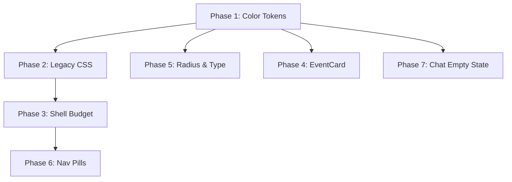

# Mission Control Frontend Consolidation — Implementation Plan

> **Historical note (2026-05-18)**: This plan targets the legacy `apps/mission-control` compatibility shell and is superseded for current `1.0` product decisions by Mission Control Next in `apps/mission-control-next`. Use [docs/1_0_CONTRACT.md](../1_0_CONTRACT.md), [docs/1_0_RELEASE_EVIDENCE.md](../1_0_RELEASE_EVIDENCE.md), and [apps/mission-control-next/src/app/route-model.ts](../../apps/mission-control-next/src/app/route-model.ts) for current route and release-surface truth.

> **Purpose**: A comprehensive, agent-executable plan for fixing the highest-impact frontend issues in GoatCitadel Mission Control. Each task is self-contained: an agent (Claude, Codex, human) should be able to pick up any task and execute it with only the information provided here and the codebase.
>
> **Companion doc**: [mission_control_review.md](./mission_control_review.md) — historical audit and rationale.
>
> **Legacy codebase root**: `apps/mission-control`
>
> **Key directories**:
> - Styles: `src/styles/` (22 CSS files, ~460KB total)
> - Components: `src/components/` (57 files + `chat/` and `ui/` subdirs)
> - Pages: `src/pages/` (63 files + 13 subdirs)
> - Content/routing: `src/content/page-registry.ts`, `src/content/copy.ts`
> - State: `src/state/ui-preferences.tsx`
> - Entry: `src/App.tsx` (1364 lines), `src/main.tsx`

---

## Table of Contents

1. [Phase 1: Color Token System](#phase-1-color-token-system) — 5 tasks
2. [Phase 2: Legacy CSS Cleanup](#phase-2-legacy-css-cleanup) — 4 tasks
3. [Phase 3: Shell Vertical Budget](#phase-3-shell-vertical-budget) — 4 tasks
4. [Phase 4: Activity Feed EventCard](#phase-4-activity-feed-eventcard) — 3 tasks
5. [Phase 5: Border-Radius & Typography Consolidation](#phase-5-border-radius--typography-consolidation) — 3 tasks
6. [Phase 6: Nav Pill Unification](#phase-6-nav-pill-unification) — 3 tasks
7. [Phase 7: Chat Empty State](#phase-7-chat-empty-state) — 4 tasks

---

## Dependency Graph



> [!IMPORTANT]
> **Phase 1 must be completed first.** All other phases depend on its token definitions. Phases 3-7 can run in parallel after their prerequisites are met.

---

## Phase 1: Color Token System

**Goal**: Extract the ~20 most-used color values from signal-noir and citadel-light into semantic CSS custom properties. All subsequent phases consume these tokens.

**Why this is first**: Every other task references `var(--gc-*)` tokens. Without canonical definitions, we'd be creating new debt while fixing old debt.

---

### Task 1.1: Create `tokens/colors.css`

**File**: `src/styles/tokens/colors.css` [NEW]

**What to do**: Create a new file that defines the canonical color token contract. These are the *interface* — theme files will provide the *values*.

```css
/*
 * GoatCitadel Color Token Contract
 * ================================
 * Every color consumed by components MUST reference one of these tokens.
 * Theme files (signal-noir.css, citadel-light.css) provide values.
 * This file provides fallbacks only for rendering without a theme.
 */

:root {
  /* ── Surface scale (5 levels) ── */
  --gc-surface-app: #06080d;
  --gc-surface-1: #0c1420;
  --gc-surface-2: #101c2a;
  --gc-surface-elevated: #142030;
  --gc-surface-inset: #080c14;

  /* ── Border scale (4 levels) ── */
  --gc-border-quiet: rgba(62, 81, 101, 0.24);
  --gc-border-subtle: rgba(89, 116, 139, 0.18);
  --gc-border-default: rgba(89, 116, 139, 0.26);
  --gc-border-strong: rgba(91, 200, 224, 0.34);

  /* ── Text scale (4 levels) ── */
  --gc-text-primary: #f0f6fb;
  --gc-text-secondary: #b6c3d1;
  --gc-text-muted: #7e8ea1;
  --gc-text-disabled: #5e6b7c;

  /* ── Accent system ── */
  --gc-accent: #54ddff;
  --gc-accent-strong: #8cf1ff;
  --gc-accent-success: #6ef5a5;
  --gc-accent-warning: #ff9a45;
  --gc-accent-danger: #ff5678;
  --gc-accent-ember: #ff9a45;
  --gc-accent-cyan: #54ddff;
  --gc-accent-info: #54ddff;

  /* ── Interactive states ── */
  --gc-focus-ring: rgba(84, 221, 255, 0.4);
  --gc-hover-overlay: rgba(84, 221, 255, 0.06);

  /* ── Kicker / eyebrow text ── */
  --gc-text-kicker: var(--gc-text-muted);
}
```

**Verification**: File exists and is valid CSS. Run `npx stylelint src/styles/tokens/colors.css` or just check that the app still builds after the file is created.

---

### Task 1.2: Wire `tokens/colors.css` into the import chain

**File**: [src/styles/base.css](file:///f:/code/personal-ai/apps/mission-control/src/styles/base.css)

**Current content** (9 lines):
```css
@import "./tokens.css";
@import "./reset.css";
@import "./typography.css";
@import "./utilities.css";
@import "./legacy-base.css";
@import "./primitives.css";
@import "./shell.css";
@import "./surfaces.css";
```

**Change**: Add the new colors import immediately after `tokens.css` (line 1) and before `reset.css` (line 2):

```css
@import "./tokens.css";
@import "./tokens/colors.css";
@import "./reset.css";
@import "./typography.css";
@import "./utilities.css";
@import "./legacy-base.css";
@import "./primitives.css";
@import "./shell.css";
@import "./surfaces.css";
```

**Why before reset**: The tokens file defines the color contract. It must load before any component styles reference the variables.

**Verification**: App builds without errors. `npm run dev` shows no CSS import resolution failures in the browser console.

---

### Task 1.3: Align signal-noir.css variables to the canonical token names

**File**: [src/styles/signal-noir.css](file:///f:/code/personal-ai/apps/mission-control/src/styles/signal-noir.css) — lines 1-52

**Current state**: signal-noir defines its own `--snr-*` variables AND sets `--gc-*` bridge variables. But it does NOT set the new `--gc-surface-*` scale tokens.

**Changes to the `.layout-shell.theme-signal-noir` rule (lines 1-52)**:

Add the following lines inside the existing rule block, after line 18 (`--snr-grid`) and before line 19 (`--gc-bg-app`):

```css
  /* Canonical surface tokens */
  --gc-surface-app: var(--snr-bg-core);       /* #06080d */
  --gc-surface-1: rgba(12, 18, 28, 0.94);     /* primary panels */
  --gc-surface-2: rgba(16, 24, 36, 0.98);     /* secondary panels */
  --gc-surface-elevated: rgba(17, 24, 35, 0.96);
  --gc-surface-inset: var(--snr-panel-inset);  /* rgba(8, 11, 18, 0.95) */

  /* Canonical border tokens */
  --gc-border-quiet: rgba(62, 81, 101, 0.24);
  --gc-border-subtle: rgba(89, 116, 139, 0.18);

  /* Focus and hover */
  --gc-focus-ring: rgba(84, 221, 255, 0.4);
  --gc-hover-overlay: rgba(84, 221, 255, 0.06);

  /* Kicker text */
  --gc-text-kicker: color-mix(in srgb, var(--snr-text-muted) 56%, var(--snr-cyan) 44%);
```

**Do NOT remove** the existing `--gc-bg-app`, `--gc-bg-shell`, etc. lines (19-44). They still serve as bridge values consumed by legacy code. They will be migrated away in Phase 2.

**Verification**: Open the app with signal-noir theme. Inspect a panel element in DevTools. Confirm that `--gc-surface-1` resolves to `rgba(12, 18, 28, 0.94)`.

---

### Task 1.4: Align citadel-light.css variables to the canonical token names

**File**: [src/styles/citadel-light.css](file:///f:/code/personal-ai/apps/mission-control/src/styles/citadel-light.css) — lines 5-61

**Changes**: Add inside the `.theme-citadel-light` rule block (after line 59, before line 60 `color: var(--gc-text-primary);`):

```css
  /* Canonical surface tokens */
  --gc-surface-app: #a8bcc3;
  --gc-surface-1: #97adb5;
  --gc-surface-2: #8ca4ad;
  --gc-surface-elevated: #7f98a2;
  --gc-surface-inset: #728a94;

  /* Canonical border tokens */
  --gc-border-quiet: rgba(15, 35, 44, 0.11);
  --gc-border-subtle: rgba(15, 35, 44, 0.14);

  /* Focus and hover */
  --gc-focus-ring: rgba(17, 112, 138, 0.3);
  --gc-hover-overlay: rgba(17, 112, 138, 0.08);

  /* Kicker text */
  --gc-text-kicker: var(--gc-text-muted);
```

**Verification**: Switch to citadel-light theme (if available via UI or by changing the class on `.app-shell` to `theme-citadel-light`). Confirm `--gc-surface-1` resolves to `#97adb5`.

---

### Task 1.5: Replace the 30 highest-frequency inline rgba() values in signal-noir.css

**File**: [src/styles/signal-noir.css](file:///f:/code/personal-ai/apps/mission-control/src/styles/signal-noir.css) — entire file (1021 lines)

**What to do**: Find-and-replace the following mappings throughout the file. **Only replace values that appear as `background:`, `background-color:`, `border-color:`, or `color:` property values** — do NOT replace values inside `radial-gradient()`, `linear-gradient()`, or `box-shadow` unless the gradient's base color is a surface/panel fill.

| Inline value | Replace with | Where it appears |
|---|---|---|
| `rgba(13, 19, 28, 0.92)` | `var(--gc-surface-1)` | Panel backgrounds |
| `rgba(12, 18, 28, 0.94)` | `var(--gc-surface-1)` | Panel backgrounds |
| `rgba(10, 16, 24, 0.96)` | `var(--gc-surface-1)` | Panel backgrounds |
| `rgba(17, 24, 35, 0.96)` | `var(--gc-surface-elevated)` | Elevated panels |
| `rgba(13, 21, 32, 0.98)` | `var(--gc-surface-elevated)` | Elevated panels |
| `rgba(16, 24, 36, 0.98)` | `var(--gc-surface-2)` | Secondary backgrounds |
| `rgba(8, 11, 18, 0.95)` | `var(--gc-surface-inset)` | Input/code backgrounds |
| `rgba(8, 11, 18, 1)` | `var(--gc-surface-inset)` | Inset backgrounds |
| `rgba(92, 198, 223, 0.18)` | `var(--gc-border-subtle)` | Button/input borders |
| `rgba(92, 198, 223, 0.12)` | `var(--gc-border-quiet)` | Quiet borders |
| `rgba(89, 116, 139, 0.26)` | `var(--gc-border-default)` | Default borders |
| `rgba(91, 200, 224, 0.34)` | `var(--gc-border-strong)` | Strong borders |
| `var(--snr-text-primary)` | `var(--gc-text-primary)` | Text (already partially done) |
| `var(--snr-text-secondary)` | `var(--gc-text-secondary)` | Text |
| `var(--snr-text-muted)` | `var(--gc-text-muted)` | Muted text |
| `#f0f6fb` | `var(--gc-text-primary)` | Text colors |
| `#b6c3d1` | `var(--gc-text-secondary)` | Text colors |

> [!WARNING]
> **Do NOT replace colors inside gradient stops that provide visual atmosphere** (like the cyan/ember radial gradients on `.layout-shell.theme-signal-noir` lines 46-51, or panel `::before` decorative gradients). Those are brand-level visual effects, not semantic surface fills.

**How to identify safe replacements**: If the `rgba()` value is the *sole* value of a `background:` property (or the last layer in a gradient stack that serves as a fill), it's safe. If it's one stop in a decorative gradient, leave it.

**Verification**:
1. `git diff src/styles/signal-noir.css` should show ~30-50 line changes
2. App builds without errors
3. Visual comparison: screenshot before and after should be pixel-identical (the values are the same, just referenced via token)

---

## Phase 2: Legacy CSS Cleanup

**Goal**: Remove the most harmful global style declarations from `legacy-base.css` and bridge them into theme-scoped rules.

> [!IMPORTANT]
> `legacy-base.css` is 5,860 lines and 115KB. We are NOT deleting the entire file in this pass. We are surgically removing the global declarations that cause the most override churn, and moving the necessary styles into theme-scoped blocks.

---

### Task 2.1: Remove the global `button` styles from legacy-base.css

**File**: [src/styles/legacy-base.css](file:///f:/code/personal-ai/apps/mission-control/src/styles/legacy-base.css) — lines 147-187

**Current code** (lines 147-187):
```css
button {
  font-family: var(--font-display);
  font-weight: 600;
  letter-spacing: 0.03em;
  border: 1px solid var(--line);
  background: linear-gradient(180deg, rgba(49, 73, 108, 0.92), rgba(31, 49, 74, 0.96));
  color: var(--text);
  padding: 8px 10px;
  border-radius: 11px;
  cursor: pointer;
  transition: border-color 120ms ease, transform 120ms ease, background 120ms ease, box-shadow 120ms ease;
}

button:hover { ... }
button:disabled { ... }
button:focus-visible { ... }
button.active { ... }
button.danger { ... }
```

**Action**: Comment out lines 147-187 entirely (wrap in `/* LEGACY-DISABLED: ... */`). Do not delete — we want easy rollback.

```css
/* LEGACY-DISABLED: Global button styles moved to shell.css theme-scoped blocks.
   Kept here as rollback reference. See Phase 2 Task 2.1 of consolidation plan.
button {
  font-family: var(--font-display);
  ...
}
*/
```

**Why comment instead of delete**: There may be pages we haven't audited that rely on these globals. The comment makes it trivial to find and restore if something breaks.

**Pre-check**: Before disabling, verify that `shell.css` already provides button styles scoped to `.theme-signal-noir button` (lines 63-86 of shell.css). It does — this is confirmed in the audit. The themed version already covers:
- `border`, `background`, `color`, `box-shadow` (line 69-76)
- `:hover` state (lines 78-86)

**What's NOT covered by shell.css theme-scoped button rules that was in the legacy global**:
- `font-family: var(--font-display)` — IMPORTANT: shell.css sets `font: 700 12px/1 var(--font-body)` only on nav items, not all buttons
- `padding: 8px 10px`
- `border-radius: 11px`
- `cursor: pointer`
- `transition: ...`
- `:disabled`, `:focus-visible`, `.active`, `.danger` states

**So we need to add a minimal global button reset to `reset.css`**:

**File**: [src/styles/reset.css](file:///f:/code/personal-ai/apps/mission-control/src/styles/reset.css)

**Current content** (173 bytes — just box-sizing):
```css
*, *::before, *::after {
  box-sizing: border-box;
}
```

**Append** the following:

```css
/* Minimal button reset — appearance only, no colors.
   Theme files handle visual styling. */
button {
  font-family: inherit;
  font-size: inherit;
  font-weight: 600;
  padding: 8px 10px;
  border-radius: var(--radius-sm, 8px);
  border: 1px solid var(--gc-border-default, transparent);
  background: transparent;
  color: inherit;
  cursor: pointer;
  transition: border-color 120ms ease, background 120ms ease, box-shadow 120ms ease;
}

button:disabled {
  cursor: not-allowed;
  opacity: 0.7;
}

button:focus-visible {
  outline: 2px solid var(--gc-focus-ring, #54ddff);
  outline-offset: 2px;
}
```

**Verification**:
1. App builds
2. Navigate to every space (Operate, Observe, Configure) and confirm buttons render correctly
3. Check that buttons in signal-noir theme have `background: linear-gradient(...)` from shell.css line 70-71
4. Check that disabled buttons show `opacity: 0.7` and `cursor: not-allowed`
5. Check focus-visible outline on tab navigation

---

### Task 2.2: Remove the global `:root` color variables from legacy-base.css

**File**: [src/styles/legacy-base.css](file:///f:/code/personal-ai/apps/mission-control/src/styles/legacy-base.css) — lines 25-58

**Current code**: The `:root` block defines legacy color variables (`--bg`, `--bg-alt`, `--panel`, `--line`, `--accent`, `--text`, etc.) AND re-declares `--font-body` as `"Aptos"` (line 27), overriding `tokens.css`'s `"Inter"`.

**Action**: Comment out the color variables AND the `--font-body` override. Keep `color-scheme: dark` and `font-family: var(--font-body)`. Keep `--font-display` and `--font-mono` since they match tokens.css. Keep `--font-reading` as it's unique.

**Before** (lines 25-58):
```css
:root {
  color-scheme: dark;
  --font-body: "Aptos", "Segoe UI Variable Text", ...;
  --font-display: "Rajdhani", ...;
  --font-reading: ...;
  --font-mono: ...;
  font-family: var(--font-body);
  --bg: #0f1724;
  --bg-alt: #162233;
  --panel: #1e3047;
  --panel-soft: #273a56;
  --line: #476788;
  --line-strong: #8ec2ff;
  --line-soft: rgba(142, 194, 255, 0.4);
  --accent: #58dcff;
  --accent-soft: #f1fbff;
  --accent-muted: #b8ebff;
  --text: #f7fbff;
  --muted: #c5d6ea;
  --danger: #ff8e98;
  --ok: #95f5c9;
  --warn: #ffd88f;
  --focus: #b4f7ff;
  --space-1: 4px;
  --space-2: 8px;
  --space-3: 12px;
  --space-4: 16px;
  --space-5: 24px;
  --radius-sm: 8px;
  --radius-md: 12px;
  --radius-lg: 16px;
  --shadow-sm: ...;
  --shadow-md: ...;
}
```

**After**:
```css
:root {
  color-scheme: dark;
  /* font-body is defined in tokens.css — do NOT re-declare here */
  --font-display: "Rajdhani", "Aptos", "Segoe UI Variable Text", "Segoe UI", sans-serif;
  --font-reading: "Segoe UI Variable Text", "Aptos", "Segoe UI", "Helvetica Neue", sans-serif;
  --font-mono: "JetBrains Mono", Consolas, "Courier New", monospace;
  font-family: var(--font-body);

  /* LEGACY-BRIDGE: These variables are consumed by legacy-base.css selectors
     and will be removed when those selectors are migrated to semantic tokens. */
  --bg: var(--gc-surface-app, #06080d);
  --bg-alt: var(--gc-surface-1, #0c1420);
  --panel: var(--gc-surface-1, #0c1420);
  --panel-soft: var(--gc-surface-2, #101c2a);
  --line: var(--gc-border-default, rgba(89, 116, 139, 0.26));
  --line-strong: var(--gc-border-strong, rgba(91, 200, 224, 0.34));
  --line-soft: var(--gc-border-subtle, rgba(89, 116, 139, 0.18));
  --accent: var(--gc-accent, #54ddff);
  --accent-soft: var(--gc-accent-strong, #8cf1ff);
  --text: var(--gc-text-primary, #f0f6fb);
  --muted: var(--gc-text-muted, #7e8ea1);
  --danger: var(--gc-accent-danger, #ff5678);
  --ok: var(--gc-accent-success, #6ef5a5);
  --warn: var(--gc-accent-warning, #ff9a45);
  --focus: var(--gc-focus-ring, rgba(84, 221, 255, 0.4));
}
```

**Why bridge instead of delete**: Hundreds of selectors deeper in legacy-base.css still reference `var(--line)`, `var(--panel)`, etc. By bridging them to `--gc-*` tokens, they'll automatically pick up theme colors without needing to be individually migrated yet.

**Verification**:
1. App builds
2. Signal-noir theme: colors look identical (the bridge vars resolve to the same values)
3. **Critical check**: Verify font-family. Open DevTools, inspect body → computed styles → `font-family` should show `"Inter"` (from tokens.css), NOT `"Aptos"` (the legacy override we removed)

---

### Task 2.3: Remove the global `body` background from legacy-base.css

**File**: [src/styles/legacy-base.css](file:///f:/code/personal-ai/apps/mission-control/src/styles/legacy-base.css) — lines 64-73

**Current code**:
```css
body {
  font-family: var(--font-body);
  margin: 0;
  background:
    radial-gradient(circle at 0% 0%, rgba(98, 163, 255, 0.34), transparent 40%),
    radial-gradient(circle at 100% 0%, rgba(72, 233, 255, 0.22), transparent 34%),
    radial-gradient(circle at 50% 100%, rgba(255, 203, 130, 0.12), transparent 36%),
    linear-gradient(180deg, #111b2a 0%, #101827 55%, #0b1320 100%);
  color: var(--text);
}
```

**Problem**: This sets a visible blue gradient on `body` that fights with signal-noir's own `background` on `.layout-shell.theme-signal-noir` (signal-noir.css line 46-51). The body background peeks through during page transitions.

**Action**: Replace with:
```css
body {
  font-family: var(--font-body);
  margin: 0;
  background: var(--gc-surface-app, #06080d);
  color: var(--gc-text-primary, #f0f6fb);
}
```

**Verification**: Check that the body background is now a solid dark color, and the atmospheric gradients come only from the `.layout-shell.theme-signal-noir` rule.

---

### Task 2.4: Remove the legacy `.layout-shell` grid override

**File**: [src/styles/legacy-base.css](file:///f:/code/personal-ai/apps/mission-control/src/styles/legacy-base.css) — lines 75-79

**Current code**:
```css
.layout-shell {
  min-height: 100vh;
  display: grid;
  grid-template-columns: 300px 1fr;
}
```

**Problem**: This sets a 2-column grid (sidebar + content) that is no longer used. The current layout is in `shell.css` with `grid-template-rows: auto auto 1fr` and single-column (line 4, 12-14 of shell.css). The legacy 300px sidebar column creates an invisible grid conflict.

**Action**: Comment out the entire rule:
```css
/* LEGACY-DISABLED: Shell layout now in shell.css — see .app-shell.layout-shell rules.
.layout-shell {
  min-height: 100vh;
  display: grid;
  grid-template-columns: 300px 1fr;
}
*/
```

**Verification**: App layout unchanged (shell.css already wins via specificity, but removing the legacy rule prevents any future cascade surprise).

---

## Phase 3: Shell Vertical Budget

**Goal**: Reduce shell chrome overhead from ~295px to ~120px on work surfaces (Chat/Cowork/Code), recovering ~175px for content.

---

### Task 3.1: Make StatusStrip collapsible on work surfaces

**File**: [src/components/StatusStrip.tsx](file:///f:/code/personal-ai/apps/mission-control/src/components/StatusStrip.tsx) (145 lines)

**Current behavior**: StatusStrip has `compact`/`expanded` states driven only by viewport width (`max-width: 767px`). On desktop, it's always expanded.

**Changes**:

1. **Add a `defaultCollapsed` prop** to the component interface (line 4-14):

```typescript
interface StatusStripProps {
  approvalsCount: number;
  approvalsLabel?: string;
  approvalsNote?: string;
  activeAgentsCount: number;
  dailyCostUsd: number;
  openTasksCount: number;
  onOpenApprovals: () => void;
  onOpenAgents: () => void;
  onOpenCosts: () => void;
  onOpenTasks: () => void;
  defaultCollapsed?: boolean; // NEW
}
```

2. **Change the `expanded` initializer** (line 47):

Before:
```typescript
const [expanded, setExpanded] = useState(() => !readCompactViewport());
```

After:
```typescript
const [expanded, setExpanded] = useState(() => {
  if (defaultCollapsed) return false;
  return !readCompactViewport();
});
```

3. **Always render the summary toggle button**, not just on compact viewport. Modify lines 82-95:

Before:
```tsx
{compactViewport ? (
  <button type="button" className="status-strip-summary" ...>
    ...
  </button>
) : null}
```

After:
```tsx
{(compactViewport || !expanded) ? (
  <button type="button" className="status-strip-summary" ...>
    ...
  </button>
) : null}
{expanded ? (
  <button
    type="button"
    className="status-strip-collapse-trigger"
    onClick={() => setExpanded(false)}
    aria-label="Collapse status strip"
  >
    ▴ Collapse
  </button>
) : null}
```

**Verification**: Pass `defaultCollapsed` to StatusStrip and confirm it renders collapsed with a summary button. Click to expand, verify the full strip appears.

---

### Task 3.2: Pass `defaultCollapsed` on work surfaces in App.tsx

**File**: [src/App.tsx](file:///f:/code/personal-ai/apps/mission-control/src/App.tsx) — lines 1225-1242

**Current code** (lines 1225-1242):
```tsx
{route.space === "operate" ? (
  <StatusStrip
    approvalsCount={operateApprovalsCount}
    ...
  />
) : null}
```

**Change**: Add `defaultCollapsed` prop when the route is a work surface:

```tsx
{route.space === "operate" ? (
  <StatusStrip
    approvalsCount={operateApprovalsCount}
    approvalsLabel="Pending decisions"
    approvalsNote={...}
    activeAgentsCount={operateActiveAgentsCount}
    dailyCostUsd={operateDailyCostUsd}
    openTasksCount={operateOpenTasksCount}
    onOpenApprovals={() => navigate({ space: "operate", page: "approvals" })}
    onOpenAgents={() => navigate({ space: "configure", page: "agents", tab: "herd-live" })}
    onOpenCosts={() => navigate({ space: "observe", page: "costs" })}
    onOpenTasks={() => navigate({ space: "operate", page: "tasks" })}
    defaultCollapsed={route.page === "surface"}
  />
) : null}
```

**Why `route.page === "surface"`**: The "surface" page is Chat/Cowork/Code. Tasks and Approvals benefit from seeing the status strip expanded.

**Verification**: Navigate to Chat — status strip should be collapsed by default. Navigate to Tasks — status strip should be expanded.

---

### Task 3.3: Add CSS for collapsed status strip state

**File**: [src/styles/shell.css](file:///f:/code/personal-ai/apps/mission-control/src/styles/shell.css)

**Action**: Add the following rules (append near the existing `.status-strip-shell` styles — search for `status-strip` in the file to find the right location):

```css
/* Collapsed state: show only the summary button */
.status-strip-shell.collapsed .status-strip {
  display: none;
}

.status-strip-shell.collapsed .status-strip-summary {
  display: flex;
  align-items: center;
  gap: var(--space-3);
  padding: var(--space-2) var(--space-4);
  font-size: 0.82rem;
  border-bottom: 1px solid var(--gc-border-quiet, var(--border-default));
}

.status-strip-collapse-trigger {
  display: flex;
  align-items: center;
  justify-content: center;
  padding: var(--space-1) var(--space-3);
  font-size: 0.72rem;
  color: var(--gc-text-muted);
  border: none;
  background: transparent;
  cursor: pointer;
  letter-spacing: 0.06em;
  text-transform: uppercase;
}

.status-strip-collapse-trigger:hover {
  color: var(--gc-text-secondary);
}
```

**Verification**: Collapsed strip renders as a single line. Expanded strip renders unchanged.

---

### Task 3.4: Remove redundant page-header eyebrow in ShellPageFrame

**File**: [src/components/ShellPageFrame.tsx](file:///f:/code/personal-ai/apps/mission-control/src/components/ShellPageFrame.tsx) (23 lines)

**Current code**: `ShellPageFrame` accepts an `eyebrow` prop but already does NOT pass it to `SectionTitle` (line 13 destructures it but line 16 doesn't use it). This is already correct — the eyebrow is ignored.

**However**, `SectionTitle` itself has an `eyebrow` prop (line 14 of SectionTitle.tsx). Verify no callers pass eyebrow to SectionTitle directly within shell-owned pages.

**File**: [src/App.tsx](file:///f:/code/personal-ai/apps/mission-control/src/App.tsx) — search for `ShellPageFrame`

**Current usage** (multiple locations, e.g., lines 936-943):
```tsx
<ShellPageFrame
  eyebrow="Operate"
  title="Trailboard"
  subtitle="Track active work, blockers, and linked sessions without leaving the operator flow."
>
```

**The `eyebrow` prop IS being passed** but the component already strips it (line 13 destructures `{ title, subtitle, actions, children }` — eyebrow is destructured out). So the prop is dead. We should clean up the call sites to remove the noise.

**Action**: Remove the `eyebrow` prop from all `ShellPageFrame` usages in App.tsx. There are ~8 instances. Search for `eyebrow=` in the `<ShellPageFrame` blocks.

Example change (repeated 8 times):
```diff
 <ShellPageFrame
-  eyebrow="Operate"
   title="Trailboard"
   subtitle="Track active work, blockers, and linked sessions without leaving the operator flow."
 >
```

Then remove the `eyebrow` prop from the `ShellPageFrameProps` interface entirely:

```diff
 interface ShellPageFrameProps {
-  eyebrow: string;
   title: string;
   subtitle: ReactNode;
   actions?: ReactNode;
   children: ReactNode;
 }

-export function ShellPageFrame({ title, subtitle, actions, children }: ShellPageFrameProps) {
+export function ShellPageFrame({ title, subtitle, actions, children }: ShellPageFrameProps) {
```

**Verification**: TypeScript compiles without errors. No "OPERATE" / "OBSERVE" / "CONFIGURE" eyebrows appear above page titles on any non-chat page.

---

## Phase 4: Activity Feed EventCard

**Goal**: Replace the raw JSON dump in the Activity live feed with structured event cards.

---

### Task 4.1: Create EventCard component

**File**: `src/components/EventCard.tsx` [NEW]

```tsx
import { useState, type ReactNode } from "react";

interface EventCardProps {
  eventType: string;
  source: string;
  timestamp: string;
  sequence?: number;
  traceId?: string;
  correlationId?: string;
  payload: Record<string, unknown>;
  actions?: ReactNode;
  tracePreview?: string[];
  onLoadTrace?: () => void;
}

/** Human-readable labels for common event types */
const EVENT_TYPE_LABELS: Record<string, string> = {
  chat_session_updated: "Chat session updated",
  chat_session_prefs_updated: "Session preferences changed",
  chat_message: "Chat message",
  approval_created: "Approval created",
  approval_resolved: "Approval resolved",
  task_created: "Task created",
  task_updated: "Task updated",
  agent_started: "Agent started",
  agent_completed: "Agent completed",
  tool_invoked: "Tool invoked",
  scheduler_tick: "Scheduler tick",
  system_health: "System health check",
};

/** Simple icon/emoji per event category */
function eventIcon(eventType: string): string {
  if (eventType.startsWith("chat")) return "💬";
  if (eventType.startsWith("approval")) return "🔐";
  if (eventType.startsWith("task")) return "📋";
  if (eventType.startsWith("agent")) return "🤖";
  if (eventType.startsWith("tool")) return "🔧";
  if (eventType.startsWith("scheduler")) return "⏱";
  if (eventType.startsWith("system")) return "🖥";
  return "📡";
}

/** Extract a one-line summary from the payload if possible */
function payloadSummary(payload: Record<string, unknown>): string | null {
  if (typeof payload.summary === "string") return payload.summary;
  if (typeof payload.message === "string") return payload.message;
  if (typeof payload.status === "string") return `Status: ${payload.status}`;
  if (typeof payload.kind === "string") return `Kind: ${payload.kind}`;
  return null;
}

export function EventCard({
  eventType,
  source,
  timestamp,
  sequence,
  traceId,
  correlationId,
  payload,
  tracePreview,
  onLoadTrace,
}: EventCardProps) {
  const [showRaw, setShowRaw] = useState(false);
  const label = EVENT_TYPE_LABELS[eventType] ?? eventType;
  const icon = eventIcon(eventType);
  const summary = payloadSummary(payload);
  const formattedTime = new Date(timestamp).toLocaleString();

  return (
    <article className="event-card">
      <div className="event-card-header">
        <span className="event-card-icon" aria-hidden>{icon}</span>
        <div className="event-card-meta">
          <strong className="event-card-type">{label}</strong>
          <span className="event-card-source">{source}</span>
          <time className="event-card-time" dateTime={timestamp}>{formattedTime}</time>
          {sequence != null ? <span className="event-card-seq">#{sequence}</span> : null}
        </div>
      </div>
      {summary ? <p className="event-card-summary">{summary}</p> : null}
      {traceId ? <div className="event-card-trace">Trace: <code>{traceId}</code></div> : null}
      {correlationId ? (
        <div className="event-card-trace">
          Correlation: <code>{correlationId}</code>
          {onLoadTrace ? (
            <button type="button" className="event-card-trace-btn" onClick={onLoadTrace}>
              {tracePreview ? "Refresh" : "Load trace"}
            </button>
          ) : null}
        </div>
      ) : null}
      {tracePreview?.length ? (
        <div className="event-card-trace-detail">
          <strong>Trace detail</strong>
          <ul className="event-card-trace-list">
            {tracePreview.map((item, i) => <li key={i}>{item}</li>)}
          </ul>
        </div>
      ) : null}
      <div className="event-card-raw-toggle">
        <button type="button" onClick={() => setShowRaw((prev) => !prev)}>
          {showRaw ? "Hide raw payload" : "Show raw payload"}
        </button>
      </div>
      {showRaw ? <pre className="event-card-json">{JSON.stringify(payload, null, 2)}</pre> : null}
    </article>
  );
}
```

**Verification**: File compiles. Import it in a test page and render with mock data to confirm the structure.

---

### Task 4.2: Add EventCard styles

**File**: `src/styles/event-card.css` [NEW]

```css
.event-card {
  display: grid;
  gap: var(--space-3, 12px);
  padding: var(--space-4, 16px);
  border-radius: var(--radius-md, 14px);
  border: 1px solid var(--gc-border-default, rgba(89, 116, 139, 0.26));
  background: var(--gc-surface-1, rgba(12, 18, 28, 0.94));
}

.event-card-header {
  display: flex;
  align-items: flex-start;
  gap: var(--space-3, 12px);
}

.event-card-icon {
  font-size: 1.4rem;
  line-height: 1;
  flex-shrink: 0;
}

.event-card-meta {
  display: flex;
  flex-wrap: wrap;
  align-items: baseline;
  gap: var(--space-2, 8px) var(--space-3, 12px);
  min-width: 0;
}

.event-card-type {
  font-size: 0.92rem;
  font-weight: 600;
  color: var(--gc-text-primary, #f0f6fb);
}

.event-card-source,
.event-card-time,
.event-card-seq {
  font-size: 0.78rem;
  color: var(--gc-text-muted, #7e8ea1);
}

.event-card-summary {
  margin: 0;
  font-size: 0.88rem;
  line-height: 1.5;
  color: var(--gc-text-secondary, #b6c3d1);
}

.event-card-trace {
  display: flex;
  align-items: center;
  gap: var(--space-2, 8px);
  font-size: 0.76rem;
  color: var(--gc-text-muted, #7e8ea1);
}

.event-card-trace code {
  font-family: var(--font-mono, monospace);
  font-size: 0.72rem;
  padding: 2px 6px;
  border-radius: 4px;
  background: var(--gc-surface-inset, rgba(8, 11, 18, 0.95));
}

.event-card-trace-btn {
  font-size: 0.72rem !important;
  padding: 2px 8px !important;
  min-height: auto !important;
}

.event-card-trace-detail {
  padding: var(--space-3, 12px);
  border-radius: var(--radius-sm, 8px);
  background: var(--gc-surface-inset, rgba(8, 11, 18, 0.95));
}

.event-card-trace-list {
  margin: var(--space-2, 8px) 0 0;
  padding-left: var(--space-4, 16px);
  font-size: 0.76rem;
  color: var(--gc-text-secondary, #b6c3d1);
}

.event-card-raw-toggle button {
  font-size: 0.72rem !important;
  padding: 2px 8px !important;
  min-height: auto !important;
  color: var(--gc-text-muted, #7e8ea1) !important;
  border-color: var(--gc-border-quiet, rgba(62, 81, 101, 0.24)) !important;
  background: transparent !important;
}

.event-card-json {
  max-height: 300px;
  overflow-y: auto;
  font-size: 0.72rem;
}
```

**Wire it**: Add `@import "./event-card.css";` to `src/styles/base.css` (after the `surfaces.css` import).

---

### Task 4.3: Replace LiveFeedPage to use EventCard

**File**: [src/pages/LiveFeedPage.tsx](file:///f:/code/personal-ai/apps/mission-control/src/pages/LiveFeedPage.tsx) (97 lines)

**Replace lines 66-93** (the `<ul className="compact-list">` block) with:

```tsx
<div className="live-feed-list" style={{ display: "grid", gap: "var(--space-3, 12px)" }}>
  {events.map((event) => {
    const tracePreview = tracePreviewByEventId[event.eventId];
    return (
      <EventCard
        key={event.eventId}
        eventType={event.eventType}
        source={event.source}
        timestamp={event.timestamp}
        sequence={event.sequence}
        traceId={event.traceId}
        correlationId={event.correlationId}
        payload={event.payload}
        tracePreview={tracePreview}
        onLoadTrace={event.correlationId ? () => void loadTracePreview(event) : undefined}
      />
    );
  })}
</div>
```

**Also add the import** at the top of the file:
```typescript
import { EventCard } from "../components/EventCard";
```

**Verification**:
1. Navigate to Observe → Activity → Live feed
2. Events should render as structured cards with icon, type label, source, time, and summary
3. Raw JSON should be hidden by default, expandable via "Show raw payload" button
4. Trace load button should still work

---

## Phase 5: Border-Radius & Typography Consolidation

**Goal**: Reduce the border-radius vocabulary from 10+ values to 4, and fix the font-family conflict.

---

### Task 5.1: Define canonical border-radius tokens

**File**: [src/styles/tokens.css](file:///f:/code/personal-ai/apps/mission-control/src/styles/tokens.css) — lines 9-11

**Current code**:
```css
  --radius-sm: 8px;
  --radius-md: 14px;
  --radius-lg: 20px;
```

**Replace with**:
```css
  /* Border radius scale — 4 levels + pill */
  --radius-sm: 8px;    /* chips, small buttons, inline elements */
  --radius-md: 12px;   /* panels, cards, inputs */
  --radius-lg: 18px;   /* large panels, sheets */
  --radius-xl: 24px;   /* full-page cards, modals */
  --radius-pill: 999px; /* pills, status chips, nav items */
```

**Then**: Do a project-wide search-and-replace in the CSS files:
- `border-radius: 7px` → `border-radius: var(--radius-sm)`
- `border-radius: 8px` → `border-radius: var(--radius-sm)`
- `border-radius: 10px` → `border-radius: var(--radius-md)`
- `border-radius: 11px` → `border-radius: var(--radius-md)`
- `border-radius: 12px` → `border-radius: var(--radius-md)`
- `border-radius: 14px` → `border-radius: var(--radius-md)`
- `border-radius: 16px` → `border-radius: var(--radius-lg)`
- `border-radius: 18px` → `border-radius: var(--radius-lg)`
- `border-radius: 20px` → `border-radius: var(--radius-lg)`
- `border-radius: 22px` → `border-radius: var(--radius-xl)`
- `border-radius: 24px` → `border-radius: var(--radius-xl)`
- `border-radius: 999px` → `border-radius: var(--radius-pill)`

> [!IMPORTANT]
> **Only replace in files under `src/styles/`**. Do not replace in JS/TSX files or in files outside Mission Control.
> **Do NOT replace values nested inside shorthand properties** or composite values like `border-radius: 14px 14px 0 0`. Only replace when the value is a single uniform radius.

**Verification**: Grep for `border-radius: [0-9]+px` in `src/styles/` — all remaining matches should be non-uniform values (like `14px 14px 0 0`).

---

### Task 5.2: Fix the font-family conflict

**File**: Already handled in Task 2.2 (removing the `--font-body: "Aptos"` override from legacy-base.css).

**Additional check**: Search ALL CSS files for any direct `font-family: "Aptos"` or `font-family: Aptos` declarations:

```bash
grep -rn "Aptos" src/styles/
```

If any remain outside of legacy-base.css `:root`, remove them.

**File**: [src/styles/tokens.css](file:///f:/code/personal-ai/apps/mission-control/src/styles/tokens.css) — line 16

Confirm this is the canonical font definition:
```css
  --font-body: "Inter", "Segoe UI", sans-serif;
```

**Verification**: DevTools → computed `font-family` on `body`, `.app-shell`, `.shell-bar`, any `<p>`, any `<button>` → should all show `Inter` as first candidate.

---

### Task 5.3: Add shadow token scale

**File**: [src/styles/tokens.css](file:///f:/code/personal-ai/apps/mission-control/src/styles/tokens.css) — lines 12-14

**Current code**:
```css
  --shadow-1: 0 2px 8px rgba(6, 12, 23, 0.12);
  --shadow-2: 0 8px 24px rgba(6, 12, 23, 0.2);
  --shadow-3: 0 16px 48px rgba(6, 12, 23, 0.3);
```

These are fine. Add one more level:
```css
  --shadow-1: 0 2px 8px rgba(6, 12, 23, 0.12);
  --shadow-2: 0 8px 24px rgba(6, 12, 23, 0.2);
  --shadow-3: 0 16px 48px rgba(6, 12, 23, 0.3);
  --shadow-inset: inset 0 1px 0 rgba(255, 255, 255, 0.04);
```

The `--shadow-inset` value appears ~20 times across signal-noir.css as `inset 0 1px 0 rgba(255, 255, 255, 0.03)` or `0.04`. Standardize to one token.

---

## Phase 6: Nav Pill Unification

**Goal**: All three nav bands (space nav, surface/page nav, page tabs) use a single pill button component.

---

### Task 6.1: Create `.gc-nav-pill` base class in shell.css

**File**: [src/styles/shell.css](file:///f:/code/personal-ai/apps/mission-control/src/styles/shell.css) — near lines 146-160

**Current code**: Three separate selector blocks with near-identical styles:
```css
.space-nav-item,
.surface-nav-item,
.secondary-page-nav-item,
.shell-command-trigger-topbar,
.shell-status-link {
  min-height: 38px;
  display: inline-flex;
  align-items: center;
  ...
}
```

**Action**: Add a new `.gc-nav-pill` class above the existing selectors:

```css
/* Canonical nav pill — used by space nav, page nav, and page tabs */
.gc-nav-pill {
  min-height: 36px;
  display: inline-flex;
  align-items: center;
  justify-content: center;
  gap: var(--space-2);
  border: 1px solid var(--gc-border-default, var(--border-default));
  border-radius: var(--radius-pill);
  padding: calc(var(--space-2) * var(--density-scale, 1)) calc(var(--space-3) * var(--density-scale, 1));
  font: 700 12px/1 var(--font-body);
  color: var(--gc-text-primary, var(--text-primary));
  text-transform: uppercase;
  letter-spacing: 0.06em;
  cursor: pointer;
  white-space: nowrap;
  transition: border-color 120ms ease, background 120ms ease, box-shadow 120ms ease;
}

.gc-nav-pill:hover {
  border-color: var(--gc-border-strong, var(--border-emphasis));
}

.gc-nav-pill.active {
  border-color: var(--gc-accent, #54ddff);
  color: var(--gc-accent-strong, #8cf1ff);
}
```

Then update the existing selectors to extend from the base:
```css
.space-nav-item,
.surface-nav-item,
.secondary-page-nav-item { /* inherits .gc-nav-pill visuals via shared properties */ }
```

**Or** (preferred): Update the TSX components to use `className="gc-nav-pill"` instead of having three different class names in CSS.

---

### Task 6.2: Update PageTabs component to use `.gc-nav-pill`

**File**: [src/components/PageTabs.tsx](file:///f:/code/personal-ai/apps/mission-control/src/components/PageTabs.tsx)

**View first**, then update the button `className` to include `gc-nav-pill`:

```tsx
<button
  className={`gc-nav-pill page-tab-item${item.id === activeId ? " active" : ""}`}
  ...
>
```

---

### Task 6.3: Update App.tsx nav buttons to use `.gc-nav-pill`

**File**: [src/App.tsx](file:///f:/code/personal-ai/apps/mission-control/src/App.tsx)

**Lines 1116-1124** (space nav buttons): Add `gc-nav-pill` to className:
```tsx
className={`gc-nav-pill space-nav-item${route.space === space ? " active" : ""}`}
```

**Lines 1167-1190** (surface nav buttons): Add `gc-nav-pill`:
```tsx
className={`gc-nav-pill surface-nav-item${route.page === "surface" && operateSurfaceTab === surface ? " active" : ""}`}
```

**Lines 1194-1203** (secondary page nav buttons): Add `gc-nav-pill`:
```tsx
className={`gc-nav-pill secondary-page-nav-item${route.page === item.page ? " active" : ""}`}
```

**Verification**: All three nav bands should now have identical pill styling. Visual should be uniform across Operate (surface tabs), Observe (page tabs), and Configure (page tabs).

---

## Phase 7: Chat Empty State

**Goal**: Replace the barren "Start with a plain request" empty state with a useful, welcoming landing.

---

### Task 7.1: Identify the empty state component

**File**: [src/pages/chat/MissionControlEmptyState.tsx](file:///f:/code/personal-ai/apps/mission-control/src/pages/chat/MissionControlEmptyState.tsx)

**Action**: View this file to understand its current structure. This is the component that renders when no messages exist in a chat session.

---

### Task 7.2: Redesign the empty state

**File**: `src/pages/chat/MissionControlEmptyState.tsx` — full rewrite

The new empty state should include:

1. **GoatCitadel wordmark or name** (keep existing)
2. **Active model/provider badge** — e.g., "glm-5 via glm" using `StatusChip`
3. **Active workspace** — show current workspace name
4. **Suggested actions grid** — 4 cards:
   - "Ask a question" — start a plain conversation
   - "Start a code session" — switch to Code surface
   - "Run a task" — navigate to Tasks
   - "Review approvals" — navigate to Approvals (only if count > 0)
5. **Quick tips** — "Type /help to see commands" and "Drag files here to attach"

**Props the component needs**:
```typescript
interface MissionControlEmptyStateProps {
  workspaceName?: string;
  modelLabel?: string;
  providerLabel?: string;
  approvalsCount?: number;
  onSwitchToCode?: () => void;
  onOpenTasks?: () => void;
  onOpenApprovals?: () => void;
}
```

**Suggested JSX structure**:
```tsx
<div className="chat-empty-state">
  <div className="chat-empty-brand">
    <h2>GoatCitadel</h2>
    <div className="chat-empty-context">
      {modelLabel ? <StatusChip tone="muted">{modelLabel}{providerLabel ? ` via ${providerLabel}` : ""}</StatusChip> : null}
      {workspaceName ? <StatusChip tone="muted">{workspaceName}</StatusChip> : null}
    </div>
  </div>
  <div className="chat-empty-actions">
    <button type="button" className="chat-empty-action" onClick={() => { /* focus composer */ }}>
      <span className="chat-empty-action-icon">💬</span>
      <span className="chat-empty-action-label">Ask a question</span>
      <span className="chat-empty-action-hint">Start a plain conversation</span>
    </button>
    <button type="button" className="chat-empty-action" onClick={onSwitchToCode}>
      <span className="chat-empty-action-icon">📝</span>
      <span className="chat-empty-action-label">Start a code session</span>
      <span className="chat-empty-action-hint">Project-bound with review defaults</span>
    </button>
    <button type="button" className="chat-empty-action" onClick={onOpenTasks}>
      <span className="chat-empty-action-icon">📋</span>
      <span className="chat-empty-action-label">View tasks</span>
      <span className="chat-empty-action-hint">Check the Trailboard queue</span>
    </button>
    {(approvalsCount ?? 0) > 0 ? (
      <button type="button" className="chat-empty-action" onClick={onOpenApprovals}>
        <span className="chat-empty-action-icon">🔐</span>
        <span className="chat-empty-action-label">Review approvals</span>
        <span className="chat-empty-action-hint">{approvalsCount} decision{approvalsCount === 1 ? "" : "s"} waiting</span>
      </button>
    ) : null}
  </div>
  <p className="chat-empty-tips">
    Type <code>/help</code> to see commands · Drag files here to attach
  </p>
</div>
```

---

### Task 7.3: Style the empty state

**File**: Add styles to `src/styles/chat-surface.css` or `src/styles/surfaces.css` (whichever currently contains `.chat-v11-empty-*` styles):

```css
.chat-empty-state {
  display: grid;
  gap: var(--space-6, 32px);
  justify-items: center;
  padding: var(--space-7, 48px) var(--space-5, 24px);
  text-align: center;
}

.chat-empty-brand h2 {
  font-family: var(--font-display);
  font-size: 1.8rem;
  letter-spacing: 0.04em;
  margin: 0 0 var(--space-3, 12px);
}

.chat-empty-context {
  display: flex;
  justify-content: center;
  gap: var(--space-2, 8px);
  flex-wrap: wrap;
}

.chat-empty-actions {
  display: grid;
  grid-template-columns: repeat(auto-fit, minmax(200px, 1fr));
  gap: var(--space-3, 12px);
  max-width: 680px;
  width: 100%;
}

.chat-empty-action {
  display: grid;
  gap: var(--space-1, 4px);
  padding: var(--space-4, 16px);
  border-radius: var(--radius-md, 12px);
  border: 1px solid var(--gc-border-default, rgba(89, 116, 139, 0.26));
  background: var(--gc-surface-1, rgba(12, 18, 28, 0.94));
  text-align: left;
  cursor: pointer;
  transition: border-color 120ms ease, transform 120ms ease;
}

.chat-empty-action:hover {
  border-color: var(--gc-border-strong, rgba(91, 200, 224, 0.34));
  transform: translateY(-1px);
}

.chat-empty-action-icon {
  font-size: 1.4rem;
}

.chat-empty-action-label {
  font-weight: 600;
  font-size: 0.92rem;
  color: var(--gc-text-primary, #f0f6fb);
}

.chat-empty-action-hint {
  font-size: 0.78rem;
  color: var(--gc-text-muted, #7e8ea1);
}

.chat-empty-tips {
  font-size: 0.78rem;
  color: var(--gc-text-muted, #7e8ea1);
}

.chat-empty-tips code {
  font-family: var(--font-mono, monospace);
  padding: 2px 6px;
  border-radius: 4px;
  background: var(--gc-surface-inset, rgba(8, 11, 18, 0.95));
}
```

---

### Task 7.4: Wire up props from ChatPage to the empty state

**File**: [src/pages/ChatPage.tsx](file:///f:/code/personal-ai/apps/mission-control/src/pages/ChatPage.tsx)

**Action**: Find where `MissionControlEmptyState` is rendered and pass the new props. You'll need to trace:
- `activeModelLabel` / `activeProviderLabel` from the chat session prefs
- `workspaceName` from the workspace context
- `approvalsCount` already available via the parent App.tsx status

This requires viewing the specific render location in ChatPage.tsx. Search for `MissionControlEmptyState` in the file and update the props accordingly.

**Verification**:
1. Open a new chat session (no messages)
2. Empty state should show: model badge, workspace name, 4 action cards, tips
3. Click "Start a code session" — should navigate to Code surface
4. Click "View tasks" — should navigate to Tasks page

---

## Global Verification Checklist

After all phases are complete, run through this checklist:

- [ ] `npm run build` completes without errors
- [ ] `npm run dev` starts without CSS import errors in console
- [ ] Navigate to all 3 spaces (Operate, Observe, Configure)
- [ ] Navigate to all pages within each space
- [ ] Switch between Chat/Cowork/Code surfaces
- [ ] Verify StatusStrip collapses on Chat, expands on Tasks
- [ ] Verify no "OPERATE" / "OBSERVE" eyebrow appears above page titles
- [ ] Verify Activity live feed shows EventCards, not raw JSON
- [ ] Verify all nav pills have consistent styling
- [ ] Verify font-family is Inter everywhere (not Aptos)
- [ ] Verify signal-noir theme colors look unchanged
- [ ] Run existing tests: `npm run test` — all should pass
- [ ] Check for any TypeScript errors: `npx tsc --noEmit`

---

## Files Changed Summary

| Phase | New Files | Modified Files |
|-------|-----------|----------------|
| 1 | `src/styles/tokens/colors.css` | `base.css`, `signal-noir.css`, `citadel-light.css` |
| 2 | — | `legacy-base.css`, `reset.css` |
| 3 | — | `StatusStrip.tsx`, `App.tsx`, `shell.css`, `ShellPageFrame.tsx` |
| 4 | `EventCard.tsx`, `event-card.css` | `LiveFeedPage.tsx`, `base.css` |
| 5 | — | `tokens.css` + CSS files (border-radius replacements) |
| 6 | — | `shell.css`, `PageTabs.tsx`, `App.tsx` |
| 7 | — | `MissionControlEmptyState.tsx`, `chat-surface.css` or `surfaces.css`, `ChatPage.tsx` |

**Total new files**: 3
**Total modified files**: ~15
**Estimated effort**: 2-3 weeks for one engineer, or parallelized across phases by multiple agents.
