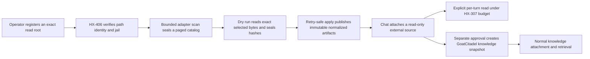

# HX-407 Governed Codex and Claude External Sources

Prepared: 2026-07-14
Program row: `HX-407`
Packet status: **ARCHITECTURE READY / IMPLEMENTATION HOLD**

## Decision

GoatCitadel should add a separate, Gateway-owned external-source domain for Codex and Claude sessions and memory. It must not route foreign directories through the existing generic file/URL knowledge-ingest API, import them into durable memory, or treat them as callable skills.

The safe v1 flow is:

An initial external attachment may be read by an explicitly selected Chat turn from its immutable normalized artifact. It is not a `knowledge_document`, retrieval index, durable memory item, candidate skill, capability, or callable catalog entry. `HX-307` must freeze the exact imported artifact bytes and provenance in the routed-context snapshot before any provider call. A durable GoatCitadel knowledge copy is a distinct approval effect.

This packet excludes xAI, Grok, X, Cursor, arbitrary agent formats, remote cloud history, and write-back to Codex or Claude.

## Live source-of-truth snapshot

The packet was checked against live `HEAD` `ef079d74ae649dd2f7a817fd3b57fc7674d7fe30` and the current owners on 2026-07-14.

| Truth | Current state | HX-407 consequence |
|---|---|---|
| Program pins | OpenClaw report `f8aa995856ecec703e7391e0f3818a16ac844847`, program `e330e4a17d3c9705ff79da123efe259acd9bd0f3`; Hermes report `5ecc07986f46463ca3096679b03a46402eb19cee`, program `b663d50a6a0101d5214112b24ffe20924af32beb` | Keep adapter fixtures pinned and record the observed producer version per item. |
| Upstream drivers | OpenClaw `4319ddbe8c`; Hermes `b51d365ef0`, `ac705b52c9`, `f2fcf89c1f` | Adopt reviewed/retry-safe planning, bounded payloads, cycle safety, and Windows path identity; do not copy upstream trust assumptions. |
| Journey | `HX-402` is read-only and partial; only `HX-401` currently produces events | HX-407 must add explicit producers with declared source/approval requirements. |
| Path identity | `HX-406` Phase A exists, but production composition, canonical binding, source configuration, and `verify:workspace:path-bridge` remain Phase B gates | No production scan or import until Phase B is SHIP at the integration SHA. |
| Existing knowledge | `DocsIngestInput` supports file/URL/text and `ThreadKnowledgeAttachmentRecord` supports file/URL; `ChatThreadKnowledgeService` ingests directly | Do not overload these contracts for raw foreign sources. Add an external attachment type and create ordinary knowledge only after approval. |
| Migration heads | SQLite `165`; PostgreSQL `107` | A migration is required. The prospective next pair is SQLite `166` / PostgreSQL `108` only if still free at implementation start. This packet reserves neither slot. |

Relevant local owners:

- `docs/OPENCLAW_HERMES_PARITY_PROGRAM.md`
- `docs/review/HX_402_JOURNEY_PRODUCER_PACKET_2026-07-13.md`
- `packages/contracts/src/workspace-path-bridge.ts`
- `apps/gateway/src/services/workspace-path-bridge-service.ts`
- `apps/gateway/src/services/workspace-path-bridge-integration.ts`
- `packages/contracts/src/knowledge.ts`
- `apps/gateway/src/services/chat-thread-knowledge-service.ts`
- `packages/storage/src/knowledge-repo.ts`
- `packages/storage/src/chat-thread-knowledge-attachment-repo.ts`
- `packages/contracts/src/journey.ts`
- `packages/storage/src/governance-journey-event-repo.ts`
- `apps/gateway/src/services/journey-timeline-service.ts`

## External evidence and format uncertainty

Primary upstream evidence:

- [OpenClaw governed Codex/Claude memory migration, `4319ddbe8c`](https://github.com/openclaw/openclaw/commit/4319ddbe8c)
- [Hermes session import, `b51d365ef0`](https://github.com/NousResearch/hermes-agent/commit/b51d365ef0)
- [Hermes bounded and cycle-safe validation, `ac705b52c9`](https://github.com/NousResearch/hermes-agent/commit/ac705b52c9)
- [Hermes Windows/MSYS path correction, `f2fcf89c1f`](https://github.com/NousResearch/hermes-agent/commit/f2fcf89c1f)
- [OpenAI Codex app-server persistence documentation](https://github.com/openai/codex/blob/main/codex-rs/app-server/README.md)
- [OpenAI Codex memory-pipeline documentation](https://github.com/openai/codex/blob/main/codex-rs/core/src/memories/README.md)
- [Claude Code session storage](https://code.claude.com/docs/en/sessions)
- [Claude Code memory and rules](https://code.claude.com/docs/en/memory)
- [Claude Code application-data security](https://code.claude.com/docs/en/claude-directory)

Safe local shape inspection read key names and value types only; it did not print prompts, responses, paths, credentials, or tool results.

| Adapter | Confirmed current shape | Initial allowed content | Uncertain or explicitly excluded |
|---|---|---|---|
| `codex.rollout-jsonl.v1` | `sessions/YYYY/MM/DD/*.jsonl` and `archived_sessions/*.jsonl`; envelopes observed: `session_meta`, `turn_context`, `event_msg`, `response_item`, `compacted`, `world_state`; session identity is carried by session metadata | User-visible user/assistant text, bounded compaction summary, content-free turn/model/timestamp metadata, explicit fork IDs when structurally valid | Envelope fields are not a stable public interchange schema. Unknown envelope types, missing/corrupt session metadata, multiple conflicting session IDs, private reasoning, base/developer instructions, tool output bodies, and world-state bodies block or remain metadata-only. `history.jsonl`, auth/config/state DBs, logs, attachments, caches, and credentials are excluded. |
| `codex.memory-markdown.v1` | Codex memory pipeline owns `memories/MEMORY.md`, `memory_summary.md`, and `rollout_summaries/` | Explicitly selected Markdown under the registered memory root | Skills, auth, config, generated images, browser state, and files outside the registered root are excluded. Markdown links/imports are not recursively followed. |
| `claude.project-jsonl.v1` | `projects/<encoded-project>/<session-id>.jsonl`; local records observed: `user`, `assistant`, `system`, `attachment`, `queue-operation`, `last-prompt`; `sessionId`, `uuid`, `parentUuid`, `isSidechain`, `version`, and message envelopes occur | User-visible user/assistant text, bounded tool-call names/status metadata, timestamps, branch/cwd hashes, and structurally valid message ordering | Anthropic documents JSONL location, not a stable field-level interchange schema. `parentUuid` is message lineage, not proof of cross-session ancestry. Sideagent directories need explicit fixtures. Tool result bodies, system/hook bodies, attachment bytes, queue contents, file history, shell snapshots, caches, debug, plans, tasks, settings, auth, and prompt `history.jsonl` are excluded. |
| `claude.memory-markdown.v1` | `projects/<encoded-project>/memory/MEMORY.md` and topic Markdown; `CLAUDE.md`, `CLAUDE.local.md`, and `.claude/rules/*.md` are instruction sources | Explicitly selected memory or instruction Markdown inside the registered root | `@path` imports are not followed automatically even though Claude supports them. Each imported file must itself be inside the root and explicitly selected. Settings, plugins, credentials, and arbitrary repo files are excluded. |

Before implementation, the Architect/Researcher must capture synthetic, secret-free fixtures from the pinned upstream layouts and record an adapter compatibility matrix. A producer version or record type not represented by an accepted fixture is `unsupported_variant`, not best-effort parsed. Cataloging may continue, but a selected atomic import containing an unsupported item fails closed.

## Frozen v1 invariants

1. **Explicit root grant.** A scan accepts `sourceId`, never a caller-supplied path. An operator first registers one exact root, source kind, workspace, owner, auth actor, input flavor, target flavor, optional WSL distro, and ownership/authorization attestation.
2. **Workspace isolation.** A root and all scans, plans, imports, artifacts, attachments, snapshots, and Journey events have a required `workspaceId`. Registering the same filesystem root for another workspace creates a separate source identity and cannot reuse imports implicitly.
3. **Request-derived ownership.** `ownerActorId`, `authActorId`, and `authActorSource` come from the authenticated Fastify request. Request bodies cannot claim another owner. `auth:none` remains explicit if the installation deliberately runs without auth; there is no IP fallback.
4. **No foreign credentials.** Codex/Claude credentials are never read. This is local read access, not provider authentication.
5. **HX-406 identity.** Root activation requires a verified, current path-bridge snapshot whose workspace, canonical host path, root hashes, flavor, distro, and snapshot hash match. Use `requireGitIdentity=false` for home/config roots; if a source claims a project/repository binding, require the verified Git identity. Root or path-bridge revision drift blocks scans.
6. **No links.** Enumeration uses `lstat`; it never follows symlinks, directory junctions/reparse points, or adapter-discovered path imports. Every ancestor and opened file is revalidated. Canonical paths must remain under the exact root.
7. **No mutation.** Readers open foreign files read-only, never lock them for writing, rename, chmod, delete, checkpoint a database, run Codex/Claude, or invoke a shell. SQLite/WAL files are excluded in v1.
8. **Race safety.** Capture file identity, size, and high-resolution mtime before open; read through the file handle; hash exact bytes; restat the handle and path; require identical identity/size/mtime and containment. A live append or replacement returns `source_changed` and publishes nothing.
9. **Immutable paging.** No cursor pages a live directory. A completed scan seals immutable item rows and a manifest hash. The cursor binds schema version, workspace, source, scan, config revision, adapter version, filters, high-water tuple, manifest hash, and last position. New or changed files appear only in a new scan.
10. **Atomic selection.** A dry-run plan is immutable and covers the exact ordered selected-item set, raw hashes, normalized hashes, counts, adapter versions, exclusions, and manifest hash. Apply accepts the plan ID and expected plan hash; it does not rescan or expand the selection.
11. **Retry-safe publication.** The idempotency key is derived from workspace, source, config revision, scan manifest, plan hash, adapter versions, and selected-item-set hash. Exact replay returns the canonical result. Same key/different material is `409 conflict`.
12. **Normalized artifact only.** V1 retains the exact raw source SHA-256 and byte count but does not retain or serve raw foreign bytes. It publishes an immutable normalized artifact with owner-only filesystem permissions/ACLs. Private reasoning, system/developer instructions, tool-result bodies, and unsupported records do not enter it.
13. **Read-only attach.** External attachments cannot be edited, indexed, promoted, or selected by default. An operator explicitly selects them for a turn; `HX-307` then freezes the exact normalized bytes/hash within the final route budget and records the external provenance.
14. **Separate knowledge effect.** `external_source.knowledge_snapshot` is a distinct approval kind. Only the approval-effect path may copy an imported normalized artifact into GoatCitadel `knowledge_documents`/chunks and create an ordinary thread knowledge attachment.
15. **No direct promotion.** No scan, plan, import, attach, or knowledge snapshot writes `MemoryLifecycleService`, memory items, skill candidates, proposals, runtime skills, or callable catalogs. Those remain separate governed candidate flows.
16. **Content-free diagnostics.** API errors, Journey summaries, audit, logs, metrics, and verification artifacts contain IDs, hashes, counts, reason codes, and relative labels only—never transcript text, absolute root paths outside operator-only config detail, credentials, or tool output.

## Hard limits

All limits are contract constants, not request-controlled knobs. Exceeding a limit blocks the item or entire selected batch; content is never silently truncated.

| Boundary | V1 limit |
|---|---:|
| Root path | 2,048 UTF-8 bytes |
| Active source roots per workspace | 16 |
| Directory depth below root | 12 |
| Directory entries examined per scan | 10,000 |
| Catalog items per scan | 5,000 |
| Scan wall time | 60 seconds with required `AbortSignal` |
| Concurrent file reads | 4 |
| Source file | 16 MiB |
| JSONL line | 1 MiB |
| Normalized content per message | 256 KiB |
| Messages per session item | 10,000 |
| Total messages per selected import | 50,000 |
| Normalized session artifact | 8 MiB |
| Markdown memory item | 1 MiB |
| Selected items per import | 100 |
| Exact raw bytes read per dry-run/import plan | 25 MiB |
| Normalized bytes per import | 25 MiB |
| Logical lineage nodes | 10,000 |
| Logical lineage depth | 64 |
| Page size | default 50, maximum 100 |
| Encoded cursor | 8,192 bytes |

Logical path traversal maintains visited filesystem identities. Message/session lineage maintains a separate visited-ID set and depth counter. Any cycle, duplicate node with conflicting bytes, or limit breach quarantines the item and blocks atomic apply; HX-407 does not silently detach a closing edge.

## Contract and API shape

Add `packages/contracts/src/external-sources.ts` and export it from `packages/contracts/src/index.ts`.

Core types:

- `ExternalSourceKind = "codex_sessions" | "codex_memory" | "claude_sessions" | "claude_memory"`
- `ExternalSourceRecord` with workspace, owner/auth, root/path snapshot identity, adapter policy, revision, config hash, status, approval/root-grant linkage, and timestamps
- `ExternalSourceScanRecord`, `ExternalSourceCatalogItem`, and `ExternalSourcePage`
- `ExternalSourceImportPlan`, `ExternalSourceImportIntent`, `ExternalSourceImportSettlement`, and `ExternalSourceImportItem`
- `ExternalSessionAttachmentRecord` with `mode: "read_only_external"`
- versioned cursor and exact validators using `canonicalJsonString`
- the hard-limit constants above

All routes are explicit `withRouteAccess(fastify, "operator")`, `Cache-Control: no-store`, and `x-goatcitadel-execution-authority: none` for reads/dry runs. Mutations use request-derived actor scope and resource-revision CAS.

| Method | Route | Semantics |
|---|---|---|
| `POST` | `/api/v1/library/external-sources` | Register an exact source/root grant. Body includes workspace, kind, label, root path/flavor/distro, path-bridge evidence, expected resource revision, and attestation. No scan is implied. |
| `GET` | `/api/v1/library/external-sources` | Workspace-scoped source list; content-free health and last scan only. |
| `GET` | `/api/v1/library/external-sources/:sourceId` | Operator config detail; exact workspace match or `404` without existence leak. |
| `PATCH` | `/api/v1/library/external-sources/:sourceId` | CAS label/status/adapter-policy update. Root identity changes create a new source; they do not rewrite history. |
| `POST` | `/api/v1/library/external-sources/:sourceId/scans` | Seal a new bounded catalog scan against the current root/config/path identity. |
| `GET` | `/api/v1/library/external-sources/:sourceId/items` | Page one immutable scan selected by `scanId`; opaque high-water cursor. |
| `POST` | `/api/v1/library/external-source-import-plans` | Dry-run exact selected item IDs, copy no foreign state, and return hashes/counts/blockers. |
| `POST` | `/api/v1/library/external-source-imports` | Apply exactly one plan with `expectedPlanSha256` and `idempotencyKey`; returns canonical replay or conflict. |
| `GET` | `/api/v1/library/external-source-imports/:importId` | Inspect content-free provenance and settlement. |
| `POST` | `/api/v1/chat/sessions/:sessionId/external-source-attachments` | Attach one imported item as `read_only_external`; exact workspace/session/import binding required. |
| `DELETE` | `/api/v1/chat/sessions/:sessionId/external-source-attachments/:attachmentId` | Detach only; imported evidence remains immutable. |
| `POST` | `/api/v1/library/external-source-imports/:importId/knowledge-snapshot-requests` | Create the dedicated approval request over exact import item/artifact hashes. It does not create knowledge inline. |

The list cursor follows the existing Journey pattern but binds a sealed scan:

`{version, workspaceId, sourceId, scanId, configRevision, adapterVersion, filterHash, manifestSha256, highWater:{observedMtimeNs,itemId}, position:{observedMtimeNs,itemId}}`.

The repository orders by captured `observed_mtime_ns DESC, item_id DESC` under the fixed scan. Cursor/filter/source mismatch is a `400`; an unavailable scan is `404`; a changed live root does not alter old pages.

## Storage and recoverable apply

One additive paired migration is required because a stable catalog, atomic provenance, and retry settlement cannot be reconstructed from files or UI state.

Proposed tables:

| Table | Authority and key invariants |
|---|---|
| `external_source_configs` | Mutable CAS aggregate keyed by `(workspace_id, source_id)`; exact owner/auth/root/path snapshot/config hash/status/revision. A unique active identity covers workspace + kind + canonical root identity. |
| `external_source_scans` | Immutable sealed scan header keyed by `(workspace_id, scan_id)`; source/config/adapter identity, manifest SHA, high-water, counts, terminal status. |
| `external_source_catalog_items` | Immutable items keyed by `(workspace_id, scan_id, item_id)`; normalized relative path, foreign ID hash, producer version, stat fingerprint, lineage metadata, size/counts, support/quarantine state. No transcript content. |
| `external_source_import_plans` | Immutable dry-run plan keyed by `(workspace_id, plan_id)`; selected-set hash, raw and normalized hashes/counts, manifest/config/adapter binding, blockers, plan SHA. |
| `external_source_import_intents` | Immutable admitted operation keyed by `(workspace_id, import_id)` with unique workspace idempotency key and exact plan material. |
| `external_source_import_items` | Immutable mapping from import to catalog item and managed normalized artifact SHA/relative CAS key; exact raw hash and bounded provenance. |
| `external_source_import_settlements` | At most one immutable terminal result per intent: `applied`, `blocked`, or `manual_reconciliation`. |
| `chat_external_source_attachments` | Workspace/session/import-item binding with `read_only_external`, revision, attached/detached timestamps, and no `knowledge_document_id`. |
| `external_source_knowledge_links` | Immutable approval-effect mapping from exact import item/artifact/approval to GoatCitadel knowledge document and optional ordinary thread attachment. |

Use SQLite/PostgreSQL composite workspace keys, equivalent unique indexes, bounded canonical JSON, and migration-integrity tests. Do not add foreign keys to mutable foreign filesystem identities. All artifact paths are managed relative CAS keys, never absolute foreign paths.

Apply is a recoverable cross-filesystem/database protocol:

1. In one DB transaction, claim or replay the immutable import intent from the plan hash and idempotency material.
2. Read no foreign file: apply consumes the dry-run's private staged normalized bytes only after rechecking plan lease/expiry and staged hash. If the plan staging was lost, mark blocked and require a new dry run.
3. Publish normalized artifacts through a dedicated content-addressed store under a server-owned managed prefix, using temporary files, owner-only permissions/ACLs, fsync where supported, atomic rename, no-link ancestor checks, and same-hash convergence. Reuse the safety pattern from `skill-hub-artifact-store.ts`, not the skill namespace or records.
4. In one DB transaction, insert import items, the single settlement, and HX-402 Journey events. `applied` is impossible unless every referenced CAS object exists and rehashes exactly.
5. Recovery replays admitted intents idempotently. A crash after CAS publication but before settlement leaves only an unreferenced hash object; it may be reconciled or lease-aware garbage-collected later and never implies success.

The knowledge approval effect rechecks current deny-wins policy, approval ID/expiry/actor, exact import/artifact hash, workspace/session binding, attachment status, and resource revisions. Its transaction creates the `knowledge_documents`/chunks record with full external provenance metadata, inserts `external_source_knowledge_links`, optionally creates the ordinary thread knowledge attachment, and appends the Journey event. No direct call to the public `knowledgeDocsIngest` route is allowed.

## HX-402 Journey producers

Extend the Journey evidence-owner union in `packages/contracts/src/journey.ts` and `packages/storage/src/governance-journey-event-repo.ts` with `external_source`, and update `apps/gateway/src/services/journey-timeline-service.ts` so it counts as source evidence.

Every event declares both `provenance.sourceRequired` and `provenance.approvalRequired`; action-name inference remains forbidden.

| Event type | Actions | Requirements and atomic owner |
|---|---|---|
| `external_source_lifecycle` | `configured`, `root_verified`, `scan_completed`, `scan_blocked`, `disabled`, `revoked` | Configure: source `false`; root/scan: source `true`. Approval is `true` only when frozen policy requires an out-of-workspace root grant, and then the real approval ID is mandatory. Event shares the config/scan transaction. |
| `external_session_import` | `dry_run_completed`, `imported_read_only`, `replayed`, `conflicted`, `blocked`, `attached_read_only`, `detached` | Source `true`; approval `false` for the proposed evidence-only/read-only policy. Freeze this policy before code. Event shares the plan, settlement, or attachment transaction. Replays return the existing event; they do not append recurrence. |
| `knowledge_snapshot_lifecycle` | `approval_requested`, `snapshot_created`, `attached` | Source `true`; `snapshot_created` and `attached` approval `true` with the real approval ID. The approval request uses the approval transaction; creation/attach use the recovered approval-effect transaction. |

Use stable fingerprints over workspace, source/import item, action, raw source hash, normalized artifact hash, adapter version, and canonical policy disposition. A same foreign ID with different raw bytes is `conflicting`; malformed/cyclic/unknown material is `quarantined`; cap/path/policy failures are `blocked`. Journey summaries remain content-free and no event can promote memory or skills.

## Exact owner map

### Contracts and storage tranche — one migration owner

New owners:

- `packages/contracts/src/external-sources.ts`
- `packages/contracts/src/external-sources.test.ts`
- `packages/storage/src/external-source-config-repo.ts`
- `packages/storage/src/external-source-scan-repo.ts`
- `packages/storage/src/external-source-import-repo.ts`
- `packages/storage/src/external-session-attachment-repo.ts`
- focused repository and schema-parity tests beside those files

Integration owners:

- `packages/contracts/src/index.ts`
- `packages/contracts/src/journey.ts`
- `packages/storage/src/index.ts`
- `packages/storage/src/sqlite.ts`
- `packages/storage/src/postgres/migrations.ts`
- `packages/storage/src/postgres-migration-integrity.test.ts`
- `packages/storage/src/governance-journey-event-repo.ts`
- `packages/storage/src/governance-journey-event-repo.test.ts`

Only this tranche may allocate the paired migration after re-reading both heads.

### Gateway reader, adapters, lifecycle, and routes tranche

New owners:

- `apps/gateway/src/services/external-source-reader.ts`
- `apps/gateway/src/services/external-source-adapters/codex-rollout-adapter.ts`
- `apps/gateway/src/services/external-source-adapters/codex-memory-adapter.ts`
- `apps/gateway/src/services/external-source-adapters/claude-session-adapter.ts`
- `apps/gateway/src/services/external-source-adapters/claude-memory-adapter.ts`
- `apps/gateway/src/services/external-source-artifact-store.ts`
- `apps/gateway/src/services/external-source-service.ts`
- `apps/gateway/src/services/external-source-route-service.ts`
- `apps/gateway/src/routes/external-sources.ts`
- synthetic fixtures and focused tests under the matching service/route test owners

Existing owners touched only through explicit integration handoff:

- `apps/gateway/src/services/workspace-path-bridge-service.ts`
- `apps/gateway/src/services/workspace-path-bridge-integration.ts`
- `apps/gateway/src/services/journey-timeline-service.ts`
- `apps/gateway/src/services/approval-resolution-effects-service.ts`
- `apps/gateway/src/services/chat-thread-knowledge-service.ts`
- `apps/gateway/src/services/gateway-route-services.ts`
- `apps/gateway/src/services/gateway-route-service-composition.ts`
- `apps/gateway/src/services/gateway-route-composition-memory.ts`
- `apps/gateway/src/services/gateway-route-composition-chat.ts`
- `apps/gateway/src/app.ts`

No adapter may depend on executable-harness availability or call Codex/Claude. `agentic-harness-availability.ts` is not the persistence owner.

### Shared client and Mission Control tranche

New owners:

- `packages/mission-control-shared/src/api/external-sources.ts`
- `apps/mission-control-next/src/features/native-routes/library/LibraryExternalSourcesSection.tsx`
- focused shared-client and component tests

Existing owners:

- `packages/mission-control-shared/src/index.ts`
- `apps/mission-control-next/src/features/native-routes/library/LibraryKnowledgeSection.tsx`
- `packages/threaded-surface-core/src/chat/useChatSessionData.ts`
- `packages/threaded-surface-core/src/MissionThreadedControllerHost.tsx`
- `apps/mission-control-next/src/features/threaded-surface/ThreadedComposer.tsx`

Library owns root registration, scan, stable paging, dry-run review, import, health, and provenance. Chat owns only source selection, read-only chips, detach, and the separate knowledge-snapshot approval action. Do not add a new primary route or resurrect Cowork/Code.

### Verification and truth tranche

- `scripts/verification/external-sources-proof.mjs`
- `package.json` script `verify:external-sources`
- release-surface/docs truth only after the named lane passes
- `docs/OPENCLAW_HERMES_PARITY_PROGRAM.md` updated only by the Goatherder after independent QA

`packages/contracts/src/index.ts`, storage migrations/index, Gateway route composition, `app.ts`, shared-client index, and the program register are integration hotspots. Assign them to one integration owner; parallel agents must not edit them concurrently.

## Failure matrix

| Failure | Required result |
|---|---|
| Missing/foreign workspace, actor, or source | `404` without cross-workspace existence leak; no scan/read/Journey claim. |
| Non-current HX-406 snapshot, config revision, root grant, or Git identity | `409 identity_drift`; no foreign file opened. |
| Root missing, unreadable, outside jail, wrong flavor/distro, symlink, junction, or reparse ancestor | Fail closed with content-free blocker; source remains non-callable/non-importable. |
| File replaced/appended during read | `409 source_changed`; discard staged bytes; require new dry run. |
| Oversized directory/file/line/message/session/batch or timeout | `413` or bounded `422` with exact limit code; never truncate and continue. |
| Corrupt JSONL or missing required identity | Item quarantined; selected atomic plan fails. |
| Unknown producer version, envelope type, or field shape | `unsupported_variant`; catalog may show metadata, import blocked. |
| Same foreign ID and same raw hash in active/archive locations | One stable item with alias provenance; no duplicate trust/recurrence. |
| Same foreign ID with different raw hash | Conflict/quarantine; no winner chosen by mtime or path. |
| Message/session lineage cycle or depth/node overflow | Quarantine and block atomic selection; do not detach silently. |
| Cursor used against another workspace/source/scan/filter/manifest | `400 invalid_cursor`; return no partial page. |
| Exact apply retry | Return original import/settlement/Journey IDs and hashes. |
| Idempotency key reused with different plan material | `409 idempotency_conflict`; no second intent or artifact claim. |
| Crash before/after CAS rename or DB settlement | Recovery produces one terminal settlement or explicit manual reconciliation; never two imports and never an applied row with missing bytes. |
| Root revoked after import | Block new scans/plans/imports. Existing immutable imported evidence remains inspectable; no live reread. |
| Knowledge approval denied/expired/revoked or policy changed | No knowledge document/chunks/ordinary attachment; read-only external import remains unchanged. |
| Direct memory/skill/callable mutation attempted | Contract/test failure and release HOLD. |
| PostgreSQL unavailable in local proof | Static parity must pass; report live PG as a conditional gap, never as executed proof. |

## Phased subagent execution

At most three subagents run beside the Goatherder. The implementation starts only from a committed integration SHA and explicit file allowlists.

1. **Architect/Researcher — format and policy freeze.** Refresh the four adapter fixtures from the pinned sources, publish the compatibility matrix, freeze limits, root-grant approval posture, content projection/redaction, Journey booleans, and the exact `HX-307` read-only context contract. No runtime edits.
2. **Coder A — contracts/storage.** Own every contract/repository/migration file in the first owner block. Allocate one paired migration only after a fresh head check. Prove SQLite, static PostgreSQL parity, exact replay/conflict, workspace isolation, stable high-water, and transaction/Journey coupling. No Gateway/UI edits.
3. **Coder B — Gateway/reader/adapters.** Start after contracts freeze. Own only the new reader/adapter/artifact/service/route files. Use injected filesystem ports and synthetic fixtures for Windows junction, symlink, race, active append, corrupt JSONL, cycle, unknown type, and cap tests. No migrations/UI edits.
4. **Goatherder integration checkpoint.** Merge contracts/storage first; freeze API SHA and route-service ports; then integrate Gateway composition hotspots. Publish a clean committed SHA and a disjoint UI allowlist.
5. **Coder C — shared client/UI.** Add the Library review flow and Chat read-only attachment controls after the API checkpoint. It cannot add direct knowledge/memory/skill mutation or accept raw JSON as the primary UI.
6. **Coder B or a new approval-effects Coder — knowledge snapshot effect.** After the HX-402 approval-effect recovery seam is available, implement the exact approved snapshot copy and Journey coupling. Keep this separate from scan/import.
7. **Independent QA.** An agent that authored none of the tranche provides the only SHIP/HOLD verdict, reviews the integrated diff, adds adversarial gaps, runs the named lane at integrated HEAD, and records conditional proof gaps.

## Named proof lane

Add `pnpm verify:external-sources` with these required scenarios:

1. operator/auth/workspace/root-grant isolation, revision CAS, revoke, and no existence leak;
2. HX-406 Windows/native/forward/MSYS/WSL identity, non-Git home roots, Git-bound project roots, symlink/junction/reparse/outside-jail rejection;
3. current and archived Codex rollouts, duplicate/conflicting IDs, compaction/world-state metadata, memory Markdown, and unknown envelopes;
4. Claude project sessions, subagents/sidechains, message-graph cycles, memory/rules, excluded settings/history/tool-result/file-history paths, and unknown records;
5. every hard cap, cancellation, corrupt/truncated JSONL, active append, replacement race, and no foreign writes;
6. sealed high-water paging across a mutated live source and cursor scope/filter tampering;
7. dry-run hashes, exact plan binding, CAS tamper, crash points, replay/conflict, one settlement, SQLite/static PostgreSQL parity, and optional live PostgreSQL;
8. read-only Chat attach through `HX-307`, detached behavior, denied/expired/revoked knowledge approval, successful recovered knowledge snapshot, exact Journey producers, and proof that no memory/skill/callable row changed.

The lane must run focused contract, storage, Gateway, shared-client, threaded-surface, and Mission Control tests; affected package typechecks; Prettier; `git diff --check`; a browser proof for Library and Chat; and a synthetic-fixture content-leak scan. Test artifacts contain hashes/counts/reason codes only. Real user Codex/Claude content is never copied into fixtures or verification artifacts.

## Ship gates

HX-407 remains **HOLD** until all of the following are true at one committed integrated SHA:

- `HX-406` Phase B is SHIP, including production composition, canonical workspace/session/project binding, source flavor/distro config, stable path/Git identity, and `verify:workspace:path-bridge`;
- the adapter compatibility matrix and synthetic fixtures cover the current Codex/Claude layouts; uncertain fields remain fail-closed;
- root ownership/auth/workspace and out-of-workspace approval policy are frozen;
- one fresh paired migration is allocated by the storage owner and SQLite/PostgreSQL parity passes;
- scan, cursor, dry-run, artifact, apply, replay, recovery, and Journey invariants pass independently;
- the initial attachment is demonstrably `read_only_external` and `HX-307` freezes exact bytes/provenance before use;
- the separately approved knowledge snapshot uses recovered approval effects and current deny-wins policy;
- no scan/import/attach/snapshot path directly creates durable memory, a skill candidate/proposal/runtime skill, or callable capability;
- Library/Chat browser proof and `pnpm verify:external-sources` pass at the integrated SHA;
- independent QA issues SHIP and the Goatherder updates the program row with exact evidence.

Until then, no production root may be registered and no external source may be advertised as shipped.
