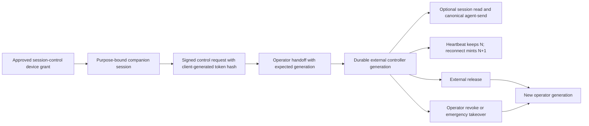

# HX-411 Governed External Session Control

Prepared: 2026-07-14

Program row: `HX-411`

Packet status: **ARCHITECTURE READY / IMPLEMENTATION HOLD**

## Decision

GoatCitadel should support a CLI or external harness attaching to an existing Chat session through a distinct, Gateway-owned session-control domain. Existing companion authentication remains the outer device identity. A short-lived, session-scoped control capability and a durable, monotonically increasing controller generation determine who may mutate that Chat session.

The seven v1 control operations are frozen to:

- `read`
- `send`
- `heartbeat`
- `reconnect`
- `handoff`
- `release`
- `revoke`

These operations are deliberately split into three authority classes:

- Delegated external capabilities are `send` plus optional `read`. Every controller capability set must contain `send`; `{read}` and an empty set are invalid. V1 does not define a read-only controller. A future observer/advisory role must be a separate non-owner design and can never own a controller generation.
- `heartbeat`, `reconnect`, and `release` are intrinsic controller protocol operations. They are available only to the exact purpose-bound companion, client instance, token, and current controller generation; they are not requested scopes and cannot be removed in a way that strands the controller. Heartbeat retains generation `N`; a valid reconnect authenticates generation `N`, terminalizes it as `superseded`, and creates the same-bound external controller at generation `N+1` with a new client-generated token hash.
- `handoff` and `revoke` are operator-only actions. An external client can never request them, a handoff can never mint them into a token, and the Gateway can never infer them from companion identity, device approval, or another external capability. Emergency takeover is an operator `revoke` mode, not an eighth operation or an external capability.

The outer external principal is not a generic companion session. A device may request the `session_control_client` purpose, but that request grants nothing until the operator approves that exact purpose. The device request, approved device grant, companion session, access token, and refresh token then carry the immutable purpose. Exchange and refresh preserve it exactly and cannot select or broaden it. Existing/general companion grants remain `general_companion`. A general companion principal cannot call session-control routes, and a `session_control_client` principal is denied global events and every unrelated or unscoped API surface.

Purpose isolation begins before companion-session exchange. A purpose-bound approved device credential confers authenticated access only to the exact companion-session exchange route through a narrow `device-session-exchange` access class; it cannot fall through generic `device`, `authenticated-read`, `sse-read`, or default route handling. Truly public endpoints remain anonymous/public and must ignore, not derive authority from, an attached device or companion bearer. After exchange, the purpose-bound companion may call only `session-control-companion` or `operator-or-session-control-companion`. The public refresh endpoint is a credential-rotation boundary rather than an authenticated route principal: it loads the stored companion session by refresh-token hash, preserves the stored purpose, and grants no unrelated API access.

External mid-turn `steer` is explicitly excluded. The current `ChatSteerService` owns a process-local `Map`, so it cannot recover an accepted instruction after Gateway restart or prove which worker consumed it. `POST /api/v1/chat/sessions/:sessionId/steer` remains an ordinary local operator feature and must not be exposed through an external control capability. A later tranche may add external steering only after a durable, generation-fenced instruction owner and recovery proof replace that queue.

The governing rule is one canonical mutation owner per Chat session. This rule covers ordinary Mission Control UI mutations as well as external clients. While an external control generation is active or stale-but-reconnectable, an ordinary operator Chat send or any other session mutation must either follow an explicit hand-back/takeover that increments the generation, or fail closed. An ordinary lease lapse or transport disconnect with no contradictory identity evidence leaves external generation `N` current-but-stale and non-mutating. Duplicate, replaced, mismatched, or otherwise unverifiable controller identity is different: it hard-revokes external `N` and creates operator generation `N+1`. Neither condition may race the external controller silently or infer authority from absence.

The operator always retains:

- read access;
- approval resolution through the existing approval owner;
- revoke;
- emergency takeover, implemented as a revocation plus generation increment;
- visibility of control state and audit evidence in Ops.

Approval resolution is not delegated by session control. It mutates the approval aggregate, not the Chat session aggregate. A control capability must never contain approval action tokens or imply approval authority.

The later live-program addendum uses `close`, `interrupt`, and `resume` as lifecycle terms rather than new delegated capabilities. In this packet they are frozen as follows:

- `close` means the existing intrinsic external `release` operation. It does not mean hard-delete, archive, process exit, or a new session-control capability.
- `interrupt` means canonical Chat turn cancellation. External v1 has no interrupt capability. An operator must first complete emergency takeover when an external generation owns the session, then use the existing cancellation owner under the new operator generation.
- `resume` means the mutation-authority `reconnect` transition from external `N` to same-bound external `N+1`. Resuming an event or persisted-turn stream from a cursor is read continuity only and never renews or recreates mutation authority.

Send, close/release, interrupt, revoke, and resume/reconnect serialize through the one Chat session aggregate revision owner together with the exact current control generation. Canonical message content, structured parts, attachment/context references, and their stable digest are snapshotted under that owner lock and bound to idempotency material before the lock is released. Exact retries converge on one canonical message; different session, generation, or structured-input material conflicts.

Work that outlives admission carries the frozen control generation. Every provider result, tool/external-effect boundary, artifact write, transcript/result commit, and stream terminal callback rechecks that generation. A late callback from superseded or revoked `N` cannot mutate Chat or trigger a replay. If an external attempt already occurred, `HX-305` still records its delivered/unknown/uncertain truth and `HX-306` still records the actual effective provider/model/route/cost attempt; ownership change never erases evidence or causes redispatch.

## Live source-of-truth snapshot

This packet was rechecked against live committed `HEAD` `aa68ba9d9b13671c5e6587b9bead37568d034a31` on 2026-07-14. That checkpoint commits HX-501 and both committed source migration heads; unrelated working-tree changes remain outside this packet.

| Concern | Current owner and truth | HX-411 consequence |
|---|---|---|
| Companion identity | `packages/contracts/src/auth.ts`, `packages/contracts/src/companion-auth.ts`, `apps/gateway/src/plugins/auth.ts`, `apps/gateway/src/routes/auth.ts`, `apps/gateway/src/services/settings-auth-service.ts`, and `apps/gateway/src/services/companion-auth-helpers.ts` own device request/grant identity, exchange, 15-minute access tokens, refresh, Ed25519 request signing, replay rejection, list, and revoke. | Extend the request, approved grant, companion session, token responses, and request-auth projection with an immutable `session_control_client` purpose. A purpose-bound device credential may reach only exact session exchange; a purpose-bound companion may reach only the two session-control classes. Do not create a CLI master token, treat a generic companion as a controller, or accept an actor/session ID from the body. |
| Canonical Chat send | `apps/gateway/src/routes/chat.messages.ts` routes both buffered and streaming sends through `/api/v1/chat/sessions/:sessionId/agent-send` and `/agent-send/stream`. | External send must enter these canonical owners and produce the same durable turn/answer. Do not add a second message pipeline. |
| In-process Chat write exclusion | `apps/gateway/src/services/chat-turn-execution-registry.ts` keeps write leases and active streams in process-local maps. | Keep this as an inner single-process guard, but do not treat it as durable or cross-Gateway session-control authority. |
| Durable execution | `apps/gateway/src/services/durable-run-service.ts` and `packages/storage/src/durable-run-repo.ts` own worker claim, heartbeat, fencing, and recovery for durable runs. | Do not reuse or extend a durable worker lease for a human/external controller. A controller may submit a turn; the durable worker still owns execution. |
| Realtime stream lease | `apps/gateway/src/routes/events.ts` and `apps/gateway/src/services/realtime-event-service.ts` own a global retained event list/stream plus connection leases. | Do not reuse the global stream lease as mutation authority. A purpose-bound session-control principal must be rejected by both global routes. Add a session-scoped filtered stream that cannot expose other workspaces/sessions or approval action tokens. |
| Mesh session owner | `packages/storage/src/mesh-repo.ts` and `apps/gateway/src/routes/mesh.ts` own which Gateway node serves a session. | Mesh node ownership is routing/failover authority, not operator/client ownership. Preserve both fences independently. |
| External steer | `apps/gateway/src/services/chat-steer-service.ts` stores active turns and queued instructions in a `Map`; the stream service drains it. | External steer is HOLD. No accepted external instruction may depend on this process-local queue. |
| Chat session identity and lifecycle | `chat_session_meta.session_id` is the global primary key. `packages/storage/src/chat-session-meta-repo.ts` and `chat-session-revision-repo.ts` can currently insert it implicitly, mutation helpers can call `ensure`, `apps/gateway/src/services/chat-session-service.ts` can upsert a deterministic stable-key session and patch its workspace, and `packages/storage/src/index.ts` plus the Chat service recursively hard-delete side-chat trees. | Key the control generation namespace by global `session_id`; allow creation only through an explicit workspace-bearing initializer; make mutation/delete helpers require existing metadata; treat workspace as immutable; reject a stable-key workspace mismatch; and tree-fence every affected session before deleting any of them. |
| Migration heads | Committed `HEAD` contains SQLite `170` and PostgreSQL `112`. SQLite `171` / PostgreSQL `113` are exclusively reserved for the paired HX-502/HX-504 assignment, ordered-event, and settlement foundation. | HX-411 requires a later paired migration. SQLite `172` / PostgreSQL `114` are an unallocated candidate only after the migration-free contract gate and a fresh head/reservation scan; this packet does not allocate or reserve them. |

The external drivers are intentionally narrow:

- OpenClaw's attach-to-existing-session CLI demonstrates the workflow value.
- Hermes live handoff and tool-visible session identity demonstrate explicit continuity.
- GoatCitadel must add its own durable ownership, auth, policy, audit, and operator-truth controls rather than importing either upstream trust model.

This packet excludes xAI, Grok, X, Cursor, arbitrary remote shells, raw database access, direct worker attachment, tool-authorized approval resolution, and a second Chat backend.

## Frozen trust and ownership invariants

1. **One durable owner generation.** Every Chat session has exactly one current control generation with owner kind `operator` or `external_companion`. Ownership changes increment the generation in the database.
2. **All session mutations are fenced.** Every route or service that mutates session-owned Chat state must validate the current owner and expected generation before its first side effect. This includes send, retry, edit, undo/select, cancel, goal, preferences, policy, learned-memory binding, specialist state, session metadata/lifecycle, project/binding, side chat, workbench mutation, generated artifact mutation, and knowledge/attachment mutation.
3. **UI is a competing client.** The ordinary Mission Control UI is not exempt. While an external generation owns the session, UI mutations return a typed conflict until explicit release, revoke, or emergency takeover creates a new operator generation.
4. **Approvals remain operator-owned.** Approval reads and resolutions remain available to the operator. Session control never delivers approval action tokens and cannot approve, edit, reject, or replay an effect.
5. **Two credentials, two jobs.** The purpose-bound companion access token authenticates the `session_control_client` device/session. The session-control token authorizes the exact Chat session, controller generation, client instance, and delegated capabilities `{send}` or `{send, read}`. Both must be valid for external mutation. Heartbeat, reconnect, and release derive only from being the exact current controller; they are never stored as capabilities. `handoff` and `revoke` remain operator authority and are invalid in an external request, stored capability set, or minted token.
6. **No body-claimed identity.** Principal purpose, workspace, actor, companion session, device grant, and current Chat session binding come from authenticated and stored owners. A request body may carry only expected generation, request/client IDs, a client-generated token hash during request/rotation, delegated capabilities, and bounded action input.
7. **Client-generated secret.** The external client generates at least 256 random bits, sends only its lowercase SHA-256 during request or rotation, and later presents the secret through a dedicated non-loggable control header. GoatCitadel stores only the hash. The plaintext is never returned by an API, persisted, logged, placed in an event, or embedded in a CLI command line.
8. **Short-lived capability.** The control token has a fixed 15-minute absolute lifetime. Heartbeat proves liveness but does not extend the token beyond its absolute expiry. Reconnect authenticates the old exact generation/token, terminalizes that generation as `superseded`, and creates same-bound external generation `N+1` with a newly client-generated token hash.
9. **Database-clock liveness.** V1 uses a fixed 15-second heartbeat cadence, a 60-second live lease, and a five-minute reconnect window. Database time, not client or Gateway wall time, decides live, stale, and reconnect-expired state.
10. **Stale never means operator-owned.** Missing heartbeat or an ordinary transport disconnect with no contradictory identity evidence changes the projection to `stale` and blocks every external and ordinary UI session mutation, but does not silently return ownership to the UI. The exact bound client may reconnect within the fixed window, producing external generation `N+1`. After expiry, only explicit operator revoke/emergency takeover creates a new operator generation.
11. **Generation CAS.** Handoff, heartbeat, reconnect, release, revoke, and every session mutation bind the exact current generation. Same-generation retries with the same idempotency material converge; stale or conflicting material fails with no mutation. Reconnect is a one-winner generation transition rather than a same-generation token update.
12. **Signed external mutations.** Existing companion Ed25519 signing, timestamp, nonce, body-hash, and replay protection remain mandatory for external control mutations in addition to the control token.
13. **Workspace/session isolation.** The grant, Chat session metadata, companion identity, events, read stream, and send all resolve to one exact stored workspace/session binding. Mismatch returns `404` or a typed capability error without cross-workspace existence disclosure. A `session_control_client` device or companion principal is denied `/api/v1/events`, `/api/v1/events/stream`, and every unrelated or unscoped route even when an existing generic class would otherwise accept that authenticated source.
14. **No lease substitution.** A session-control grant is not a durable worker lease, realtime stream lease, mesh owner, tool grant, autonomous activation grant, or approval capability.
15. **One canonical answer.** External `send` uses the existing Chat entry, routing, durable execution, approval, usage, tool-effect, and persisted stream owners. There is no external answer cache or parallel transcript.
16. **Content-free control evidence.** Control records, audit, realtime control events, logs, and Ops projections contain IDs, generations, timestamps, reason codes, hashes, and bounded labels only. They never contain message text, token plaintext, prompts, tool output, or raw approval capabilities.
17. **Purpose is immutable and deny-by-default.** A device request may declare `session_control_client`, but only operator approval of that exact visible purpose authorizes it. Exchange and refresh copy the stored grant purpose; those inputs cannot select, add, or broaden it. Existing records and requests without the new value normalize to `general_companion`. A purpose-bound device credential authenticates only exact session exchange; general companions cannot become controllers; and purpose-bound companions cannot fall through to generic device/companion, authenticated-read, SSE, default, or unrelated authorization. Public endpoints remain public but derive no identity or authority from an attached purpose-bound bearer.
18. **Control state is total for live sessions.** Migration backfill and database-enforced session creation establish exactly one current operator generation for every live Chat session. A missing or duplicate current row is corruption and all session mutation fails closed; no service may synthesize operator ownership from absence.
19. **Session identity is global; workspace is immutable.** The control generation namespace is the globally unique `chat_session_meta.session_id`, not `(workspace_id, session_id)`. Only an explicit creation/reactivation owner with a normalized workspace may insert metadata. Revision, patch, goal-counter, delete, and other mutation helpers require an existing live session and cannot synthesize one with a default workspace. The workspace is copied into the control record as a mandatory isolation binding and cannot change through stable-key upsert, metadata patch, project/binding mutation, restore, import, or reactivation. A missing session or mismatched workspace fails before side effects; a future session-move feature requires a separately reviewed control-aware transition.
20. **Aggregate delete is tree-fenced.** Hard deletion of a parent may recursively remove side-chat children in the live owner. The transaction must discover the complete deletion tree, lock and validate every session revision and control generation in deterministic order, require every node to be operator-owned, and only then terminalize and delete the whole tree. One external, corrupt, missing, or stale child aborts the entire delete.
21. **Identity ambiguity revokes; absence only stales.** Duplicate controller identity, replacement by a different companion/client binding, a mismatched presented binding, or evidence that cannot establish one exact current identity hard-revokes external `N` before send or interrupt and creates operator `N+1`. A mere missed heartbeat or disconnected transport without contradictory evidence remains current-but-stale and reconnectable; absence alone never proves replacement or operator ownership.
22. **One revision owner and one message.** Send, close/release, interrupt, revoke, and resume/reconnect serialize through the Chat session aggregate revision owner plus exact control generation. Canonical content, structured parts, attachment/context references, and their digest are frozen under that lock and included in idempotency material. No second message can emerge from a retry or late callback.
23. **Late evidence remains truthful.** A generation change fences late provider, tool, artifact, transcript, result, and stream-terminal callbacks before mutation. `HX-305` effect truth and `HX-306` actual effective-provider usage/cost remain durable even when the result is rejected as late; neither condition authorizes retry or redispatch.
24. **Stream counters do not overclaim delivery.** External-control streams use ordered replay and bounded unsent buffers with explicit low/high watermarks. `sentThrough` means handed to the socket write path, `acknowledgedThrough` advances only from a client-supplied cursor, and `pending` counts queued unsent envelopes. TCP write or connection health is never presented as client acknowledgement.

## Controller state machine

The durable aggregate is a generation ledger. Operator generations have no control-token hash and no lease expiry. External generations bind one active companion session and one client instance.

| Current state | Action | Required authority | New state | Generation rule |
|---|---|---|---|---|
| `operator_active` | companion requests control | Active signed `session_control_client` companion session; stored exact session/workspace binding; capability set includes `send` | Pending request only; owner unchanged | No increment |
| `operator_active` | operator handoff | Operator, exact pending request, exact current generation | `external_live` | Increment once |
| `external_live` | heartbeat | Bound companion, valid control token, exact generation | `external_live` with later DB lease deadline | No increment |
| `external_live` | lease lapse or ordinary transport disconnect without contradictory identity evidence | Database clock or bounded connection observation | Same external generation becomes current-but-`external_stale`; all session mutation is blocked | No increment |
| `external_live` or `external_stale` | reconnect | Same bound companion/client, signed request, valid old token, exact generation `N`, inside reconnect window, new token hash | Terminalize `N` as `superseded`; create same-bound `external_live` generation `N+1` | Increment once |
| `external_live` or `external_stale` | duplicate, replaced, mismatched, or unverifiable controller identity | Gateway/storage evidence cannot prove one exact stored companion/client binding | Hard-revoke external `N`; create `operator_active` generation `N+1` | Increment once |
| `external_live` or `external_stale` | release | Bound companion, valid signed release, exact generation | `operator_active` | Increment once |
| `external_live` or `external_stale` | revoke | Operator, exact generation and reason | `operator_active` | Increment once |
| `external_live` or `external_stale` | emergency takeover | Operator confirmation; implemented through revoke | `operator_active` | Increment once |
| `external_live` or `external_stale` | companion-session or parent-device-grant revoke | Auth owner, exact stored binding, one database transaction | Hard-revoke external `N`; create `operator_active` generation `N+1` | Increment once |
| `operator_active` | hard delete | Operator, exact session revision and current generation | Terminal `deleted`; no live owner or Chat metadata remains | No increment; terminalize current generation |
| `external_live` or `external_stale` | hard delete | Operator without prior explicit takeover | No change; typed externally controlled conflict | No increment |
| Terminal `deleted` | explicit same-workspace session-ID reactivation | Control-aware session repository, exact terminal maximum generation and immutable stored workspace | `operator_active` with new metadata | Increment once |
| Any | stale generation mutation | Any caller | No change; typed conflict | No increment |
| `external_stale` after reconnect window | reconnect or send | External client | No change; operator action required | No increment |

An external control request is not ownership. Creating, listing, rejecting, expiring, or cancelling a pending request cannot block ordinary operator mutation. Only a transactionally committed handoff changes operator ownership to external ownership. Reconnect is the only external-to-external owner transition and always advances the generation; identity ambiguity, release, revoke, takeover, and bound-auth revocation return ownership to a new operator generation.

Companion access-token refresh keeps the same `companionSessionId` and immutable `session_control_client` purpose and does not change the control generation. Refresh may never turn an ordinary companion into a session-control principal or broaden a purpose-bound principal. Revoking the companion session or its parent device grant must, in the same database transaction, revoke every current external generation bound to it, create new operator generations, and append the corresponding control events. If that atomic coupling cannot be implemented through the current auth owner, HX-411 stays HOLD rather than relying on an after-commit callback.

## Contract shape

Add `packages/contracts/src/session-control.ts` and export it from `packages/contracts/src/index.ts`.

Core contract types:

- `SessionControlOperation = "read" | "send" | "heartbeat" | "reconnect" | "handoff" | "release" | "revoke"`
- `ExternalSessionControlCapability = "read" | "send"`
- `SessionControlProtocolOperation = "heartbeat" | "reconnect" | "release"`
- `OperatorSessionControlAction = "handoff" | "revoke"`
- `SessionControlOwnerKind = "operator" | "external_companion"`
- `SessionControlLeaseState = "operator_active" | "external_live" | "external_stale" | "released" | "revoked" | "superseded" | "deleted"`
- `SessionControlRequestStatus = "pending" | "rejected" | "expired" | "activated" | "cancelled"`
- `SessionControlRecord`, a content-free projection of current owner, generation, lease health, capability set, bound companion/client summary, and last event
- `SessionControlRequestRecord`, with request, session/workspace, companion/client, token-hash fingerprint, expiry, and decision metadata
- `SessionControlEventRecord`, with immutable event ID, previous/next generation and owner, reason code, actor attribution, correlation ID, and timestamp
- input/response types for request, handoff, heartbeat, reconnect, release, revoke, and list/detail views; the external request validator accepts only `ExternalSessionControlCapability[]`, requires `send`, permits optional `read`, and rejects empty, read-only, duplicate, protocol-operation, operator-action, or unknown inputs rather than stripping them
- typed conflict codes including `SESSION_CONTROLLED_EXTERNALLY`, `SESSION_CONTROL_GENERATION_STALE`, `SESSION_CONTROL_STALE`, `SESSION_CONTROL_RECONNECT_EXPIRED`, `SESSION_CONTROL_TOKEN_INVALID`, `SESSION_CONTROL_CAPABILITY_DENIED`, `SESSION_CONTROL_PRINCIPAL_PURPOSE_DENIED`, and `SESSION_CONTROL_STATE_CORRUPT`

Extend `packages/contracts/src/auth.ts` and `packages/contracts/src/companion-auth.ts` with `CompanionPrincipalPurpose = "general_companion" | "session_control_client"`. A device request may declare its requested purpose, and operator approval persists that exact reviewed value from `auth_device_requests` onto `auth_device_grants`. The device-auth projection, exchange response, companion session, refresh response, companion request-auth projection, and administrative projection carry the same stored value. Existing request, grant, and companion-session rows default/backfill to `general_companion`; exchange/refresh inputs do not accept a purpose.

The token hash is accepted only in request/reconnect inputs. Public response types expose a stable last-eight-character fingerprint, never the full hash or secret. A token's capability hash covers only `{send}` or `{send, read}`; protocol authority is checked separately against the bound current-controller record. A successful reconnect response identifies newly created external generation `N+1`; it never returns token plaintext or presents the old generation as renewed.

## API and handshake

All control responses use `Cache-Control: no-store` and `Pragma: no-cache`. External routes require an authenticated `session_control_client` principal before session binding or capability checks. Mutations use the existing mutation admission/drain boundary, request-derived actor attribution, idempotency keys, and companion signature verification where applicable.

| Method | Route | Access and semantics |
|---|---|---|
| `POST` | Existing `/api/v1/auth/companion/session/exchange` | `device-session-exchange`. The only API route available to an approved purpose-bound device credential. Loads the purpose from the stored grant and copies it to the companion session/response; the request cannot select or broaden it. General approved device grants retain the same existing exchange behavior. |
| `POST` | `/api/v1/chat/sessions/:sessionId/control/requests` | `session-control-companion`. Signed `session_control_client` request. Stores a pending, session-scoped request with client instance ID, client-generated token SHA-256, and capabilities `{send}` or `{send, read}`. Empty, read-only, duplicate, protocol-operation, operator-action, or unknown input is rejected before a row is written. Does not change ownership. |
| `GET` | `/api/v1/chat/sessions/:sessionId/control` | `operator-or-session-control-companion`. Returns content-free current owner, generation, lease state, and pending requests allowed to that actor. A bound controller may read this protocol state without delegated `read`; transcript/history access still requires `read`. |
| `POST` | `/api/v1/chat/sessions/:sessionId/control/handoff` | Operator only. CASes exact operator generation plus pending request into one external generation. Effective capabilities must include `send`, may include requested `read`, and can never contain a protocol operation or operator action. No prompt or message is sent. |
| `POST` | `/api/v1/chat/sessions/:sessionId/control/heartbeat` | `session-control-companion`. Bound `session_control_client` plus control token and exact generation. Intrinsic controller protocol; renews only the live lease using database time. |
| `POST` | `/api/v1/chat/sessions/:sessionId/control/reconnect` | `session-control-companion`. Same bound `session_control_client`, signed body, valid old token, exact generation `N`, and new token hash. Intrinsic controller protocol; only inside the reconnect window it terminalizes `N` as `superseded` and creates same-bound `external_live` generation `N+1`. Duplicate/replaced/mismatched identity and expired reconnect fail closed. |
| `POST` | `/api/v1/chat/sessions/:sessionId/control/release` | `session-control-companion`. Bound `session_control_client` plus signed request, control token, and exact generation. Intrinsic controller protocol; atomically returns ownership to a new operator generation. |
| `POST` | `/api/v1/chat/sessions/:sessionId/control/revoke` | Operator only. Revokes a pending request or current external generation. `mode: "emergency_takeover"` is the explicit takeover path and creates a new operator generation. |
| `GET` | `/api/v1/chat/sessions/:sessionId/control/events/stream` | `operator-or-session-control-companion`; external branch also requires delegated `read`. Session/workspace-filtered retained stream with cursor/replay-gap semantics and no approval action tokens. |
| `GET` | Existing `/messages`, `/history`, `/thread`, and turn stream routes | Explicit `operator-or-session-control-companion` only on the reviewed bounded routes. Operator retains normal reads. External reads require exact purpose, `read`, and session binding. No generic read class grants this access. |
| `POST` | Existing `/agent-send` and `/agent-send/stream` | Explicit `operator-or-session-control-companion`. The only external send path; its external branch requires exact purpose, signed request, control token, `send`, generation, and live lease before canonical admission. |

Route access is explicit and fail closed:

- add `device-session-exchange` for the exact existing grant-to-companion-session exchange route; it admits a valid stored device grant of either purpose and is the only route class a `session_control_client` device credential may use;
- add `session-control-companion` for routes callable only by a `session_control_client` companion principal;
- add `operator-or-session-control-companion` for exact session-control status/read routes shared with the operator;
- project stored purpose after either device or companion authentication and apply a central purpose guard before the access-class switch: a purpose-bound device may pass only `device-session-exchange`, while a purpose-bound companion may pass only the two session-control classes; generic `device`, `companion`, `authenticated-read`, `sse-read`, default, and every other authenticated class reject the purpose; intentionally public routes do not authenticate the attached bearer and grant no bearer-derived authority;
- preserve the current hook ordering in which route-access enforcement is installed before the companion signed-mutation `preHandler`. Authentication still occurs in `onRequest`, but a purpose-denied route must fail before signature verification consumes a nonce, inserts a replay row, or appends an accepted-signature audit event;
- make `authenticated-read` and `sse-read` explicitly regression-test that rejection, because they currently accept some companion-authenticated requests;
- keep `GET /api/v1/events` and `GET /api/v1/events/stream` on their existing global classes, which therefore deny this purpose regardless of session-control token or delegated `read`;
- reject `session_control_client` on every unclassified, unrelated, or unscoped API route. Handler-level session/generation/capability checks remain mandatory after the narrow route class succeeds.

Handshake sequence:

1. The device requests `session_control_client`; Mission Control shows that purpose during device approval. After the operator approves the exact purpose, the resulting device credential can call only `device-session-exchange` and completes the existing grant-to-companion-session exchange. The server copies the grant purpose into the session and token claims; exchange cannot select it. The device credential cannot read global events or any unrelated route before exchange.
2. The external client generates a 256-bit control secret locally, retains it in process memory or an OS-protected credential store, and submits only its SHA-256 with a signed control request.
3. Mission Control shows the request, exact target workspace/session, device/client identity, requested external capabilities, expiry, and current generation. Capabilities must include `send`; protocol operations and operator actions are not requestable.
4. The operator explicitly selects **Hand off** with the expected generation and effective capabilities containing `send` plus optional requested `read`. One transaction locks current control state, revalidates active purpose-bound companion/device authority, rejects read-only, protocol-operation, operator-action, or unrequested capability material, terminates the operator generation, activates the request as generation `N+1`, and appends the event.
5. The client observes generation `N+1` through the content-free control-status route and may call the canonical send route while heartbeat is live. If the effective capability set also contains `read`, it may open the session-scoped event stream and bounded transcript/turn reads.
6. A valid reconnect authenticates the exact old generation and token, terminalizes that generation, and creates the same-bound external controller at the next generation with the new token hash. The old token and generation cannot send, interrupt, resume mutation authority, or commit a late callback.
7. Release, revoke, emergency takeover, bound auth revocation, or hard identity ambiguity atomically creates the next operator generation. Any late external send carrying the prior generation fails before message, trace, durable-run, tool dispatch, artifact, or result rows are written. Actual attempts already made retain `HX-305`/`HX-306` evidence without redispatch.

The dedicated header names should be frozen in the contract and redacted by the logging layer:

- `X-GoatCitadel-Session-Control-Token`: plaintext session-control secret
- `X-GoatCitadel-Control-Generation`: canonical decimal generation
- existing companion timestamp, nonce, and signature headers for signed mutations

Control secrets must not be accepted in query strings, JSON bodies, environment-variable diagnostics, process arguments, or SSE URLs. `packages/gateway-core/src/logger.ts` must classify the complete case-insensitive header key `X-GoatCitadel-Session-Control-Token` as sensitive, and both the structured logger and `apps/gateway/src/runtime-ux.ts` Fastify/terminal logger paths must prove that request metadata and errors cannot emit its value.

## Mutation admission order

The same service-level gate must protect every session mutation; route-only checks are insufficient because tests, internal callers, and future routes could bypass them.

1. Resolve authenticated actor and stored workspace/session binding.
2. Admit the API request through the current shared-host drain boundary.
3. Start the storage transaction or durable admission transaction appropriate to the owner.
4. Lock the one Chat session aggregate revision owner and read/lock the exact current session-control generation using database time.
5. Authorize operator or external owner, principal purpose, delegated capability or intrinsic protocol operation, token hash, companion binding, liveness, and expected generation.
6. Canonicalize and snapshot message content, structured parts, attachment/context references, and their stable digest under that same revision/control lock; bind session, generation, actor, and digest into idempotency material.
7. Apply the current process-local `ChatTurnExecutionRegistry` write lease when the operation is a turn write.
8. Perform the canonical mutation and append the content-free control-use/audit event in the same transaction or canonical durable admission boundary.
9. Recheck generation at every final pre-side-effect and pre-commit fence for provider, tool, artifact, transcript/result, or stream-terminal work that can outlive admission. Reject late `N` mutation while preserving `HX-305` delivery truth and `HX-306` actual-attempt accounting; never redispatch because the generation changed.

For streaming send, a client disconnect does not transfer ownership or cancel the canonical turn. The client reconnects to the persisted turn stream. Explicit cancellation requires the current owner; the operator must first perform emergency takeover if an external generation owns the session.

## Storage model

HX-411 needs one additive paired SQLite/PostgreSQL migration after its migration-free contract gate. Committed heads are SQLite `170` / PostgreSQL `112`, and SQLite `171` / PostgreSQL `113` are exclusively reserved for HX-502/HX-504. SQLite `172` / PostgreSQL `114` are therefore only an unallocated HX-411 candidate after a fresh head/reservation scan. This packet allocates and reserves no migration number.

### `chat_session_control_grants`

This table owns pending requests and generation records. Required invariants:

- `session_id` is the canonical global control identity, matching the primary key of `chat_session_meta`; `workspace_id` is a required immutable isolation attribute, not a second generation namespace, and there is deliberately no foreign key or cascade from the control ledger to deletable metadata;
- one current owner row per `session_id` across `operator_active`, `external_live`, and `external_stale`;
- monotonically increasing generation with unique `(session_id, generation)` and no generation reset through a different workspace;
- pending request identity is unique and cannot claim a generation before handoff;
- external generations bind exact `companion_session_id`, parent `device_grant_id`, immutable principal purpose, `client_instance_id`, requested/effective capability hashes, token hash, absolute token expiry, database-clock lease deadline, and reconnect deadline;
- request and storage checks allow only capability sets `{send}` or `{send, read}`; `heartbeat`, `reconnect`, `release`, `handoff`, and `revoke` can never be stored as delegated capabilities;
- token hash is globally unique among nonterminal grants;
- operator generations contain no companion or token material and never have lease/reconnect deadlines;
- heartbeat may update only lease timestamps/revision for the same external generation;
- reconnect is a SQL-level one-winner transition: authenticate exact external `N` and its valid old token inside the reconnect window, terminalize `N` as `superseded`, and create same-bound external-live `N+1` with the new token hash/expiry and lease timestamps; it may not update authority in place;
- an ordinary lease lapse or transport disconnect without contradictory identity evidence keeps `N` current as `external_stale` and non-mutating, while duplicate, replaced, mismatched, or unverifiable identity hard-revokes `N` and creates operator `N+1`;
- terminal ownership fields and prior generations are immutable;
- handoff/reconnect/release/revoke/takeover, identity-ambiguity revocation, and bound companion/device revocation use SQL-level CAS and one-winner checks, not a read-then-write application promise;
- SQLite uses `BEGIN IMMEDIATE`; PostgreSQL locks the exact current row and uses database-clock predicates;
- no cascade may silently delete control history or content-free deletion tombstones.

### `chat_session_control_events`

This append-only table is the canonical control history. It records initialization, request, handoff, heartbeat-health transition, ordinary-disconnect stale transition, reconnect supersession and new generation, identity-ambiguity revocation, release, revoke, takeover, denied-stale-generation, companion/device revocation, session deletion, and explicit session-ID reactivation events. Repeated heartbeats need not append one row each; append only the first recovery to live and first transition to stale, while the grant row retains the latest heartbeat.

Each event binds:

- workspace/session;
- request/grant IDs when applicable;
- previous and next generation/owner/state;
- authenticated actor source/ID and bound companion/device IDs;
- idempotency and correlation hashes;
- reason code and database timestamp;
- no message, prompt, tool, token, or approval payload content.

### Session lifecycle coupling and content-free tombstones

The paired migration must make control state total without weakening hard deletion:

1. Backfill existing device requests, device grants, and companion sessions to `general_companion`, enforce the two-value purpose constraint and immutable copy at each hop, then backfill generation `1`, owner `operator`, state `operator_active`, and a content-free initialization event for every existing `chat_session_meta` row using database time. The migration aborts if any auth/control row is invalid, any live session cannot end with exactly one current owner, or pre-existing rows conflict.
2. Install database-level session-initialization enforcement for both dialects. Every first insertion of a Chat session through the explicit workspace-bearing initializer, import, bootstrap, test fixture, or another reviewed creation path creates operator generation `1` and its initialization event in the same transaction. Application-only convention is insufficient; raw insertion that would leave a live session without exactly one current row is rejected.
3. Remove mutation-time implicit creation. `ChatSessionRevisionRepository.ensure`, `ChatSessionMetaRepository.patch`/goal-counter helpers, `deleteChatSessionData`, and equivalent mutation/delete paths must require existing metadata/control state or delegate to the explicit initializer with an explicit workspace before any mutation. Deleting, patching, or fencing an unknown session must not create metadata, generation `1`, initialization/deletion events, prefs, bindings, or tombstones.
4. Make workspace binding immutable. First insertion copies `chat_session_meta.workspace_id` into control state. A deterministic stable-key upsert for an existing session must compare the requested workspace before patching metadata, bindings, projects, or other rows and reject a mismatch. Database guards reject raw workspace changes; workspace reassignment is not an HX-411 v1 operation.
5. Require control-state reads to count the current rows for a live session. Zero or more than one is `SESSION_CONTROL_STATE_CORRUPT`; send, metadata changes, archive, deletion, and every other mutation fail before side effects. Absence never projects operator ownership.
6. Preserve real hard-delete semantics. The control grant/event tables have no foreign key or cascade to `chat_session_meta`. A hard-delete transaction discovers the complete parent/side-chat deletion tree, locks every session revision and controller generation in deterministic order, and requires every node to be operator-owned. It then cancels each node's pending requests, terminalizes every current generation, appends one content-free `session_deleted` event per node, and only then deletes transcript, attachments, derived content, and `chat_session_meta`. The surviving terminal control rows/events are the tombstone; no Chat metadata or user content is retained. One externally controlled or corrupt node rolls back the entire tree.
7. Guard raw `chat_session_meta` deletion at the database boundary. Deletion is rejected unless the matching current generation has already been terminalized and the same transaction has appended the exact `session_deleted` event. A cascade, direct repository delete, or alternate service cannot bypass that ordering.
8. Reusing a terminal `session_id` is never an ordinary initializer, even when the caller supplies a different workspace. A dedicated control-aware reactivation transaction must lock the global terminal maximum generation `N`, require the tombstone's immutable workspace, prove no live metadata/current owner exists, create the new metadata row plus operator generation `N+1`, and append `session_reactivated`. The database enforcement distinguishes this explicit expected-`N` transition from a first insert and rejects raw ID reuse, cross-workspace reuse, or a reset to generation `1`.

The concrete paired migration may use dialect-appropriate triggers plus a transaction-scoped reactivation intent/guard, but its observable contract is frozen above: first creation is automatic and total, deletion is content-erasing but audit-preserving, and reactivation is explicit and monotonic. No migration number is allocated by this packet.

There is deliberately no `chat_turn_steer_instructions` table in v1. If external steer is later approved, it requires its own immutable instruction intent, exact session/turn/controller-generation binding, one terminal consumption settlement, worker recovery, and no-double-delivery proof before a new capability can be added.

## Realtime and reconnect truth

The existing `/api/v1/events` list and `/api/v1/events/stream` are global, and the stream lease represents delivery connection health only. Both `authenticated-read` and `sse-read` must reject the `session_control_client` purpose before their current generic companion allowance. HX-411 adds a session-scoped projection behind `operator-or-session-control-companion`; it never teaches a control token to read either global route.

The control stream:

- filters in storage/service code by exact workspace and session before serialization;
- reuses retained monotonic cursor and replay-gap semantics;
- emits controller-generation changes, turn lifecycle, durable wait/recovery state, tool-state summaries, and approval-needed summaries;
- omits approval action tokens and any event that cannot prove its workspace/session binding;
- includes the current controller generation in `stream-ready` and every mutation-relevant envelope;
- maintains an explicitly bounded unsent-envelope queue with frozen low/high watermarks; crossing the high watermark stops intake or closes with a named bounded-backpressure reason rather than silently dropping or growing without bound;
- reports `sentThrough`, `acknowledgedThrough`, and `pending` separately: sent means handed to the socket write path, acknowledged advances only from a client-supplied retained cursor, and pending counts queued unsent envelopes; a successful TCP write or live connection never fabricates acknowledgement;
- closes with a named `control-revoked`, `control-superseded`, `control-stale`, `backpressure`, or `replay-gap` event when continued delivery is unsafe;
- treats reconnecting the event stream as read continuity only. It does not renew mutation ownership; the explicit heartbeat/reconnect route does that.

An external client recovering after Gateway restart first refreshes companion auth if necessary without changing its purpose, reads content-free control state, authenticates the exact prior generation/token, and rotates session-control authority through `reconnect`, which creates same-bound external generation `N+1`. A controller with `read` then resumes the session-filtered event stream and persisted turn stream from their cursors; that read resume does not change control state, and a send-only controller cannot read either stream. It never asks a worker lease or an in-memory stream registration to recreate ownership.

## Ops and Mission Control projection

Ops must show one semantic control card per non-default or recently changed session, not raw JSON. The card includes:

- workspace and Chat session label/ID;
- owner kind and generation;
- companion device/client summary;
- live, stale, reconnect-expired, released, or revoked state;
- last heartbeat and token/lease/reconnect expiry times;
- requested and effective external capabilities, separately from intrinsic controller protocol operations and operator-only handoff/revoke actions;
- pending request count;
- last handoff/release/revoke actor and reason;
- canonical versus retained-signal basis and any caveat;
- explicit **Revoke** and **Emergency takeover** actions.

The Chat surface shows a compact controller banner. When external control is active, mutation controls are disabled with the exact reason and an operator action to take over. It must not optimistically re-enable send merely because SSE disconnected or a heartbeat is late. Read, approval cards, revoke, and emergency takeover remain available.

The external CLI shows session identity, workspace, generation, effective capabilities, lease countdown, and reconnect state. It shows active turn and retained cursor only when `read` is present. It must never print or persist the control secret in normal output, diagnostics, shell history, or evidence artifacts.

## Failure matrix

| Failure or race | Required result | Durable evidence |
|---|---|---|
| UI and CLI send the same session concurrently while operator owns it | UI wins only if it commits before handoff CAS; otherwise the external generation wins and UI fails `SESSION_CONTROLLED_EXTERNALLY`. Never two admitted turns from one generation race. | One generation transition and at most one canonical send admission per idempotency key. |
| UI send starts after external handoff | Fail before message/trace/durable-run rows. UI offers explicit takeover. | Denied mutation reason with observed generation; no content. |
| CLI send arrives after operator takeover | Fail `SESSION_CONTROL_GENERATION_STALE` before side effects. | Revoke/takeover event plus denied old-generation event. |
| Two operator tabs hand off different clients | SQL CAS permits one generation transition; loser receives current state. | One handoff event only. |
| External request contains `{read}`, an empty set, duplicates, a protocol operation, `handoff`, `revoke`, or an unknown capability | Reject the complete request before persistence; do not strip, downgrade, or infer a replacement. | Content-free validation rejection only; no pending grant row. |
| Ordinary companion calls a control route | Reject `SESSION_CONTROL_PRINCIPAL_PURPOSE_DENIED` before resolving target session state. A caller cannot select purpose during exchange or refresh. | Companion auth denial without cross-session existence or content. |
| Purpose-bound device credential calls anything except exact session exchange | The credential authenticates no other route. Deny global events, SSE, generic device, default, and unrelated protected routes; intentionally public routes remain anonymous and ignore the bearer. Exchange copies stored purpose without accepting it from input. | Route-access denial, anonymous public behavior, or one exchange event; never bearer-derived unrelated authority. |
| Purpose-bound device or companion calls global `/api/v1/events`, `/api/v1/events/stream`, or an unrelated/unscoped route | The central purpose guard rejects before the handler and before companion signature/replay persistence. A control token and delegated `read` do not widen access. | Route-access denial naming the purpose/class, with no returned event, resource content, consumed nonce, replay row, or accepted-signature audit event. |
| Two external clients present the same request/token | Exact companion session and client instance binding permits only the approved client; replay/nonce guard rejects duplicate signed mutation. | Accepted request/use or replay-rejected event, never both mutations. |
| Same idempotency key with different session, generation, or body hash | `409` conflict; no convergence across different material. | Original admission hash retained. |
| Heartbeat is late or the transport disconnects without contradictory identity evidence, inside the reconnect window | Keep external `N` current, project `external_stale`, and block all session mutation until signed reconnect or operator takeover. A valid reconnect terminalizes `N` and creates same-bound external-live `N+1`. | First stale transition, `N` supersession, and `N+1` creation; latest heartbeat remains in the old grant row. |
| Two live presentations, replacement, mismatched companion/client binding, or otherwise unverifiable current identity | Hard-revoke external `N` before send or interrupt, create operator `N+1`, and reject reconnect. Do not treat this as an ordinary disconnect. | Identity-ambiguity reason, revoked `N`, and one operator `N+1`; no external mutation. |
| Valid reconnect races another reconnect, release, revoke, or takeover | SQL CAS permits one transition from exact `N`. A winning reconnect terminalizes `N`, creates same-bound external `N+1`, and invalidates the old token; any other winner creates operator `N+1`. | One terminal event for `N` and one next generation only. |
| Reconnect after window or token expiry | Fail closed; do not auto-return ownership. Operator revoke/takeover required. | Reconnect-expired reason. |
| Companion access token expires | External calls fail auth. Refresh preserves `session_control_client` purpose and binding but does not renew control liveness; explicit reconnect/heartbeat still required. | Companion auth event plus unchanged purpose and control generation. |
| Companion session or device grant is revoked | Atomically revoke bound external generations and create operator generations, or fail the whole auth revocation transaction. | Auth revoke and control revoke share exact IDs/timestamp/correlation. |
| Gateway restarts | Prior controller generation, lease state, token hash, request, and cursor remain recoverable. Process-local Chat write/steer state grants no authority. A valid mutation-authority reconnect advances to `N+1`; a stream cursor resume alone does not. | Storage rows, supersession/new-generation events when reconnect occurs, plus retained stream evidence. |
| Durable worker lease moves nodes | Controller remains the same; the new worker still validates the frozen control/send admission and existing durable fences. | Durable lease evidence and unchanged controller generation. |
| Mesh session owner changes | Routing moves, not client ownership. Stale Gateway cannot admit against old generation. | Mesh epoch plus controller generation. |
| Global events list or SSE is reachable to other authenticated actors | `session_control_client` still cannot use either route to enumerate unrelated events and never receives approval action tokens. | Explicit `authenticated-read`/`sse-read` purpose rejection. |
| Session-scoped stream cursor is outside retention | Emit `replay-gap`, close, require bounded canonical reread, and preserve owner generation. | Gap envelope with bounds only. |
| Session-scoped stream reaches its high watermark | Stop intake or close with named `backpressure`; do not drop silently or exceed the bounded unsent queue. Report sent, client-acknowledged, and pending positions separately. | Content-free watermark/close diagnostics; TCP write is never recorded as client acknowledgement. |
| Client disconnects during a streamed answer | Canonical turn continues under durable execution; ownership does not move. Client resumes the persisted turn stream. | Existing turn/durable state plus stream-close reason. |
| Operator resolves an approval during external control | Resolution proceeds through approval authority. External client receives only an approval-state summary. | Existing approval/effect evidence; no control capability use. |
| External client attempts steer, retry, edit, undo, preferences, workbench, attachment, or approval mutation | Deny capability before side effects. | Bounded capability-denied event. |
| Structured parts or attachment/context references change after send admission | The canonical digest snapshotted under the one revision/control owner remains authoritative; changed material conflicts and cannot converge on the old idempotency key. | One admission digest and one canonical message only. |
| Provider, tool, artifact, transcript/result, or stream-terminal callback from late generation `N` arrives after reconnect/revoke/takeover | Recheck the current generation and reject Chat mutation or automatic retry. Preserve any actual `HX-305` effect outcome and `HX-306` effective-provider usage/cost attempt. | Stale-generation rejection linked to immutable effect/accounting evidence; no second dispatch or message. |
| Backfill encounters a live session with conflicting control history | Roll back the paired migration; do not guess an owner or partially initialize sessions. | Migration-integrity failure with content-free IDs/counts. |
| Any reviewed session-creation path inserts metadata | The explicit initializer supplies workspace and the database-enforced hook creates operator generation `1` plus initialization event in the same transaction. A live session is never observable without exactly one owner. | New metadata, generation, and initialization event share the transaction. |
| Revision, patch, goal-counter, mutation, or delete helper receives an unknown session | Fail not-found before side effects. It must not synthesize default-workspace metadata, generation `1`, prefs, bindings, deletion evidence, or a tombstone. | No row or event created. |
| Stable-key `ensure`/upsert names an existing session with a different workspace | Reject before changing metadata, binding, project, session, or control rows. Workspace is not a second generation namespace and cannot reset ownership. | Bounded workspace-binding conflict; no mutation. |
| A live session has zero or duplicate current control rows | Fail `SESSION_CONTROL_STATE_CORRUPT` before every read-dependent mutation, including hard delete. Never infer `operator_active`. | Content-free corruption diagnostic; no session side effect. |
| Hard delete is requested for a parent with side-chat descendants | Discover and deterministically lock the whole tree. If every node is operator-owned, terminalize and append `session_deleted` per node before removing all content/metadata atomically; if any node is external, corrupt, missing, or stale, roll back the whole tree. | One terminal generation/event per deleted node or no tree side effect. |
| Raw metadata deletion or cascade bypasses the control owner | Database guard rejects it unless the exact terminalization/deletion event already exists in the same transaction. | Rejected database operation; original session remains intact. |
| A deleted session ID is reused | Ordinary `ensure`/insert and cross-workspace reuse fail. Only explicit same-workspace expected-`N` reactivation creates metadata, operator generation `N+1`, and `session_reactivated` atomically. | Monotonic reactivation event; no generation or workspace reset. |
| Control token is present in request metadata, nested errors, or verbose terminal logging | The complete `X-GoatCitadel-Session-Control-Token` key/value is redacted case-insensitively in gateway-core and runtime-UX sinks. | Secret-free logger fixtures and artifact scan. |
| Database/audit event append fails during handoff/reconnect/release/revoke/identity-revocation | Roll back the ownership transition. Never report success from a partial mutation. | No new generation. |
| Ops projection is stale or incomplete | Show `unknown`/`stale`, never operator-owned by inference. Mutations still consult canonical storage. | Projection caveat and canonical lookup result. |

The required two-client regression is explicit: one Mission Control UI client and one CLI client race sends, handoff, close/release, interrupt-after-takeover, revoke, and resume/reconnect against the same session. At every interleaving, only the current generation can mutate, a successful reconnect creates `N+1`, cursor resume alone grants nothing, and the UI cannot silently bypass external ownership.

## Implementation tranches

1. **Docs-only state-machine freeze — complete for architecture, not runtime.** Keep this packet and the live program addendum identical about current-but-stale ordinary disconnects, hard identity-ambiguity revocation, reconnect-created `N+1`, close/interrupt/resume meanings, the one revision owner, structured-input digest, stream counters, and late `HX-305`/`HX-306` callbacks. This tranche allocates no migration and does not change the implementation HOLD.
2. **Migration-free contract vocabulary.** Only after tranche 1 is frozen, add the capability/protocol/action types, exact errors, purpose enum/schema, reconnect-creates-`N+1` inputs/responses, and header constants. This production-dark tranche must not add purpose to the live device-request schema, accept `session_control_client` at a route, change a persisted auth projection, or register a control route.
3. **Paired storage, auth-purpose persistence, and session lifecycle.** After the migration-free contract gate, re-read both migration heads/reservations; SQLite `172` / PostgreSQL `114` may be allocated only if still next and explicitly assigned then. Add grant/event repositories, immutable auth-purpose backfill, explicit workspace-bearing initialization, removal of mutation/delete-time implicit creation, reconnect supersession plus `N+1`, identity-ambiguity revocation, globally monotonic generations, immutable workspace binding, tree-fenced hard-delete tombstones, explicit same-workspace reactivation, cross-dialect CAS, and migration-integrity tests.
4. **Purpose and route access.** Wire immutable `session_control_client` request/grant/session/token/request-auth projections, `device-session-exchange` plus the two session-control route classes, purpose rejection in every other authenticated/default class, public-route bearer non-authority, and proof that denial precedes companion signature/replay persistence.
5. **Production-dark Gateway control owner.** Add a `SessionControlService` that owns request, handoff, authorization, heartbeat, reconnect-to-`N+1`, release, revoke, takeover, identity-ambiguity and companion-revocation coupling, corruption handling, one-revision-owner serialization, structured-input digest, and content-free event publication. Do not register external routes yet.
6. **Universal mutation and late-callback fence.** Inventory every session-mutating route and internal caller, including deterministic stable-key upsert, workspace-bearing metadata/binding paths, recursive side-chat deletion, provider/tool/artifact/result callbacks, and stream terminals. Install the service-level generation/owner guard before side effects and a final generation recheck before late commits, with the existing process-local write lease remaining inside it. Add a check that fails when a new mutation, callback, creation, reactivation, or deletion path is not classified.
7. **Canonical send and optional read attach.** Register external routes only after prior gates pass. Permit external `send` and optional `read` only through bounded Chat reads, canonical `agent-send`, and persisted turn streams. Snapshot structured material under the revision/control lock and prove one idempotent canonical answer plus current `HX-305`/`HX-306`/`HX-307` evidence behavior.
8. **Session-scoped realtime and auth revoke coupling.** Add filtered ordered retained events, explicit low/high watermarks, bounded unsent buffers, truthful sent/client-acknowledged/pending diagnostics, reconnect/gap proof, and no approval capability exposure. Atomically return every affected session to a new operator generation during companion/device revocation; hold if cross-owner atomicity is unavailable.
9. **CLI, logging, and operator UI.** Add request/attach/heartbeat/reconnect/release CLI flow, case-insensitive control-header redaction in both logging stacks, Chat controller banner, and Ops control cards/actions. Stream cursor resume stays read-only. No secret-bearing command arguments, new TUI/terminal product, or raw JSON primary UI.
10. **Independent QA and proof lane.** Run cross-process, two-client, restart, identity-ambiguity, token/replay, late-callback, purpose isolation, route-access, lifecycle-corruption, hard-delete/reactivation, workspace-isolation, stream-backpressure, and shared-host-drain races before changing the program row to a shipped claim.

## Prospective file ownership map

This is an implementation map, not an edit authorization. Existing owners must be coordinated at the integration SHA.

| Area | Prospective files | Ownership note |
|---|---|---|
| Contracts | `packages/contracts/src/session-control.ts`, `session-control.test.ts`, `auth.ts`, auth tests, `companion-auth.ts`, `companion-auth.test.ts`, and `index.ts` | Frozen capabilities/protocol/actions, requested/approved principal purpose, projections, inputs, and typed failures. |
| Storage | `packages/storage/src/session-control-repo.ts`, paired repo tests, `chat-session-meta-repo.ts`, `chat-session-revision-repo.ts`, `index.ts`, creation/delete-tree tests, `sqlite.ts`, `postgres/migrations.ts`, and runtime-schema/migration-integrity tests | Durable authority, explicit workspace-bearing initialization, no mutation/delete-time creation, total backfill, immutable workspace binding, tree-fenced hard-delete tombstones, and explicit reactivation. Do not reuse mesh, durable-run, realtime-lease tables, create a workspace-scoped generation namespace, or cascade from deletable metadata. |
| Gateway owner | `apps/gateway/src/services/session-control-service.ts` and focused tests | Sole control-domain business owner and universal mutation authorization API. |
| Routes | New `apps/gateway/src/routes/session-control.ts`; registration in route composition/app owners | Explicit control request and lifecycle endpoints. |
| Route access | `apps/gateway/src/routes/route-access.ts`, `route-access.test.ts`, `apps/gateway/src/plugins/auth.ts`, `apps/gateway/src/app.ts`, and auth-matrix/runtime-truth checks | Add `device-session-exchange` and the two session-control classes; deny purpose-bound device/companion principals on every other authenticated/default class, keep public routes bearer-agnostic, and preserve route-guard-before-signature/replay hook ordering. |
| Canonical Chat | `apps/gateway/src/routes/chat.messages.ts`, `chat.sessions.ts`, `chat.misc.ts`, `chat.delegate.ts`, compaction action routes, `apps/gateway/src/services/chat-session-service.ts`, and their service owners/tests | Classify and fence every session mutation, stable-key upsert, immutable workspace check, and every node in recursive deletion. External v1 calls only canonical send/read owners. |
| Companion auth | `apps/gateway/src/services/settings-auth-service.ts`, `auth-admin-route-service.ts`, `companion-auth-helpers.ts`, `apps/gateway/src/plugins/auth.ts`, `apps/gateway/src/routes/auth.ts`, and focused tests | Server-derived immutable purpose through request, approval, grant, device exchange, companion auth, and refresh plus atomic revoke coupling; preserve existing signing and replay checks. |
| Realtime | `apps/gateway/src/routes/events.ts`, a new session-control stream route, `realtime-event-service.ts`, and projection/access tests | Filter before serialization; explicitly deny the purpose on both global event routes; no global authorization widening. |
| Logging | `packages/gateway-core/src/logger.ts`, `logger.test.ts`, `apps/gateway/src/runtime-ux.ts`, and `runtime-ux.coverage.test.ts` | Redact the complete control-token header key/value across structured, Fastify, error, and terminal paths. |
| Shared client | `packages/mission-control-shared/src/api/session-control.ts`, API exports/tests | Typed no-store client and canonical secret-header construction; never log or place the secret in argv/query/body. |
| Chat surface | `packages/threaded-surface-core` controller/banner hooks and tests | Disable mutations from canonical owner truth; preserve reads and approvals. |
| Mission Control Ops | `apps/mission-control-next` Chat integration and an Ops session-control panel with tests | Semantic cards, request approval, revoke, emergency takeover; no raw JSON. |
| CLI | A narrowly owned Gateway CLI module and tests, wired through the existing executable entry/package script | Client-generated secret, signed companion requests, secure local handling, attach/reconnect/release UX. Do not place secrets in argv. |
| Verification | `scripts/verification/verify-session-control.mjs`, package script/docs, synthetic scenarios | Two processes, two clients, restart, drain, replay, revocation, and content-leak scan. |

HX-501 is committed at SQLite `170` / PostgreSQL `112`, and SQLite `171` / PostgreSQL `113` are exclusively reserved for HX-502/HX-504. HX-411 must receive an explicit disjoint allowlist and fresh migration pair only after its contract gate and another head/reservation scan. SQLite `172` / PostgreSQL `114` are an unallocated candidate, not a reservation. No file or migration in this map is reserved by this packet.

## Required proof lane

Add `pnpm verify:session-control` with synthetic, secret-free fixtures and at least these scenarios:

1. a device may request `session_control_client` but gains no authority before explicit operator approval of that exact purpose; device-request, grant, and companion-session rows without the value normalize to `general_companion`, and exchange/refresh preserve stored purpose without caller-selected broadening;
2. a purpose-bound approved device credential authenticates only `device-session-exchange`; it is denied global `/api/v1/events`, global `/api/v1/events/stream`, generic device, default/unclassified, and unrelated protected routes before exchange, while intentionally public routes ignore the bearer and grant no bearer-derived authority;
3. ordinary companions are denied every control route, while a purpose-bound companion is denied both global event routes, default/unclassified routes, and unrelated/unscoped reads even when it presents a valid control token with `read`;
4. `device-session-exchange`, `session-control-companion`, and `operator-or-session-control-companion` admit only their documented principals; the central purpose guard makes every other authenticated/default class reject the purpose, public routes ignore attached bearers, and a denied signed mutation consumes no nonce, writes no replay row, and appends no accepted-signature audit event;
5. a companion request does not transfer ownership;
6. only `{send}` and `{send, read}` capability sets validate; empty, `{read}`, duplicate, protocol-operation, operator-action, and unknown inputs create no pending row, and handoff cannot mint unrequested material;
7. heartbeat, reconnect, and release work as intrinsic exact-controller protocol operations without appearing in requested/effective capabilities; heartbeat retains `N`, reconnect authenticates and supersedes `N` to create same-bound external `N+1`, release creates operator `N+1`, and handoff/revoke remain operator-only;
8. migration backfill gives every existing live session exactly one operator generation `1`, aborts on conflicting auth/control state, and creates no partial initialization;
9. every reviewed creation path, including the explicit metadata initializer, stable-key first creation, raw/alternate insert tests, import, and bootstrap, supplies the intended workspace and atomically creates metadata, operator generation `1`, and initialization evidence; zero/duplicate current state fails every mutation as `SESSION_CONTROL_STATE_CORRUPT`;
10. revision fencing, patch, goal-counter, delete, and other mutation helpers reject an unknown session without creating default-workspace metadata, control state, prefs, bindings, deletion evidence, or tombstones;
11. an existing session's workspace cannot change through stable-key upsert, metadata patch, binding/project mutation, raw SQL, or reactivation; a mismatch fails before side effects and cannot create a second generation namespace;
12. parent/side-chat tree deletion locks every revision/generation, rolls back the whole tree when any child is external or corrupt, and otherwise terminalizes/appends `session_deleted` for every node before removing all metadata/content;
13. raw/cascade deletion bypass is rejected, and only explicit same-workspace expected-`N` ID reuse creates operator generation `N+1` plus `session_reactivated`; ordinary, cross-workspace, and generation-reset reuse fail;
14. handoff exact-generation one-winner across two database connections;
15. UI-versus-CLI send race in both orderings, for buffered and streaming send, freezes canonical content/structured parts/attachment-context references and their digest under the one revision/control owner, and permits exactly one idempotent canonical message;
16. every session-mutating route, internal caller, provider/tool/artifact/result callback, and stream terminal is classified; current ownership is checked before admission and the frozen generation is rechecked before late effects or commits;
17. heartbeat live/stale thresholds use database time; an ordinary lease lapse or disconnect without contradictory identity evidence leaves external `N` current-but-stale and non-mutating, while duplicate/replaced/mismatched or unverifiable identity hard-revokes `N` and creates operator `N+1`;
18. reconnect authenticates exact `N` and its old token, terminalizes `N` as `superseded`, creates same-bound external-live `N+1` with the new token, rejects the old token, proves one-winner CAS against reconnect/release/revoke/takeover, and fails outside the window without inferring ownership;
19. close means release, interrupt remains canonical operator cancellation after takeover, and resume means reconnect while cursor resume stays read-only; release, revoke, emergency takeover, identity revocation, and auth revocation increment generation exactly once and reject late external writes;
20. companion refresh preserves purpose/binding without changing control state, while companion/device revoke atomically returns every bound session to a new operator generation;
21. Gateway restart and two-Gateway/process concurrency preserve one exact current owner; mutation reconnect creates the next generation, while process-local state or stream resume cannot recreate authority;
22. durable-worker and mesh-owner failover do not change controller ownership;
23. session-filtered ordered replay, duplicate suppression, gap closure, foreign-workspace rejection, send-only read denial, absence of approval action tokens, explicit low/high watermarks, bounded unsent buffers, and truthful `sentThrough`/client-`acknowledgedThrough`/`pending` diagnostics without treating TCP write as acknowledgement;
24. shared-host drain rejects new handoff/send/heartbeat admission consistently and preserves restart recovery for already admitted durable turns;
25. external attempts to steer, retry, edit, undo, cancel, mutate settings/workbench/attachments, or resolve approvals fail before effects; callbacks from late `N` cannot mutate or redispatch, while actual `HX-305` effect truth and `HX-306` effective-provider usage/cost remain recorded;
26. gateway-core and runtime-UX logger tests prove case-insensitive `X-GoatCitadel-Session-Control-Token` redaction from direct, nested, request, and error metadata; the content-leak scan proves no control token, message text, prompt, tool result, or approval capability appears in storage evidence, logs, fixtures, screenshots, or verification artifacts;
27. Ops and Chat browser proof at desktop and 390x844 shows external owner, stale state, disabled mutation controls, approval availability, revoke, and emergency takeover;
28. SQLite behavior, static PostgreSQL parity, and live PostgreSQL auth-purpose backfill, explicit session initialization, mutation-time non-creation, workspace immutability, tree-delete/reactivation, CAS, and revocation execution when `GOATCITADEL_TEST_POSTGRES_URL` is available.

The focused lane must include affected package tests and typechecks, Prettier, `pnpm docs:check`, `git diff --check`, `pnpm verify:runtime:truth`, and the relevant durable-recovery/shared-host-drain regression lanes. Release evidence must bind one committed integration SHA.

## Ship gates

HX-411 remains **PARTIAL / HOLD** until all of the following are true at one committed integration SHA:

- after the migration-free contract gate, a fresh head/reservation scan proves the next SQLite/PostgreSQL pair and that pair is explicitly allocated; `172`/`114` remain only an unallocated candidate until then and are not reserved by this packet;
- an explicitly approved, immutable `session_control_client` purpose flows from device request through grant, device auth, exchange, companion session, access/refresh, and request-auth projection; refresh cannot select or broaden it;
- a purpose-bound device credential authenticates only `device-session-exchange`, and a purpose-bound companion authenticates only `session-control-companion` or `operator-or-session-control-companion`; the central guard denies every other authenticated/default class and both global event routes before handler or companion signature/replay persistence, while public routes remain bearer-agnostic;
- external capability sets are exactly `{send}` or `{send, read}`; heartbeat/reconnect/release are intrinsic current-controller protocol operations, while requests or minting attempts involving a read-only controller, protocol operation, or operator-only `handoff`/`revoke` authority fail closed with no grant;
- migration backfill and an explicit workspace-bearing initializer plus database enforcement leave every live globally identified Chat session with exactly one current operator generation; revision, patch, goal, mutation, and delete helpers cannot create an unknown session, and missing/duplicate state fails closed rather than inferring ownership;
- workspace is an immutable isolation binding rather than a generation namespace; stable-key/upsert and raw workspace changes fail, and reactivation cannot move a tombstoned session across workspaces;
- hard delete fences every node in the parent/side-chat tree, terminalizes control, and appends content-free deletion evidence before removing all metadata/content; raw deletion is guarded, and explicit same-workspace terminal-ID reuse advances to `N+1` without restoring deleted content or resetting history;
- one durable generation governs all session mutations across UI, CLI, internal callers, processes, and Gateway nodes; ordinary lease lapse/disconnect leaves external `N` current-but-stale and non-mutating, while duplicate/replaced/mismatched or unverifiable identity hard-revokes `N` and creates operator `N+1`;
- handoff, release, revoke, emergency takeover, auth revocation, heartbeat, and reconnect pass SQL-level CAS and restart proof; heartbeat stays at `N`, valid reconnect supersedes `N` and creates same-bound external `N+1`, and reconnect expiry never infers ownership;
- ordinary operator Chat send fails closed while external control is active, and the two-client UI-versus-CLI regression passes;
- operator read, approvals, revoke, and emergency takeover remain available and visible;
- external `send` uses the canonical Chat/durable pipeline and produces one canonical answer with current usage, context, approval, and tool-effect evidence; content, structured parts, attachment/context references, and their digest are snapshotted under the one revision/control owner and bound to idempotency material;
- send, close/release, interrupt-after-takeover, revoke, and resume/reconnect serialize through that revision owner; external v1 receives no interrupt capability and stream cursor resume never renews mutation authority;
- every late provider, tool, artifact, transcript/result, and stream-terminal callback rechecks the frozen generation; stale callbacks cannot mutate or redispatch, while actual `HX-305` effect outcomes and `HX-306` effective-provider usage/cost remain truthful;
- the session-scoped stream proves workspace isolation, ordered retained replay/gap behavior, explicit low/high watermarks, bounded unsent buffers, truthful sent/client-acknowledged/pending diagnostics, and zero approval-token leakage;
- companion/device revocation and session-control revocation are atomically coupled;
- the complete `X-GoatCitadel-Session-Control-Token` header is redacted case-insensitively by gateway-core and runtime-UX logging, and secret-leak proof covers request/error metadata;
- no durable worker lease, realtime stream lease, mesh owner, tool grant, or process-local Chat write/steer map is treated as controller authority;
- external steer remains absent until a separately reviewed durable instruction owner and recovery lane ship;
- Ops, Chat, and CLI show truthful controller/generation/reconnect state without raw secrets or content-bearing evidence;
- `pnpm verify:session-control`, affected typechecks, docs/diff checks, runtime truth, browser proof, and independent QA all pass at the exact integration SHA;
- the Goatherder changes `docs/OPENCLAW_HERMES_PARITY_PROGRAM.md` from architecture/HOLD to a shipped runtime claim only after the evidence exists; docs-only reconciliation is not ship evidence.

Until then, GoatCitadel may describe HX-411 as an architecture-ready governed attach/handoff design. It must not advertise external session control, CLI attach parity, or external steering as shipped.
