# HX-415 Requester-Scoped MCP Connection Resolution

Date: 2026-07-14
Status: independent security review **SHIP for architecture only**; implementation remains proof-gated; no migration allocated

## Decision

GoatCitadel should support MCP servers whose HTTP/SSE endpoint and transport headers are resolved from the authenticated requester immediately before discovery or invocation. The feature belongs inside Gateway MCP authority. It does not let a request body, model, skill, plugin, mesh publisher, Mission Control, or remote node choose a transport destination or credential.

The v1 path is:

```mermaid
flowchart LR
  A["Authenticated request or durable turn"] --> B["Server-owned requester authority"]
  B --> C["Immutable callable capability profile"]
  C --> D["Deny-wins MCP/tool policy recheck"]
  D --> E["Fixed resolver registry"]
  E --> F["Bounded ephemeral URL and headers"]
  F --> G["Exact-value secret guard"]
  G --> H["Network and redirect/DNS recheck"]
  H --> I["Per-attempt MCP transport"]
  I --> J["Secret-free evidence and HX-305/HX-306 settlement"]
```



V1 intentionally creates a fresh HTTP/SSE client and an isolated guarded network-dispatch lease per attempt. It does not pool requester-scoped MCP sessions, Undici agents/connections, resolver promises, endpoint/header material, or auth state across attempts or requesters. That is the safest useful parity boundary for the current runtime. A later pool may reuse only an exact server, resolver, requester, workspace, transport, and connection generation key and would require a separate review.

## Current implementation truth

This packet was checked against live local `HEAD` `ef079d74ae649dd2f7a817fd3b57fc7674d7fe30` and the current dirty integration tree on 2026-07-14.

- `apps/gateway/src/services/mcp-runtime.ts` owns stdio/HTTP/SSE transport, OAuth/token header construction, network-allowlisted fetches, response caps, cancellation, retry classification, content normalization, and error redaction. Its current `25s` value is applied to individual transport operations, not one aggregate initialize/notify/call/body-read deadline.
- `apps/gateway/src/services/tool-invocation-coordinator-service.ts` is the MCP invocation choke point after server/tool policy, approval, and capability scope. Its current `executionFence` and approval-replay `markExternalCallStarted` callbacks fire before the host runtime call, so they are too early for requester resolution and must move to the effect-bearing `tools/call` write boundary.
- `apps/gateway/src/services/gateway-service.ts` composes the MCP runtime with the configured network allowlist and OAuth token resolver, but its host port currently forwards only tool name, arguments, and signal.
- `packages/contracts/src/mcp.ts` stores a static command or URL plus server-scoped auth. `McpInvokeRequest` contains caller-supplied scope fields and therefore cannot itself be requester authority.
- `packages/contracts/src/chat-capability-profile.ts` and `packages/storage/src/chat-turn-capability-profile-repo.ts` already freeze authenticated actor, workspace, session, callable catalog, policy, and tool definitions. They do not freeze an MCP resolver binding.
- `packages/policy-engine/src/sandbox/network-guard.ts` already validates destinations, blocks private/reserved addresses unless explicitly allowed, owns guarded DNS lookup, and blocks replay of MCP `POST`/`DELETE` redirects. It also currently caches an Undici `Agent`/connection pool by host and allowlist. Requester resolution must use this owner with a new opaque attempt-isolated dispatcher lease; it cannot use the shared dispatcher cache or add another fetch path.
- `apps/gateway/src/routes/mcp.ts` currently falls back from `request.authActorId` to body `agentId`, and `GatewayService.enrichMcpInvokePolicyContext` currently derives session/workspace from `McpInvokeRequest`. Neither path is private requester authority. Auth mode `none` is valid for ordinary local operator routes but is deliberately insufficient for requester-scoped MCP v1.
- `apps/gateway/src/services/mcp-server-admin-service.ts` currently writes discovery results and connected/error posture to shared server/tool settings. `collectMcpBrowserFallbackTargets` also reads that global state. Requester-scoped discovery/readiness cannot use or mutate those owners globally.
- Current MCP logical clients are per operation, but physical guarded dispatchers are shared. HX-415 therefore has a real isolation change even though it allocates no storage migration.
- `HX-408` separately governs whether a remote MCP descriptor is inspectable or callable. Resolution cannot make a non-callable descriptor callable or accept a publisher-supplied endpoint/secret.

The verified upstream evidence and exact 2026-07-14 pins are recorded in [`UPSTREAM_DELTA_REFRESH_2026-07-14.md`](UPSTREAM_DELTA_REFRESH_2026-07-14.md). The primary OpenClaw commits are [`834561ad6723`](https://github.com/openclaw/openclaw/commit/834561ad672381365e5359f1e76726290982a39c), [`d50feceadbf3`](https://github.com/openclaw/openclaw/commit/d50feceadbf37723afd2dbdab3bc9186496010ea), [`8b66fe773f40`](https://github.com/openclaw/openclaw/commit/8b66fe773f405b02d6c1014914e69fabd928975d), and [`e85616940e9a`](https://github.com/openclaw/openclaw/commit/e85616940e9ae658e017b0f9cb6674f789dcc273). GoatCitadel adopts the requester partition, bounded resolution, rotation fencing, and pre-diagnostic redaction semantics, not upstream sender-ID authority.

## Repository trust boundaries retained

The repository-level security guidance in `AGENTS.md` remains authoritative:

- Gateway is the control plane.
- deny-wins policy, approvals, auth, path/network jails, and tool grants are non-overridable;
- Mission Control is an API client, not a transport owner;
- high-risk work leaves durable inspectable evidence;
- Chat is the one primary conversation surface;
- no feature may imply hostile-code sandboxing or ungoverned activation.

This packet adds a subsystem threat matrix under those boundaries; it does not replace the repository threat model.

## Threat matrix

| Threat | Attacker-controlled input or failure | Required control | Safe terminal result |
|---|---|---|---|
| Forged requester | `workspaceId`, actor, device, session, or sender supplied in `McpInvokeRequest`, tool arguments, Chat text, channel metadata, or model output | Build one private authority object from authenticated request/durable-profile owners; never merge body scope into it | Resolver is not called; `requester_scope_invalid` |
| Cross-workspace reuse | Same server/tool name requested from another workspace or companion | Exact workspace, actor, session/turn, profile, resolver, and config-generation comparison at freeze and dispatch | Block before resolution; no existence or endpoint leak |
| Resolver privilege escalation | Resolver returns another tool/server, approval, effect posture, policy exception, or callable state | Resolver output type permits only URL, bounded headers, expiry, and non-secret generations; server/tool remain frozen inputs | Invalid output; server unavailable for that attempt |
| Alternate-entrypoint bypass | Direct MCP route, approval replay, browser fallback, plugin override, skill instruction, or mesh/public descriptor omits or replaces private authority/binding | Every callable path converges on one private authority/profile/resolver gate; plugins, skills, and mesh descriptors cannot construct the private types or registry entries | Block before resolver; static behavior remains separate |
| Static/scoped auth confusion | A scoped server retains static URL, stdio command, OAuth/token state, env key, or inferred-tool fallback | `mode=requester_scoped` rejects all static destination/auth material and uses resolved headers as the sole auth material; no merge or fallback | Configuration/profile is non-callable |
| SSRF or rebinding | Public-looking URL resolves private, redirects, changes DNS, uses userinfo, unsafe scheme, or smuggles host headers | Validate syntax, scheme, userinfo/fragment, configured header names, both frozen and global allowlists, and guarded DNS at connection time; requester-scoped v1 follows no redirects | `resolved_destination_denied`; no denied target contact |
| Secret disclosure | URL origin/host/path/query, header value, resolver error/cause, transformed secret, response diagnostic, or network error crosses logs/audit/events/profile | Treat pre-output resolver errors as opaque; register bounded exact and common derived representations with an invocation-local guard before any diagnostic operation; scrub causes recursively and use content-free reason codes | Secret-free failure; if guard setup fails, do not connect |
| Durable secret retention | Resolved URL/header enters server records, capability profile JSON, Chat history, artifact, retained event, audit JSON, cache key, or crash dump helper | Ephemeral output is non-serializable by contract, never passed to repository ports, and excluded by static/runtime persistence scans | Invocation fails closed on attempted serialization |
| Cross-request session leak | MCP session, HTTP client, guarded Agent/connection, resolver promise, or credentials are reused for another requester or generation | No requester-scoped cross-attempt pool in v1; retry uses one exact authority/generation, re-resolves, and obtains a new isolated guarded lease | Old attempt is locally destroyed; other request starts independently |
| Global catalog poisoning | Requester A's discovered tools, schemas, error, or readiness are written to shared MCP server/tool state and observed by requester B | Scoped discovery is ephemeral and profile-bound; never call shared tool/status writers or inferred-tool fallback | Only A's immutable profile sees A's result; B resolves independently |
| Late callback or revoke race | Resolver, initialize, tool call, or cleanup finishes after abort, expiry, profile invalidation, server update, auth revoke, or restart | One attempt lease combines caller, shutdown, and revocation abort; assert current generation/expiry after every await and immediately before each network write and settlement | Late result discarded; no network cleanup with stale credentials and no success mutation |
| False post-dispatch evidence | Current coordinator fences fire before resolver/connect, making a resolver failure look sent | Move both Chat execution and external-side-effect delivery callbacks into the runtime and invoke once immediately before the effect-bearing `tools/call` bytes are written | Resolver/validation/initialize failure remains pre-dispatch |
| Ambiguous post-send outcome | Transport fails after the MCP tool may have received the call | Preserve existing `HX-305` unknown-after-send/manual-reconciliation rules; only the `tools/call` write crosses that boundary | No automatic replay unless existing exact idempotency proof authorizes it |
| Partial multi-server failure | One requester-scoped server fails resolution during catalog freeze or runtime | Isolate readiness per exact server; no global fallback requester or endpoint | That server is blocked; independently authorized servers remain available |
| Resolver registry compromise | Duplicate/unreviewed resolver ID or hot-reload drift | Fixed Gateway-owned registry with exact ID/version/config generation and canonical binding hash; transactional reload retains last good generation | Unknown/drifted binding is non-callable |
| Correlation leak | Raw actor/device/channel identifiers or stable secret hashes enter evidence | Persist only profile ID, requester scope hash over non-secret canonical IDs, resolver metadata, outcome, latency bucket, and non-secret generation counters | Operator can diagnose without reusable credential or raw channel identity |
| Resource exhaustion | Resolver hangs, returns huge URL/headers, repeatedly fails, or fans out | Separate fixed resolution/connect deadlines, output caps, one in-flight resolution per server/attempt, bounded parallel discovery, cancellation, and circuit diagnostics | Bounded server-specific failure; no queue spin |

## Frozen v1 identity

### Requester authority

The private `McpRequesterAuthority` is created only by Gateway after route authentication or durable-turn profile loading. It contains:

- `actorId` from authenticated operator, device, or companion authority;
- `actorSource`, limited in v1 to `token`, `basic`, `loopback`, `device`, or `companion`;
- `workspaceId`;
- `sessionId` and `turnId` for Chat work;
- immutable `capabilityProfileId` and `capabilityProfileSha256`;
- optional device/companion connection generation from its real auth owner;
- server-owned `requesterScopeSha256` over canonical non-secret identity fields;
- an invocation attempt ID and generation.

`authActorSource: none`, a missing actor, a body-only actor, an SSE connection label without authenticated actor linkage, display names, peer-provided sender IDs, and model-produced identity are insufficient. A scheduled/durable turn may use requester-scoped MCP only when its frozen originating profile contains a valid authenticated authority. Otherwise that server is unavailable while static servers remain governed normally.

`McpRequesterAuthority` is an app-private branded value and is never added to `McpInvokeRequest`, a public contract, an approval payload, or a persisted durable payload. Public/body fields are selectors or policy hints only: they must resolve to and exactly match the server-owned session/workspace/profile scope or the request is rejected. Direct `/api/v1/mcp/invoke` cannot call a requester-scoped server without a verified server-built capability profile; a body actor/workspace/session/profile ID cannot manufacture one. Approval replay reloads and verifies the original immutable profile and private authority instead of trusting the stored `McpInvokeRequest` copy.

### Resolver binding frozen in the capability profile

Every selected requester-scoped MCP tool receives one non-secret binding inside the immutable Chat capability profile:

- server ID and exact canonical tool name;
- mode `requester_scoped`;
- resolver ID and semantic version;
- positive resolver configuration generation;
- requester scope hash;
- server configuration revision/hash;
- transport policy hash, including allowed schemes, hosts, ports, and header-name allowlist;
- callable catalog snapshot/hash and `HX-408` manifest/activation binding when applicable;
- canonical binding SHA-256 over the fields above.

The profile never contains an endpoint, URL component, header value, credential, resolver exception, secret hash, or connection cache key. Static MCP tools either omit this binding or carry `mode: static`; static and requester-scoped modes cannot substitute for each other after freeze.

Legacy profiles without a requester binding remain valid only for static MCP behavior. They are never reinterpreted as requester-scoped. A requester-scoped server configuration must omit static `url`, `command`, args, token/OAuth configuration and state, credential environment keys, and static/inferred tool fallback. Missing mode continues to mean `static`; no migration or backfill guesses a resolver binding.

### Resolver registry and port

The v1 registry is Gateway-owned and fixed at a validated runtime/config generation. Plugins, skills, MCP publishers, request bodies, and Mission Control cannot register resolver code.

Conceptual port:

```ts
interface McpRequesterConnectionResolver {
  readonly resolverId: string;
  readonly resolverVersion: string;
  readonly configGeneration: number;
  resolve(input: {
    serverId: string;
    requester: McpRequesterAuthority;
    binding: McpRequesterResolutionBinding;
    signal: AbortSignal;
  }): Promise<McpEphemeralResolvedConnection>;
}
```

The resolver receives no tool arguments, prompt text, provider secret, approval mutation port, capability catalog mutation port, storage handle, shell, filesystem, general fetch client, or logger.

The Gateway resolution service wraps a validated result in a private `McpRequesterResolutionAttempt` lease containing the branded connection, a combined abort/revocation/shutdown signal, `assertCurrent()` over requester/profile/server/resolver/connection generations and expiry, and `dispose()`. Those functions are process-local capabilities, never resolver output and never serializable. `assertCurrent()` runs after every asynchronous boundary, immediately before initialize/notify/call/cleanup writes, and before evidence settlement. A resolver that ignores the two-second abort has its late value discarded and cannot reacquire an attempt lease.

### Ephemeral output

`McpEphemeralResolvedConnection` contains only:

- one absolute HTTP/S URL;
- zero to sixteen validated headers;
- a positive connection generation;
- an optional non-secret rotation generation/counter;
- an expiry no later than five minutes after resolution;
- a fixed enum outcome class and bounded non-secret timing/generation metadata used only in the in-memory attempt.

Fixed limits:

| Boundary | V1 limit |
|---|---:|
| Resolution wall time | 2 seconds |
| Connect/invoke wall time after resolution | one aggregate deadline, maximum 25 seconds across initialize, initialized notification, tool/discovery request, and body reads |
| URL UTF-8 bytes | 2,048 |
| Header count | 16 |
| Header name bytes | 64 |
| Individual header value bytes | 8,192 |
| Aggregate header bytes | 32,768 |
| Expiry | at most 5 minutes |
| Resolver attempts per MCP attempt | 1 |
| Requester-scoped concurrent resolutions per turn | selected MCP server count, bounded by the existing 32-tool profile cap |

URLs must have `http:` or `https:` according to the frozen transport policy, contain no userinfo or fragment, and stay within the current network allowlist. Non-loopback requester-scoped endpoints require HTTPS. HTTP is allowed only for an exact explicitly configured loopback authority already permitted by Gateway policy.

Header names must be NFKC-stable ASCII tokens and appear in the server's frozen non-secret allowlist. Reject `Host`, `Content-Length`, `Transfer-Encoding`, `Connection`, `Upgrade`, all `Proxy-*`, `Forwarded`, `X-Forwarded-*`, `Cookie`, `Set-Cookie`, MCP session/protocol headers, and duplicate names after case folding. Header values remain byte-exact but must be strings with no CR, LF, NUL, or other ASCII control characters and no surrounding whitespace. Aggregate bytes include UTF-8 header names, values, and separators after name canonicalization. Gateway continues to own content type, accept, protocol, and session headers.

## Resolution and invocation protocol

1. Authenticate the operator/device/companion and derive private requester authority.
2. Load and verify the immutable capability profile and exact callable MCP tool/server binding.
3. Re-evaluate current workspace authorization, deny-wins policy, tool grant, approval, server status, catalog callability, and `HX-408` publisher generation where applicable.
4. Compare current server/resolver/config/network-policy generations to the frozen profile. Drift blocks before resolver invocation.
5. Start the two-second resolution generation with the caller's abort signal.
6. Resolve through the exact fixed resolver. No fallback requester, static URL, other server, or prior connection is allowed.
7. Validate every output field and future expiry without formatting or logging the value. Resolver rejection/throw before a valid result is treated as an opaque `resolver_failed`; its message, stack, properties, and cause are not traversed. Create the bounded exact/derived secret guard before calling a logger, audit writer, event publisher, network helper, or error formatter with the result in scope.
8. Create the private attempt lease and recheck current requester/profile/server/resolver/connection generations and expiry after asynchronous resolution.
9. Invoke the existing network guard against the resolved destination with both the frozen transport allowlist and the current global allowlist. It owns private/reserved-address and guarded-DNS checks. Requester-scoped MCP sets zero followed redirects; the original endpoint may return a redirect, but no credentials or body are replayed to any next hop.
10. Create one requester-attempt-isolated guarded dispatcher and HTTP/SSE client. Do not use the network guard's shared dispatcher cache. Apply one remaining-time budget from the aggregate 25-second post-resolution deadline to every initialize, notification, request, and body read.
11. Call the Chat execution fence and approval-replay `markExternalCallStarted` exactly once, inside the runtime, after the last policy/generation/expiry/network preflight and immediately before the effect-bearing `tools/call` request write. Resolution, output validation, network denial, initialize, and initialized-notification failures are `transport_pre_dispatch_failed`; they do not become unknown-after-send and do not advance the Chat tool-effect phase to dispatch-started.
12. Preserve existing MCP external-effect retry classification after that boundary. A post-send unknown result stays manual reconciliation. A retry proven pre-dispatch by the existing exact protocol contract must re-resolve and obtain a new attempt lease; it cannot reuse headers, endpoint, session, or dispatcher.
13. Close the remote MCP session only while `assertCurrent()` and expiry still pass. After revoke, drift, expiry, or abort, destroy the local client/dispatcher without sending authenticated `DELETE` cleanup. Best-effort zero mutable byte buffers and drop all references; JavaScript strings cannot be guaranteed zeroized and the implementation must not claim otherwise.
14. Settle from the same frozen private authority/profile after one final generation check. Realtime, evidence, audit, `HX-305`, and correlation fields must not be rebuilt from `McpInvokeRequest.workspaceId`, session, actor, or policy-context fields.
15. Preserve `HX-306` lineage to the originating effective provider/model/network attempt where one exists. Resolver and MCP transport work do not themselves fabricate a model-usage or model-cost segment; any actual provider/utility model attempt remains recorded by the existing HX-306 owner.

Discovery uses the same authority, isolated dispatcher, deadline, secret guard, and resolver protocol. A requester-scoped server cannot be discovered globally or during unauthenticated Settings startup. Operator diagnostics may report `requester_context_required` without resolving. Chat profile construction discovers only for the exact authenticated requester and places the bounded tool definitions/readiness only in that requester's immutable profile. It never writes `mcp_tools_v1`/`mcp_tools_cache`, shared server `connected`/`error`/`lastError`, connector catalogs, or a mesh/public descriptor, and it never falls back to `inferMcpToolsForServer` or previously discovered static tools. A failure blocks only that exact server/profile binding. Global browser-fallback enumeration excludes requester-scoped servers; a requester-scoped fallback is eligible only when the exact frozen profile already binds that server/tool/resolver and private authority.

## Secret guard and diagnostics

Pattern-only `redactSecretText` remains defense in depth but is insufficient for arbitrary endpoint paths, query values, custom headers, or transformed credentials. Add an invocation-local guard that:

- registers the full URL plus origin, host, raw/decoded path segments, raw/decoded query keys and values, every header value, and complete authorization values before any diagnostic boundary;
- builds a fixed bounded derivation closure for raw, trimmed, percent-encoded/decoded, JSON-escaped, Base64, Base64url, and recognized authorization-scheme forms; sorts longest-first and replaces exact values/substrings in strings and recursively bounded error/cause objects;
- caps the derivation set at 512 entries and 512 KiB; overflow is `secret_guard_failed` before transport rather than partial protection;
- treats resolver exceptions raised before registration as opaque and never reads, stringifies, logs, audits, or persists their message, stack, enumerable properties, or causes;
- remains active through response parsing, content normalization, retry classification, cleanup, and settlement so echoed or transformed canaries are scrubbed before any result, error, event, evidence, artifact, or Chat-history projection;
- never exposes the registered set or a stable digest of secret material;
- returns only fixed reason codes and bounded generic messages;
- refuses transport execution if guard construction or registration fails;
- is released with the attempt and cannot become a process-wide unbounded secret cache.

Allowed durable evidence fields are:

- schema version;
- server ID;
- capability profile ID/hash;
- requester scope hash over non-secret identity fields;
- resolver ID/version/config generation;
- connection and non-secret rotation generations;
- outcome reason code;
- latency bucket rather than precise timing if correlation risk warrants it;
- invocation/tool-run/turn lineage;
- `HX-305` delivery disposition and the originating `HX-306` attempt lineage where applicable, without inventing MCP-as-model usage.

Do not persist endpoint host/path/query, raw actor/device/channel identifiers beyond existing authorized profile scope, headers, credentials, resolver cause/error text, or hashes derived from secret values.

## Storage decision

No paired migration is allocated for v1.

- Resolver metadata extends the existing MCP server configuration with non-secret mode, ID, version, generation, allowed schemes/hosts/ports, and allowed header names.
- Non-secret binding metadata lives inside the existing immutable capability-profile JSON and is covered by its hashes.
- Invocation results use existing evidence/audit/runtime-attempt owners.
- Resolved connection material is process-local and never receives a repository port.
- V1 has no requester-scoped durable connection pool, cache row, or per-requester credential record.
- Restart invalidates all in-memory attempts and forces fresh resolution against current server/profile generations.

If implementation discovers a need for durable requester-specific credentials, revocation generations, connection leases, or a shared pool, stop. Freeze a new storage contract, independently review its secret model, and allocate a fresh migration pair only after rereading both heads. `HX-415` cannot borrow `168/110`, `169/111`, or `170/112`.

## API and operator surface

No public route accepts a resolved URL, headers, requester ID, resolver output, connection generation, or rotation value.

Settings may configure only:

- static versus requester-scoped mode;
- one fixed resolver ID exposed by the Gateway registry;
- non-secret scheme/host/port policy;
- allowed custom header names;
- enabled/status and the existing server policy.

Operator diagnostics show resolver ID/version/generation, whether authenticated requester context is required, last secret-free outcome class, connection generation, expiry class, network-policy decision, and profile drift. They never include endpoint or header previews. Chat shows only that the exact MCP server is ready, blocked, or needs requester context.

All mutation and diagnostic routes remain operator-only, no-store, revision/CAS-aware, and bound to request-derived actor scope. No new primary conversation surface is added.

## Failure taxonomy

Stable content-free reason codes:

- `requester_context_missing`
- `requester_context_ambiguous`
- `requester_scope_mismatch`
- `capability_profile_missing`
- `capability_profile_invalid`
- `capability_profile_drift`
- `server_not_callable`
- `resolver_missing`
- `resolver_binding_drift`
- `resolver_timeout`
- `resolver_cancelled`
- `resolver_failed`
- `resolved_connection_invalid`
- `resolved_destination_denied`
- `resolved_header_denied`
- `resolved_connection_expired`
- `connection_generation_revoked`
- `secret_guard_failed`
- `transport_pre_dispatch_failed`
- `transport_outcome_unknown`

Unknown errors map to `resolver_failed` or `transport_pre_dispatch_failed`; raw causes are scrubbed in memory and never cross an operator boundary.

## Exact owner map

### Contracts and profile tranche

- `packages/contracts/src/mcp.ts`
- `packages/contracts/src/mcp.test.ts` or one focused requester-resolution contract test
- `packages/contracts/src/chat-capability-profile.ts`
- `packages/storage/src/chat-turn-capability-profile-repo.ts` only if its validator must recognize the optional non-secret binding; no schema/SQL edits
- focused capability-profile contract/repository tests
- `apps/gateway/src/services/chat-turn-capability-profile-service.ts`
- its focused tests

This tranche freezes only non-secret resolver metadata and profile binding. It allocates no migration and cannot add resolved values to profile/storage types.

### Resolver and secret-guard tranche

New owners:

- `apps/gateway/src/services/mcp-requester-resolution.ts`
- `apps/gateway/src/services/mcp-requester-resolution-service.ts`
- `apps/gateway/src/services/mcp-resolution-secret-guard.ts`
- focused adversarial tests beside those files

This tranche owns the fixed registry, exact requester authority, limits, output validation, deadlines, redaction registration, generation fencing, and secret-free evidence projection. It receives no storage or capability-mutation ports.

### Runtime integration tranche

- `packages/policy-engine/src/sandbox/network-guard.ts`
- `packages/policy-engine/src/network-guard.test.ts`
- `packages/policy-engine/src/sandbox/network-guard.security.test.ts`
- one focused assertion that requester attempts never enter the shared dispatcher cache
- `apps/gateway/src/services/mcp-runtime.ts`
- `apps/gateway/src/services/tool-invocation-coordinator-service.ts`
- `apps/gateway/src/services/gateway-service.ts`
- `apps/gateway/src/services/mcp-server-admin-service.ts`
- `apps/gateway/src/services/mcp-server-store.ts`
- `apps/gateway/src/routes/mcp.ts`
- `apps/gateway/src/services/chat-turn-agent-runner.ts`
- `apps/gateway/src/services/chat-turn-agent-runner/browser-fallback.ts`
- the existing focused route, MCP lifecycle, coordinator, browser-fallback, scope, and capability-profile tests beside those owners

Integration extends app-private ports to carry server-built requester authority, frozen binding, attempt lease, and effect-dispatch callback. It must not trust fields copied from `McpInvokeRequest`, must exclude requester-scoped servers from global connect/discovery/fallback state, and must keep static MCP behavior unchanged. `packages/policy-engine/src/sandbox/http-request-policy.ts` is not an allowed production edit unless implementation proves the existing no-mutation-redirect rule cannot support the isolated guard; widening redirect trust is forbidden and requires security re-review.

### Operator diagnostics and proof tranche

- `apps/gateway/src/services/mcp-diagnostics-service.ts` and `apps/gateway/src/services/mcp-public-projection.ts` only for secret-free Gateway projections after runtime completion;
- existing Settings MCP diagnostics only after Gateway completion;
- `scripts/verification/mcp-requester-scope-proof.mjs` or the repository's matching lane convention;
- `package.json` scripts `verify:mcp:requester-scope` and inclusion in `verify:runtime:truth` only after focused proof passes;
- program/truth docs updated only by the Goatherder after independent QA.

No implementation allowlist includes storage migrations/schema, requester credential repositories, plugin/skill/mesh registration, browser-owned transport, raw endpoint/header diagnostics, or a shared connection cache. If a coder needs one of those owners, implementation stops for a new security/storage review rather than expanding scope ad hoc.

## Proof matrix

The named `verify:mcp:requester-scope` lane must prove:

1. two authenticated requesters using one descriptor resolve to different URLs/headers/tool schemas with no cross-observation, resolver-promise reuse, MCP-session reuse, guarded-Agent/connection reuse, or auth reuse;
2. missing, auth-mode-`none`, body-forged, display-name-derived, stale, revoked, cross-workspace, or wrong-device authority fails before resolver/transport; the direct route and approval replay cannot manufacture a profile from `McpInvokeRequest`;
3. exact static servers remain unchanged; requester-scoped configuration rejects static URL/command/OAuth/token/env material, and the two modes cannot substitute or merge headers;
4. profile/server/resolver/network-policy/connection-generation drift at freeze, after resolve, after initialize, before every network write, before cleanup, and before settlement fails closed;
5. the resolver is hard-bounded to two seconds even when it ignores abort; initialize/notify/call/body reads share one post-resolution 25-second deadline; timeout, abort, late completion, expiry, and revoke leave no live attempt;
6. invalid scheme, userinfo, fragment, URL bytes, header count/name/value/aggregate bytes, case-folded duplicates, control characters, forbidden names, and surrounding-value whitespace are rejected before contact;
7. private/reserved host, mixed DNS answer, rebinding, redirect to same or another origin, credential-bearing redirect, and redirect-loop cases use the existing network guard; requester-scoped requests follow zero redirects and contact no redirected/denied target;
8. raw, percent-transformed, JSON-escaped, Base64/Base64url, authorization-prefixed, URL-origin/host/path/query, header, resolver-cause, response-echo, and late-callback canaries are absent from logs, audit, retained events, Chat history, profiles, artifacts, errors, snapshots, and persisted JSON; guard-cap overflow blocks transport;
9. requester-scoped discovery never mutates shared MCP tools/server status/error, connector catalogs, or mesh/public descriptors and never uses inferred/static tool fallback; one server failure does not block independently authorized servers;
10. no requester-scoped client or guarded dispatcher survives completion, abort, revoke, or restart; late generation N cannot affect N+1, and stale credentials are not sent in remote cleanup;
11. direct routes, approved replay, browser fallback, plugin overrides, skills, mesh publication, and `HX-408` non-callable/offline/revoked descriptors all converge on or remain outside the private gate; none can register a resolver or make a scoped descriptor callable;
12. `HX-305` Chat/external-effect callbacks remain untouched through resolver/initialize failure, fire once at the actual `tools/call` write, and preserve post-send manual reconciliation; each allowed retry re-resolves;
13. the originating `HX-306` effective provider/model/route lineage remains attached where applicable, while resolver/MCP transport creates no fabricated model usage/cost record;
14. static scans prove no resolved-output or attempt-lease type reaches a repository, profile serializer, durable payload, approval payload, audit/event payload builder, or logger, and no HX-415 migration/schema diff exists;
15. auth matrix, MCP conformance, runtime truth, Gateway and policy-engine typechecks, Prettier, `git diff --check`, and conditional live PostgreSQL reporting remain truthful.

## Ordered subagent execution

1. **Architect:** freeze this packet and reconcile it against the current MCP/profile owners. No runtime edits.
2. **Security reviewer:** independently attack requester authority, secret lifecycle, SSRF/rebinding, redirect credentials, late callbacks, and evidence fields. Only a SHIP verdict opens implementation.
3. **Contracts/profile coder:** add non-secret resolver config and immutable profile binding with exact validators and persistence-secret rejection. No runtime or migrations.
4. **Resolver coder:** implement the fixed registry, requester authority validator, output bounds, deadline, generation fence, and secret guard in new files only.
5. **Runtime coder:** extend the private coordinator/runtime seam after the first two tranches are independently green. Preserve static MCP behavior and existing retry truth.
6. **QA:** own the adversarial matrix and named lane. Inspect logs/artifacts/profile JSON for canary secrets, not only returned errors.
7. **Mission Control coder:** add secret-free diagnostics only after Gateway SHIP. No endpoint/header preview or resolver execution from the browser.
8. **Goatherder:** integrate one committed SHA, run the full proof set, then update the program row.

No implementation agent may share the active `HX-408`, `HX-410`, or `HX-413` migration/file owners. No external search/ClawHub task may branch from the dirty tree before an explicit committed integration SHA and file allowlist exist.

## Independent security review disposition

**Verdict: SHIP the corrected architecture; HOLD runtime implementation until the tranche gates below are satisfied.** The independent review found and corrected five material pre-code gaps in the original packet: request/body-derived authority at live route/service seams, pre-resolution HX-305 dispatch markers, shared guarded-Agent pooling, global requester-discovery/status writes, and per-operation rather than aggregate transport deadlines. It also froze opaque pre-guard resolver failures, bounded derived-secret scrubbing, no authenticated cleanup after revoke/expiry, and profile-bound browser-fallback behavior.

Implementation may proceed only in order:

1. The contracts/profile tranche proves optional legacy-static compatibility and mandatory non-secret requester binding with no migration, endpoint, header, credential, or secret-derived hash in serialized bytes.
2. The resolver/guard tranche proves fixed registry ownership, a two-second asynchronous deadline with abort-ignoring late-result discard, private attempt leases, opaque resolver exceptions, and bounded exact/derived canary removal before it is wired to transport. A hard wall-time guarantee against synchronous event-loop blocking requires the worker/process-isolation runtime gate and must not be claimed by this in-process callback tranche.
3. The policy-engine tranche proves an opaque requester-attempt dispatcher path that retains existing allowlist/guarded-DNS behavior but never enters the shared Agent cache and follows no redirects.
4. Only after gates 1-3 are independently green may runtime integration move both HX-305 callbacks to the actual `tools/call` write, add the aggregate 25-second deadline, and prove requester discovery cannot touch shared MCP tools/status or global browser fallbacks.
5. Direct-route, durable/approval replay, plugin/skill/mesh/HX-408, two-requester, revoke/restart, cleanup, partial-failure, HX-305, and HX-306 tests must all pass at one committed integration SHA before any operator UI or program-status promotion.

Any need for durable requester credentials, a migration, shared requester cache/pool, redirect forwarding, arbitrary resolver registration, or expanded implementation files reopens security review and returns HX-415 to HOLD.

## Do not copy

- upstream sender-ID, room label, or paired-host authority;
- a shared fallback requester when identity is missing;
- request-body or model-selected endpoints, headers, actors, workspaces, or resolver IDs;
- plugin/skill/mesh-publisher resolver registration in v1;
- raw URL/header/secret logging or persistence;
- stable hashes derived from credentials;
- browser, Mission Control, mesh node, or skill-owned direct MCP transport;
- automatic cross-request connection pooling;
- redirect, DNS, or private-host bypass after successful resolution;
- resolution as a grant, approval, skill activation, or callable-catalog mutation;
- another primary Chat/Cowork/Code surface.

## Release gate

This corrected packet has independent security SHIP for architecture only. `HX-415` remains `missing` until implementation begins under the frozen allowlist and gates above. It becomes `partial` only after the non-secret profile contract, requester authority, resolver/secret guard, isolated guarded-dispatch lease, and private runtime seam pass focused proof. It becomes `complete` only when the named lane, MCP conformance, runtime truth, secret-absence scan, restart/revoke matrix, no-shared-state proof, and operator diagnostics pass at one committed integration SHA. No migration is reserved by this packet.
